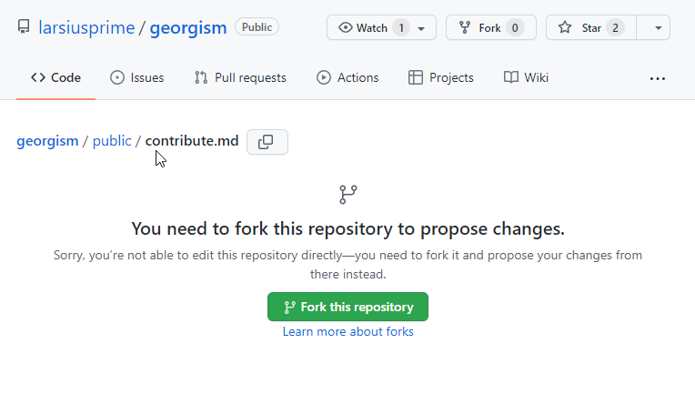
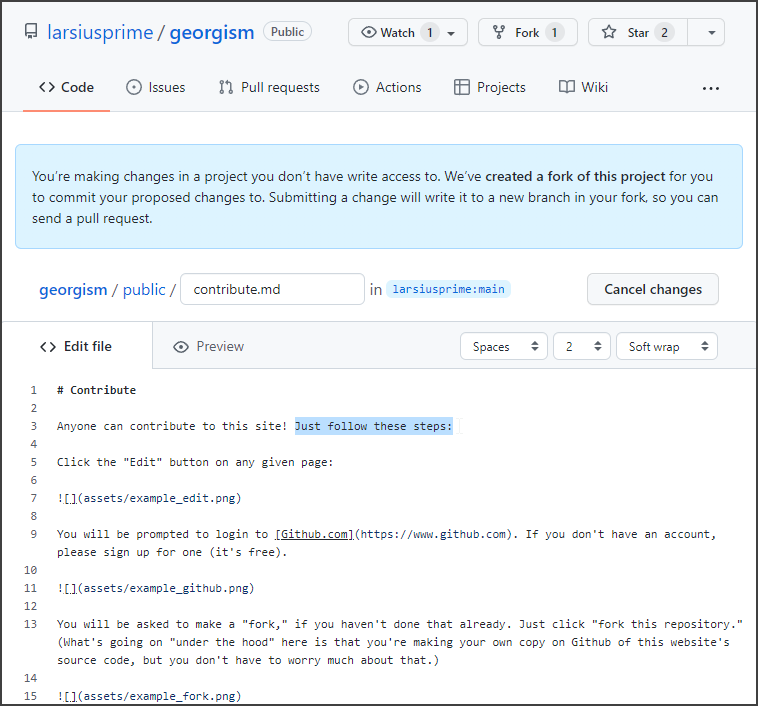
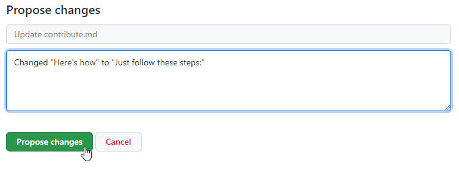

# Contribute

Anyone can contribute to this site! Just follow these steps:

Click the "Edit" button on any given page:

You will be prompted to login to [Github.com](https://www.github.com). If you don't have an account, please sign up for one (it's free).

You will be asked to make a "fork," if you haven't done that already. Just click "fork this repository." (What's going on "under the hood" here is that you're making your own copy on Github of this website's source code, but you don't have to worry much about that.)

Now you will see a text editor panel for the page you are editing. (Once you already have an account and have made your own "fork", this is where the "edit" button on any page of gameofrent.com will take you directly.) Make your edits in [Markdown](https://github.github.com/gfm/) format.

Once you're happy with your changes, scroll down and click "propose changes." Make sure to include some notes about what you changed and why.

That's it! The changes will be submitted as a Github "pull request." The site maintainer will review your changes and can  accept, reject, or comment on them. If and when the maintainer responds, you'll be notified through Github.