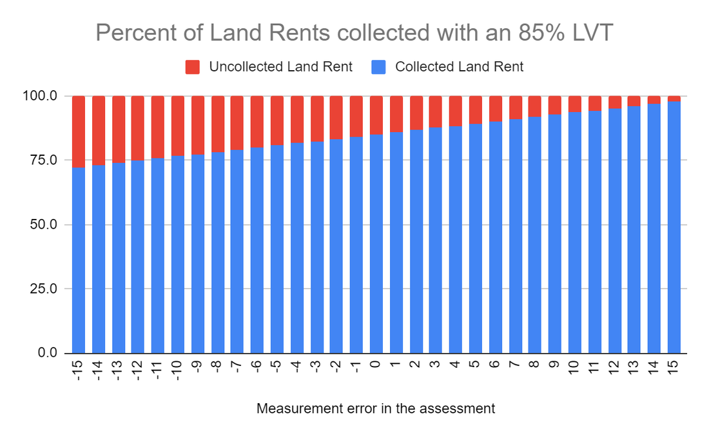
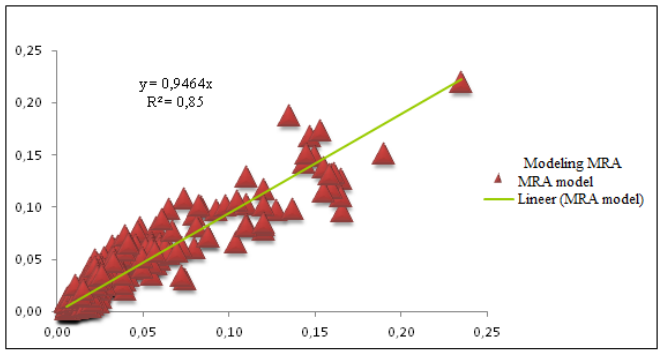
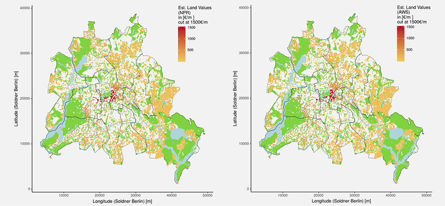
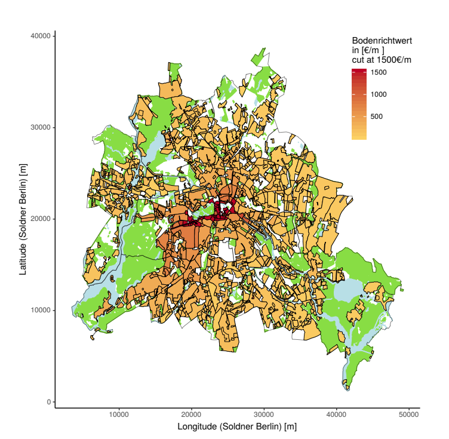
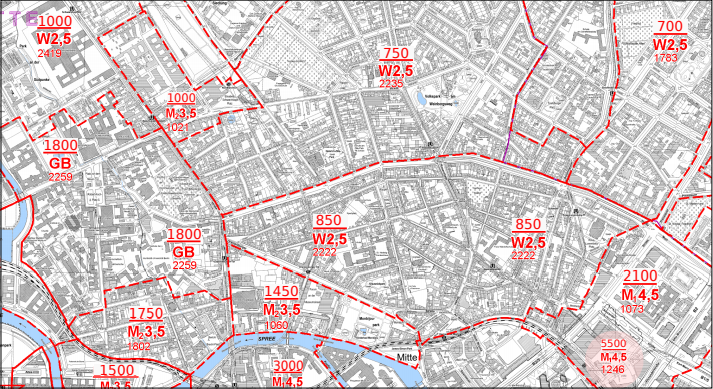
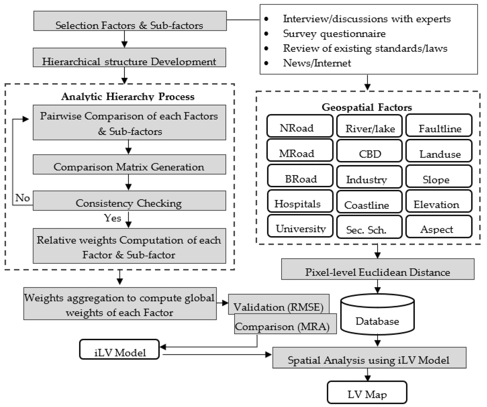
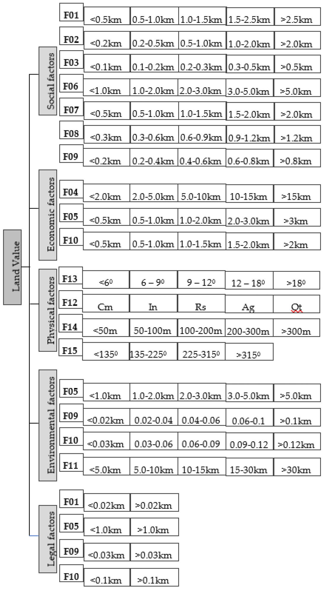
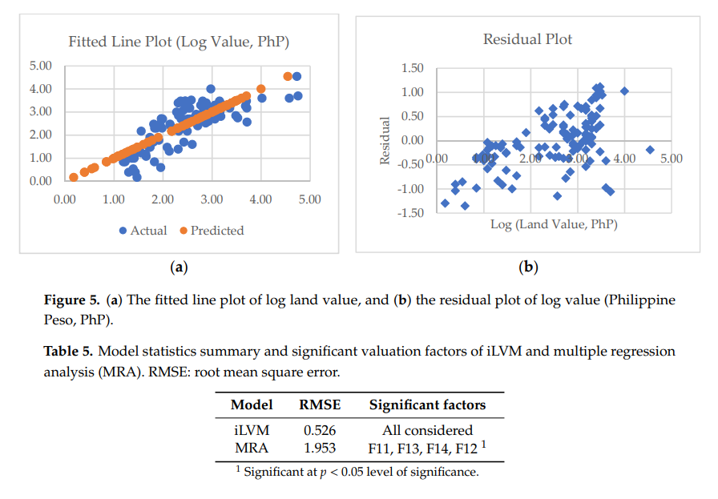
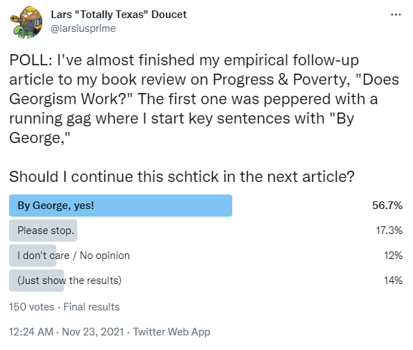

# Can Land Value Be Accurately Assessed Separately from Buildings?

by [Lars A. Doucet](lars_a_doucet), 2021

[Part 0 - Book Review: Progress & Poverty](progress-and-poverty-review)  
[Part I  - Is Land Really a Big Deal?](is-land-a-big-deal)  
[Part II - Can Land Value Tax be Passed on to Tenants?](can-lvt-be-passed-on-to-tenants)  
**Part III - Can Unimproved Land Value be Accurately Assessed Separately from Buildings? 👈** (You are here)

# Introduction

Okay, so land is a really big deal, and it looks like Land Value Tax can't just be passed on to tenants, which means Georgism works great in theory. But in order to implement it effectively, you need to be able to price all the land parcels, accurately. Or at least accurately _enough_. But how do you actually do that?

## Table of Contents

- [Introduction](#introduction)
- [1. The Basics of Assessment](#1-the-basics-of-assessment)
- [2. Assessing the Assessments](#2-assessing-the-assessments)
- [3. How Many Assessors Do You Need?](#3-how-many-assessors-do-you-need)
- [4. Modern Technology](#4-modern-technology)
- [5. Mass Appraisal Methods](#5-mass-appraisal-methods)
- [6. Conclusions and Next Steps](#6-conclusions-and-next-steps)

Some friends suggested I get in touch with Ted Gwartney, former professor of Real Estate Appraisal at Baruch College, New York. He has an [MAI](https://www.appraisalinstitute.org/ai-masters-degree-program/) in Land & Commercial Appraisal from the [Appraisal Institute](https://www.appraisalinstitute.org) and is former president of the [Council of Georgist Organizations](https://cgocouncil.org). He has a lot of professional experience as an assessor in British Columbia, Southfield in Michigan, and Hartford, Bridgeport, and Greenwich in Connecticut.

He was even a co-signer of this [famous open letter](https://en.wikisource.org/wiki/Open_letter_to_Mikhail_Gorbachev_(1990)) to Gorbachev in 1990 urging the Soviet premier to establish a Land Value Tax to provide a stable basis for the new economy as Russia struggled to rise from the collapse of communism. Other co-signers included four Nobel Laureates: [Franco Modigliani](https://en.wikipedia.org/wiki/Franco_Modigliani), [Robert Solow](https://en.wikipedia.org/wiki/Robert_Solow), [James Tobin](https://en.wikipedia.org/wiki/James_Tobin), and [William Vickrey](https://en.wikipedia.org/wiki/William_Vickrey), not to mention [William Baumol](https://en.wikipedia.org/wiki/William_Baumol) of [Baumol's cost disease](https://slatestarcodex.com/2017/02/09/considerations-on-cost-disease/). Unfortunately, the Russian authorities went with Harvard Professor Jeffrey Sachs' "[shock therapy](https://www.thenation.com/article/archive/harvard-boys-do-russia/)" instead, and the [rest is history](https://theconversation.com/the-wild-decade-how-the-1990s-laid-the-foundations-for-vladimir-putins-russia-141098), as anyone who lived through the post-Soviet chaos can tell you.

Ted Gwartney also gives online seminars. To prep for this article, I attended his 5-week course _[Assessing Land Values - Principles and Methods](https://www.hgsss.org/assessing-land-values-principles-and-methods/)_ from the [Henry George School of Social Science](https://www.hgsss.org), which I'll reference throughout this piece.

Gwartney couldn't be more Georgist if he tried, so for balance, I looked up about a dozen research papers on the topic of land value assessment in Google Scholar, some of which are cited below. I also spent some time on the homepage of the [International Association of Assessment Officers](https://www.iaao.org) (IAAO), the international professional body for real estate assessors. Then I looked up the local policies of various appraisal districts in my home state of Texas to see how things are actually done in practice in my local area.

Here's what I found.

*   There are common principles that everybody (Georgist or not) agrees on
    
*   Several promising new methods have come out in the last 15 years
    
*   The actual practice in my own area kind of sucks
    
*   The actual practice in some other places is pretty good
    
*   We can probably improve on both the state of the art and the actual practice
    
*   Georgists assert we're consistently undervaluing land basically everywhere
    

I'll cover specific case studies where Georgism has been successfully tried in a future article. I'll just note here that solid examples that uphold the purported benefits of Georgism in the wake of an LVT policy would be good evidence for accurate (enough) land assessment being feasible–"what works in practice can work in theory."

# 1. The Basics of Assessment

Pretty much everybody agrees on the basic algebraic formula for deriving land value:

> **T**otal Value = **L**and Value + **I**mprovements Value

The total value is whatever the property actually sells for. The value of improvements is the value of all of the buildings and other permanent structures and investments that sit on top of the land. The land value is the value of the location itself and any of its natural endowments. When two factors are known, you can calculate the third, which is then known as the _residual_. The high level strategy for doing valuations thus becomes to use whatever evidence you have to get at least two of these values. From there you can simply deduce the missing residual.

The quality of your assessments will depend not only on the method you use and the expertise of your assessment officers, but also on your local policies. The IAAO lists the following as "[core principles](https://www.iaao.org/media/standards/Standard_on_Property_Tax_Policy.pdf)" that local assessment policies should ideally have:

*   Assessments based on market value
    
*   Frequent and regular (preferably annual) updates to assessments
    
*   A broad tax base with limited exemptions
    
*   Targeted, easily accessible relief programs for those who need assistance
    
*   Well managed, transparent, and adequately funded mass appraisal procedures
    

Everyone is in further agreement about the three basic "approaches" to value estimation: the market approach, the cost approach, and the income approach.

## The Market Approach

This is the most common approach. You gather a bunch of information about comparable properties, look at past selling prices and rents, and make adjustments for differences. This is greatly aided by modern computerized databases, as well as Geographic Information System (GIS) mapping and visualization tools. Remember those spot checks I did in Part I to estimate the value of the land under a building in San Francisco using a nearby, similarly-sized empty lot? That was me (crudely) using the market approach.

## The Cost Approach

In this approach, you estimate the cost of the buildings minus depreciation. Professionals that value residential and commercial buildings often rely on [Marshall & Swift's](https://www.corelogic.com/wp-content/uploads/sites/4/downloadable-docs/marshall-swift/1-msrch-1909-01-marshall-swift-residential-cost-handbook_scrn.pdf) [Valuation Service](https://www.corelogic.com/wp-content/uploads/sites/4/downloadable-docs/marshall-swift/1-msvs-1909-01-marshall-swift-valuation-service_scrn.pdf). This is a fancy calculator where you plug in all the different characteristics of your building, and it spits out a cost estimate. You can think of it as a [Kelley Blue Book](https://www.kbb.com) for buildings. Once you have the cost of your building, you apply certain widely-accepted depreciation formulas based on its age.

The cost approach has two chief limitations. The first is that it requires a lot of detailed information about the building. The second is that the cost to build something isn't necessarily the same as what it would sell for in today's market. Therefore, this approach tends to overestimate building values and underestimate land values, as discussed in detail in Part I.

## The Income Approach

In this approach, you look at the net income (rent - expenses) that a commercial or residential property generates and then use the prevailing capitalization rate of the area to get the property value. You typically use this formula:

> **V**alue = **I**ncome / **R**ate

This gives you the total property value, and from there, you can use one of the other two approaches to separate land value from building value. Crucially, any observed land or property tax needs to be factored into the observed "income" portion. Even if the state is collecting the tax, it's part of the flow that originates from the property, and thus affects the full untaxed market value of the property. Naively you might expect a 100% Land Value Tax to drive itself to zero because it also drives down the purchase price of the land to approximately nothing. To avoid this, you figure out the capitalized value of the LVT that's already been applied to get the untaxed land value.

* * *

These are the basic methods that we've used to value properties "by hand" over the last century, and there are many who claim that these are good enough. As for separating land from buildings, Ted Gwartney prefers to estimate the value of land directly whenever possible and derive the building value as a residual. He claims it's easier to assess land than buildings, because in most cases, the value of land is derived almost entirely from the location. Land doesn't have as many fiddly variables, like how much damage your roof took from the last hailstorm and whether you've remodeled your bathroom in the past five years.

But let's dive deeper.

# 2. Assessing the Assessments

Okay, so once you've made all your assessments, how do you ensure they're accurate? You test them.

We have two main signals: ongoing transaction data from the market, and complaints from property owners about the assessed values. The typical way you compare yourself against market transactions are "Ratio Studies", which you can read more about in this [IAAO paper on the subject](https://www.iaao.org/media/standards/Standard_on_Ratio_Studies.pdf/).

As for complaints, you'd think property owners would always complain out of pure self-interest, but apparently, only a minority do, and assessors actually build in an expectation for a certain number of complaints as a chief source of feedback.

If complaints are below a certain threshold (2% according to [Hefferan and Boyd](https://www.emerald.com/insight/content/doi/10.1108/02637471011051291/full/html)), that's apparently a sign that you're doing well. During Ted Gwartney's seminar, someone asked him about what tends to drive objections:

> ATTENDEE: Can you tell us what fraction of property owner who request a lower assessment argue that their land assessment is too high?  
>   
> GWARTNEY: A very small number. Almost all of the adjustments that are made are made because of improvements. Most of the arguments when you go to an appeal is about the building, it’s condition, or what’s in it or whatever. Generally the land is accepted by people, they realize it’s fair by looking at what other parcels are assessed for and most people don’t argue it. They might say he has a better view than I do or whatever, but usually \[the objection is\] because there’s some physical difference or condition in the structure.

So if the public accepts your valuations, and new market signals match your assessments, then they can be said to be accurate. But how precise do they need to be? Here's Gwartney's opinion:

> ATTENDEE: How accurate do assessments have to be to get the benefits of Georgism?  
>   
> GWARTNEY: You have a lot of wiggle room. It doesn’t have to be perfectly precise. The idea is to improve on what’s already being done. You get immediate feedback that what you’re working on is making good results.

This is a part I'd like to know more about. Is plus or minus 5% of the true land value "good enough?" What about 15%? Or 1%?

If land is under-assessed, then we basically have the same problem as the status quo, and we're not really any worse off. But if land is over-assessed, we might drive people off of it, which is bad. So it seems our main problem is not _over-assessing_ the value of land.

Georgists often talk about "100% LVT," but during practical discussions, it seems that their wildest dream is just to get as high as 85%. That would leave a pretty big safety margin for not over-taxing the land, even if you over-assessed it. Here's a graph.

  

If you under-assess a property's land by 15%, the assessed value is 85% of the true value. Take 85% of that and now you're collecting 72.25% of land rents. If you over-assess a property's land by 15%, the assessed value is 115% of the true value. If you take 85% of that, you get 97.75%. Collect all that and you're still leaving 2.25% of the land rents on the table, but you're not going over. This is comforting, but frankly, all the evidence I've seen so far suggests that we're chronically and consistently _under_\-assessing the value of land.

But even if we can assess things accurately, it's a moot point if we can't afford to hire enough assessors to do the job thoroughly.

* * *

# 3. How Many Assessors do you need?

Another critique about assessment is that you're going to need an army of property assessors peeking inside windows at all hours of the night, and that it's all going to be ruinously expensive.

Here's a slide from Gwartney's presentation, which is itself taken from an IAAO conference.

  
 
Gwartney says that when he was the assessment commissioner and chief executive officer in British Columbia, he had a staff of 690, and that this number has not changed significantly since then. British Columbia has a population of about 5 million, so that's 1 assessment officer for every 7,250 British Columbians. For context, the IRS has a staff size of 74,454, or about one IRS agent for every 4,425 Americans. I don't have data on how many property tax assessors the USA has in total, but the above slide suggests British Columbia's figure is on the high end.

As for how you actually do assessments, sure, you _can_ send out an army of assessors to value each and every property in your jurisdiction by hand. However, not only is that labor-intensive, it's also a recipe for inconsistency. Whatever method you're using to value properties needs to be consistent and standardized across all properties, so you don't have sharp discontinuities on the assessment map that are due solely to differences between Assessor Fred and Assessor Sally's personal methodologies. Thankfully, we're living in the modern age, and we have some fancy new tools at our disposal.

# 4. Modern Technology

Georgists were doing split-rate assessments to allegedly good success long before the rise of the computer, such as [J. J. Pastoriza's effort in setting up a Georgist tax regime in Houston, Texas in 1911](https://twitter.com/larsiusprime/status/1427107150053183505). Today, we have spreadsheets, property value databases, GIS mapping visualizations, regression analysis, machine learning...the works.

According to Gwartney, the Canadian province of British Columbia has revalued all its land and all its property on an annual basis simply by using computers and market analysis, ever since he first helped them set up their system back in 1975. Not every jurisdiction revalues their land this thoroughly and this often, but Gwartney says there is no significant technical or staffing barrier standing in the way.

Gwartney has been retired for some time, so his seminar didn't cover all the latest cutting-edge techniques that have come out in the last few years. Let's look at some recent papers and see what new tools assessors have to play with.

The first on my list is _[Land Value Appraisal Using Statistical Methods](https://edoc.hu-berlin.de/bitstream/handle/18452/20511/FORLand-2019-07.pdf?sequence=1&isAllowed=y)_ by Kolbe, Schulz, Wersing, and Werwatz (2019). This is a study on mass appraisal techniques using real estate transaction data from Berlin, Germany. It claims that not only are the results cheaper and faster to generate than those done by conventional property assessment methods, but they are also no less accurate than those done "by hand" by experts.

Kolbe et al. assert that, provided you have access to high quality market transaction data, you can perform accurate and efficient mass appraisals of land values. They chose Berlin because it "has a very effective system of property transaction data collection and storage," in contrast to other parts of Germany. They cite some prior work by [Almy (2014)](https://www.oecd-ilibrary.org/docserver/5jz5pzvr28hk-en.pdf?expires=1637353213&id=id&accname=guest&checksum=A29E3A050D80102CAD3B1B6823A9E76D) studying Canada, the Netherlands, and the United States, suggesting that the assessment cost per property can be brought down to 20 Euros–25 times cheaper than what some other people ([Fuest, et al. (2018)](https://www.ifo.de/DocDL/ifo-studie-2018-fuest-etal-grundsteuer.pdf)) assert. Given an average tax receipt of 2,000 Euros per property, this means that the assessment cost should represent only about 1% of the funds raised.

Is that good? Let's take this assertion at face value for the moment and compare it to the cost of the IRS. Federal tax receipts in 2020 were $3.42 trillion, and operation costs for the IRS were [$12.3 billion](https://www.irs.gov/statistics/irs-budget-and-workforce), or 0.36%. However, the IRS outsources most of the labor of tax preparation to the taxpayers themselves, with compliance costs estimated between [$200 billion](https://www.americanactionforum.org/research/tax-day-2018-compliance-costs-approach-200-billion/) and [$400 billion](https://www.forbes.com/sites/kellyphillipserb/2016/06/20/report-americans-spend-more-than-8-9-billion-hours-each-year-on-tax-compliance/?sh=6d89670e3456) a year, to the [delight of Intuit](https://www.nytimes.com/2021/07/19/opinion/intuit-turbotax-free-filing.html). Add that up and the total cost of federal tax collection to the economy is anywhere between 6-12% of the amount it raises.

And what about sales tax? According to a [2006 report by PriceWaterHouseCoopers](http://www.netchoice.org/wp-content/uploads/cost-of-collection-study-sstp.pdf):

> The study finds that the national average annual state and local retail sales tax compliance cost in 2003 was 3.09 percent of sales tax collected for all retailers, 13.47 percent for small retailers, 5.20 percent for medium retailers, and 2.17 percent for large retailers

So a compliance cost of 1% would be way more efficient in terms of cost collection than the other two most common forms of taxation, and taxpayers don't even have to do anything themselves, other than pay the bill.

Alrighty, how about the accuracy? The authors cite two international examples, Australia and Lithuania, as among the few countries in the world that have both a Land Value Tax and statistical methods for mass appraisals. [Hefferan and Boyd (2010)](https://www.emerald.com/insight/content/doi/10.1108/02637471011051291/full/html) assert that objections to assessments from property owners in Australia are less than 1%.

I'm willing to buy the improved efficiency claims just by taking a look at some methodologies. It seems reasonable that computerized records and algorithms can cut costs significantly; the real question is if you're trading off accuracy.

The other papers I found on the subject are [Bencure, et al (2019)](https://www.researchgate.net/publication/334304723_Development_of_an_Innovative_Land_Valuation_Model_iLVM_for_Mass_Appraisal_Application_in_Sub-Urban_Areas_Using_AHP_An_Integration_of_Theoretical_and_Practical_Approaches) in BayBay City, Philippines, [Kilić, et al (2019)](https://hrcak.srce.hr/index.php?show=clanak&id_clanak_jezik=324144) in Croatia, [Yalpir & Unel (2017)](https://www.isites.info/PastConferences/ISITES2017/ISITES2017/papers/C3-ISITES2017ID307.pdf) in Konya, Turkey, and [Raslanas et al. (2014)](https://www.tandfonline.com/doi/abs/10.3846/ijspm.2010.13) in Vilnius, Lithuania.

Let's dive in and examine some methods.

# 5. Mass Appraisal Methods

Here are some of the latest mass appraisal methods cribbed from the research papers listed above. All of these are based on taking market transaction data, plotting them out on a map, and running computations over them to estimate valuations for the properties you don't have known values for. Furthermore, all of these methods are able to value land and building values separately.

**Multiple Regression Analysis**

This paper by [Yalpir and Unel](https://www.isites.info/PastConferences/ISITES2017/ISITES2017/papers/C3-ISITES2017ID307.pdf) out of Turkey gives a straightforward example of using Multiple Regression Analysis for land valuation.

For those of you who didn't study math, let me explain regression analysis. This is a family of mathematical models where you basically take a data set, ask the question "what mathematical formula would best fit this data," choose a basic equation model, and then have a computer search for a set of coefficients that "best fit" that curve to the data with the least amount of error.

The simplest example is using linear regression on a scatterplot of observed data points to fit a trend line. This is a common exercise in freshman physics and statistics classes.

  
 
You can use more complicated versions of this numerical method to take a big bag of observations (real estate sales) and use "multiple regression" to tease out  dependent variables (land value and improvements value) based on the independent variables (size, location, age, number of bedrooms) of your observations.

In this case the team identified about a hundred different factors that can affect the price of a property:

  
 
Then you create an entry for each property, fill in the values for each of those characteristics, and run it through the regressor. Take note of how many of these factors start with the words "proximity to." Each of these can be calculated automatically just by knowing where the property is on a map, and each of them is an independent contributor to the value of the property's location.

The next step is to generate individual "index maps" that combine various related features into combined heat maps.

  
 
Then you run everything through and see if it works. You can get the land share of the final value by combining the contributions of all the individual factors that you associate with "land," such as proximity to important things.

In the verification section the authors say:

> As a result of the analysis, since the significance level (0.000) p <.05, corresponding to the F values in the ANOVA test, indicates that the regression analysis is appropriate and the models are significant. The criteria that make up the model account for about 85% of the market value and 15% cannot be explained for reasons such as economic, non-existent data and unearned income.

  
 
Unfortunately, they don't say anything about how accurate their model is for assessing land values specifically. Otherwise, this is a pretty good example of using the Multiple Regression method for estimating the individual contributions of various factors to overall property values. Gwartney says Multiple Regression Analysis was a standard method he typically used, of which this specific paper is just one example.

**Nonparametric kernel regression**

This will be a method familiar to the programmers in the audience who have any experience with image processing algorithms. Here's an example from this old [Gamasutra article](https://www.gamasutra.com/view/feature/3102/four_tricks_for_fast_blurring_in_.php?print=1):

  
 
The basic idea here is to take a matrix of numbers, called a "kernel", and run that over every pixel in a source image. The kernel tells you how strongly to weight all of the source pixel's neighbors to compute a final result for that position. A simple "box blur" is a kernel where every value is 1 (meaning it averages the values of all neighboring pixels within a range). The more subtle gaussian blur illustrated above uses a two-dimensional normal distribution of values so that each pixel is most affected by those nearest to it.

So let's apply the same principle to land valuations. If you have a map with lots of transaction data of pure land sales–defined as sales of either vacant land or teardown properties (where the building value is essentially zero)–then you can use a special kernel filter to smoothly interpolate land values across the region.

So you basically have a smooth curve that mostly favors close-by points, tapers off a bit, and then disregards anything outside a certain distance entirely. The big assumption here is that land values change smoothly and do not change suddenly across very short distances. There are, in fact, locations with sharp jumps in value (any town with an "other side of the tracks," for instance). But for cases where we know a priori that land values change smoothly, this method is appropriate. No other prior restriction is placed on the form of the land value map, however, and this is why it's called "nonparametric."

Here's an illustration. The outer box is the entire search distance that the kernel considers, and the circles represent the falloff of the curve itself. The size of the box is called the "bandwidth" and is set by the user. Everything outside of it will have zero influence on the kernel's output at any given location.

  
 
This method operates on the same basic logic that I used when I hand-estimated the land value of that San Francisco house in Part I based on the value of the empty lot next door. However, it makes the whole procedure systematic. It can easily and accurately estimate the land value of a property with a big fat building on it simply by smoothly interpolating the known values of the nearby parking lots.

Of course, it has limitations. First and foremost, it's a highly local operation, so if you have properties you're trying to value that don't have nearby pure land sales data, you can't really do much with this. Also, most people assume that city centers have less market transactions for undeveloped land than the countryside, as did I until I read that paper by Albouy in Part I. But in any case, this is just one method in your toolbox and might not be sufficient by itself. Its key advantage is that it works directly from true market data for land and doesn't need or want any other subjective data.

In the end, basic kernel estimation just fills in the land value of unmeasured locations with a local weighted average of known locations.

**Nonparametric adaptive regression**

Kolbe, et al. build on the kernel regression method with a technique called Adaptive Weights Smoothing (AWS), which runs in several iterations and adds additional weight to any observed data points that are sufficiently close to the point being estimated. I'm not 100% sure about what all the math means, but it seems like it's basically a "smarter" version of the basic kernel method.

  
 
Left: Nonparametric kernel regression, Right: Adaptive Weights Smoothing. I think the authors goofed and printed the same figure twice with different headings because they're identical if you overlay them in Photoshop.

**Semiparametric regression**

Now, the above two methods assume you have plenty of "pure" land sale records to work with. But if you're trying to work out prices in the city center, you've probably mostly got land and buildings mixed together. To do this effectively, we need more data, and this is where the "parameter" in "semiparametric" comes in.

The model described in Kolbe et al. seems like a flavor of multiple regression analysis that takes the price, the location, and various characteristics of the building and feeds it into a regressor.

But we've got "semi" parametric here. What does that mean? Well, if you already know how certain relationships between the data work a priori, it's better to enforce those relationships yourself rather than leave it to the computer. Here, we enforce the assumption that if two properties are right next to each other, then the value due to location is going to be essentially identical. This algorithm starts by ordering things geographically and then working out the differences in observed price by regressing on the difference between remaining property characteristics. In this method, the power of "location, location, location" is not something we're leaving to the regressor to discover by itself.

  
 
Results of the Semiparametric regression method, we can see some significant differences from the simple kernel-based model.

As you can see above, this gives you more detailed and likely more accurate results, and you're better able to assess the values of properties with buildings on them, even in the absence of pure land sales. This technique is more complicated and bakes in assumptions about the power of location, but otherwise doesn't assign subjective human weights to the various property characteristics. The chief human bias comes in the form of deciding _which_ property characteristics are measured and made legible to the model in the first place.

Okay great, but how accurate are the above three methods? Their main point of comparison is this thing called the "Bodenrichtwerte," or BRW. I think that means "ground-level-values" in English, and it's an expert-assessed map of land values for Berlin done the traditional way.

  
 
The nonparametric kernel regression method has a correlation of 0.704 with the traditional method and has the added disadvantage that it's not able to produce estimates for the city center, only the outlying areas. Furthermore, the BRW map does show sharp discontinuities, which is another knock against the kernel method, at least for the city center.

  
 
What about the iterative method? Kolbe et al. find that "the agreement between \[Adaptive Weights Smoothing\] land value estimates and, both, land prices and BRW land values is fairly good for all values of λ."

  
 
Doing some quick checks, their values seem to be within about 85% of the BRW values. A different Kolbe et al. paper called _[Identifying Berlin's land value map using adaptive weights smoothing](https://link.springer.com/article/10.1007/s00180-015-0559-9)_ goes into more detail and claims to give "similar" values to that of the BRW.

For the semiparametric method, they "found a strong positive correlation of 0.845" between their numbers and a previously expert-assessed set done using the traditional method.

That sounds pretty good. It seems their margin for error is about plus or minus 15% compared to the traditional expert method. I'd like to see more direct comparisons against market transactions themselves, though, because if the prior expert assessments are wrong, then the main achievement here is improved efficiency, not accuracy. However, this method doesn't seem to be dramatically _less_ accurate than the old way of doing things.

The last three models came from the Berlin case study, where you have excellent market transaction data in an extremely wealthy and high-trust society. But what if you're trying to assess land in a developing nation with poor market transaction records, weak institutions, and widespread poverty?

**Innovative Land Valuation Model (iLVM)**

This is the particular name of the method described in _[Development of an Innovative Land Valuation Model (iLVM) for Mass Appraisal Application in Sub-Urban Areas Using AHP: An Integration of Theoretical and Practical Approaches](https://www.researchgate.net/publication/334304723_Development_of_an_Innovative_Land_Valuation_Model_iLVM_for_Mass_Appraisal_Application_in_Sub-Urban_Areas_Using_AHP_An_Integration_of_Theoretical_and_Practical_Approaches)_ by Bencure, Tripathi, Miyazaki, Ninsawat, and Kim. They used BayBay City, Philippines as their case study.

Whereas the previous models are very "hands-off" and let the computer work out the relationships between prices and property characteristics, here you get expert human opinion directly involved in building the model, baking in weights that directly embody judgments like "properties next to major roads are more valuable." These judgments are based on expert opinions that presumably come from observed experience but are a priori judgments nonetheless.

Here, look at this big complicated flowchart.

  
 
The "Analytic Hierarchy Process" in the box on the left is a particular kind of method for getting experts to set weights. The authors give this reason for using it:

> Despite criticism pinpointed by other scholars, the AHP remains the commonly used in many research fields and practical applications. This is because the AHP: (1) overcomes human difficulty in making simultaneous judgment among factors to be considered in the model; (2) is relatively simple as compared to other MCDA \[multi-criteria decision analysis\] methods; (3) is flexible to be integrated in various techniques such as programming, fuzzy logic, etc.; and (4) has the ability to check consistency in judgment

After identifying a list of "factors" that can affect land value, they group them into taxonomical buckets:

  
 
Note that certain factors like "Coastline" appear in multiple buckets; this captures the various influences a characteristic can have. For instance, land on the coast tends to be more economically valuable because of tourism, shipping, fishing, etc., so that goes under "economic." But land that's next to the coast is also more likely to flood, so it also goes under "environmental." And then there are various land use restrictions that apply specifically to coastal areas, so it goes under "legal" as well. In this way, a single factor like "the property is on the coastline" can have both positive and negative effects on land value (e.g., it's more economically valuable but it also might flood, and there are certain things you aren't allowed to do there).

The next step is to set down some rules for how sensitive each factor is to location and distance.  

  
 
So here we can see that the economic benefit of being on the coast is most strongly felt if you're within half a kilometer of the ocean, but the environmental effect (e.g., risk of flooding) is most strongly felt when you're within 0.03 kilometers. And so on and so forth. Your experts help you work out all these rules. Note that for a few of these factors (such as land use and slope), you use metrics other than distance (e.g. land use classification and grade).

Then you take all that stuff and assign everything a value between 0 and 5.

  
 
Your team of experts then uses this table to come up with a set of weights for everything.

  
 
What essentially comes out of this is a big linear equation with a bunch of coefficients for every one of your factors, which is then broadly fit to the observed market prices. When you're done, you can take any property on your list, multiply each of its characteristics by its respective weight, run that through your equation, and calculate the predicted price of the land.

So how accurate is it? The authors compare it to standard Multiple Regression Analysis and claim it fares better.

  
 
The Root Mean Square Error is quite a bit less than MRA.  In addition, I _think_ it's also saying that the MRA algorithm decided that only four of the factors were significant and basically ignored all the rest. By contrast, iLVM was able to maintain contributions from all the factors, because it doesn't leave that decision to the computer. I'm not 100% sure; it's not clear from the paper.

The authors claim that about 67% of the variability is explained by their model, but they note that there are some areas where the model can be off by more than a factor of 1.0 in either the positive or negative direction.

One thing that's kind of fun about this model is that you can make neat graphs like this that show the individual contribution of each factor:

  
 
The main downside to this model is that it relies on a whole lot of subjective expert opinion and can be questioned on that basis. That said, it can be cheaply deployed in a transparent and consistent way across a large area. You can see why that's attractive for a developing nation with weak institutions and poor market transaction records; the argument is that this is a significant improvement over the former status quo.

I wonder how well this model performs when you feed it better market transaction data, and how that would compare against all the others methods under identical conditions. More research is needed.

* * *

Rather than drag you through a bunch more research papers, I'll just leave these others I found cited in the above studies:

*   [Killić et al. (2019)](https://hrcak.srce.hr/index.php?show=clanak&id_clanak_jezik=324144) \- Fuzzy expert system for land valuation in land consolidation processes
    
*   [Aragonés-Beltrán, et al. (2008)](https://www.aeipro.com/files/congresos/2009badajoz/ciip09_0726_0737.2499.pdf) – Analytic Network Process (ANP) based on Multiple Criteria Decision Analysis (MCDA)
    
*   [Xue et al., (2008)](https://www.researchgate.net/publication/292872254_Land_evaluation_based_on_Boosting_decision_tree_ensembles) - Land valuation using C5.0 with a Boosting decision tree
    
*   [Kettani and Kehlifi (2001)](https://www.semanticscholar.org/paper/PariTOP:-A-goal-programming-based-software-for-real-Kettani-Khelifi/ede90349ef90887d42000c9a57fddbc109bfbee7) - A "decision-support system" called PariTOP
    
*   [Hefferan and Boyd (2010)](https://doi.org/10.1108/02637471011051291) - Property taxation and mass appraisal valuations in Australia - adapting to a new environment
    
*   [Almy (2014)](https://www.oecd-ilibrary.org/docserver/5jz5pzvr28hk-en.pdf?expires=1638944897&id=id&accname=guest&checksum=094DF834F67B533FED290FFCF9A949A5) - Valuation and Assessment of Immovable Property
    

Not to mention [Fundamentals of Mass Appraisal](https://www.iaao.org/Store/detail.aspx?id=BK0098), a literal textbook published by the IAAO, written by Gloudemans and Almy in 2011.

I've only scratched the surface here. There are a whole lot more methodology papers out there, and this is just a sample of the ones I happened to come across. They seem to fall into either "hands-off" or "hands-on" approaches, depending on how much direct human judgment you want to bake into the system.

* * *

So, can we accurately assess land and improvements separately?

I think it's quite plausible but not a slam dunk. That said, if the objection is, "valuing land separately from improvements is fundamentally impossible, and we can never get better at it, so we shouldn't try," I think that's plainly ruled out.

We clearly have a variety of methods at our disposal that seem reasonably accurate. Each of them has particular strengths and weaknesses, and each directly addresses shortcomings of prior methods. All of this implies that this is something we can continue to improve at. The big questions are whether we've already arrived at "good enough" and how tight our error tolerances need to be.

And the operative phrase very much is "good enough." I don't know of anywhere in the world that currently has a 100% LVT policy, let alone an 85% LVT. The lower your LVT, the greater your margin of error becomes for not taxing more than the true land value. I know plenty of Georgists who would be ecstatic if they could get a 75% LVT, or even a 50% LVT, implemented in their area.

Now, just because these assessment methods are available doesn't mean they're actually being used. Not everyone has Ted Gwartney as their assessor. Plenty of counties in my local area exclusively use the cost approach and will even apply a blanket "neighborhood factor" multiplier to up-assess swiftly appreciating areas. However, they apply that multiplier to the _buildings_ rather than the land, which feels exactly backwards. The assessor hasn't raised the value of my land in years, while the assessed value of my house (which I am eminently qualified to tell you is an ever-degrading money pit) somehow continues to go up.

Good assessment depends on having well trained staff, up-to-date methodology, and access to high quality market transaction data. I'm convinced, based on these papers and the IAAO's surveys, that assessment doesn't require a huge army of assessors poring over every aspect of citizens' properties.

Furthermore, plenty of places already have property tax systems in place and are already paying the full cost of property assessments and property tax collection. Many of the methods described above seem capable of reducing property assessment costs by focusing on the land first and foremost and letting the building's value fall out as a residual, as Ted Gwartney insists.

The cost also seems like something that, done properly, is only going to come down over time as fewer assessors are required. Another option is to keep staff sizes the same but use the emerging productivity gains to increase the frequency and quality of assessments. It also seems clear to me that Land Value Taxation is not _more_ invasive and expensive than income and sales tax when you factor in the cost of compliance (not to mention the deadweight loss imposed on the economy).

Countries that have implemented Land Value Taxes, such as Denmark, are already seeing some of the claims of Georgism borne out, as we discussed in Part II. This suggests to me that modern methods are probably "good enough," so long as assessors are well trained, abiding by current best practices, and able to access good market data.

Given that Astral Codex Ten is a blog where ideas as lofty as full brain uploading, superhuman AI, and biological immortality are frequently discussed in earnest, it doesn't seem outlandish to suggest that human beings can probably use math and science to get better at estimating the market value of land relative to buildings.

**Conclusion**  
By George, Unimproved Land Value can (probably) be accurately assessed.

* * *

# 6. Conclusions & Next Steps

This concludes my three part series on the most common objections to Georgism.  
  
By George, the evidence has convinced me of three things:

✅ Land is a really big deal  
✅ Land Value Tax cannot be passed on to tenants  
✅ Unimproved Land Value can (probably) be accurately assessed

I humbly submit that the case for Georgism survives a summary dismissal and can move on to a trial of the particulars.

So where do we go from here?

In the course of writing this series, I found a few subjects that someone should just go ahead and test already. Obviously, this would require research funding and smart people willing to do the work (hey, a guy can dream).

These subjects are:

## 6.1. Assessment methods

A lot of the methodology papers I read test one or two methods at a time in a particular case study. What I couldn't find was a study that tests _every_ major mass appraisal method in one big cross comparison study, all in the same physical location using the same dataset. If we had this, we could get a better sense of their strengths and weaknesses without wondering what differences are due simply to one study being in Germany and the other in the Philippines.

It seems the necessary ingredients are:

*   An ideal test location with excellent property records and (ideally) a history of quality land value assessment and/or Land Value Tax
    
*   Experienced local assessment experts with knowledge of the area
    
*   Data scientists, statisticians, and machine learning nerds
    

I'm told by some friends who know this kind of stuff that the ideal location in the United States would likely be somewhere in Pennsylvania, a state with LVT friendly policies and a history of detailed property records.

After that, you'd pick out every mass assessment methodology from the literature, line them up, and reproduce them. Then, you'd come up with a novel method or two of your own and test those, too. Finally, you'd come up with a validation strategy for testing against true market values. The chief goals here would be to:

*   Evaluate the current state of the art. How wide are the error bars?
    
*   See if you can improve on the state of the art. How close to ground truth can you get?
    

Once the first study is done, you'd want to test it in another area–maybe Australia, Denmark, Germany, or the Philippines. If Georgism is true, and the only thing standing in the way is being able to pull off accurate assessments, then let's just get better at doing that. We're the species that split the atom and travelled to the moon. Surely we can handle this.

## 6.2. Total Land Value of the United States

It's really annoying that we don't confidently know this figure, and it has huge implications for LVT policy. Technically, this is an "assessment" problem, but in practice, when you're assessing _the entire USA,_ you're often falling back on big black-box buckets of aggregated property values rather than building a database of direct ground-truth market transactions yourself.

In Part I, we saw how big the difference was between Albouy, who used pure land sales directly from the market, and Larson, who applied the cost approach to official figures. If one of you readers has MLS access for all 50 states and/or a bunch of other records, it'd be interesting to see if we could settle this debate once and for all.

## 6.3. A Push for More Open Real Estate Market Transaction Data

To my knowledge, there's no good, one-stop shop for solid, historical, ground truth real estate market transaction data that's uniform and detailed across, say, the entire United States. I'm well aware of how important access to solid data is for researchers. I run a site called [www.gamedatacrunch.com](http://www.gamedatacrunch.com/) that just quietly scrapes public metrics from the PC video game store Steam (they don't mind–I asked). I'm constantly getting requests from researchers to dump slices from my DB for them, which I'm always happy to do. If not for making this data available, those research papers might not be happening. So many questions that are answerable in principle go unanswered in practice simply for want of access to data, and then smart people make bad policy decisions because of that ignorance.

In principle, I suppose nothing would legally stop someone from scraping listing prices on Zillow and Redfin all day, every day, but I have a feeling I'd probably get sued if I did that. (Just checked with my lawyer; he says it's a legal grey area but probably wouldn't end well for me.) If you're an eccentric billionaire who wants to do something for Georgism, instead of building a [$400 billion super city in the desert](https://cityoftelosa.com), you could buy [Redfin](https://www.redfin.com) for about [1% of that](https://web.archive.org/web/20211205031044/https://companiesmarketcap.com/redfin/marketcap/) and make their data available to researchers.

In any case, whether improved access to consistent, country-wide data were to come from data mining or repeal of [real estate non-disclosure laws](https://www.oceancitytoday.com/business/real_estate_report/several-states-do-not-disclose-sale-prices-to-public/article_31fe9010-9dab-11e9-bf92-cb9ad3f9d4ec.html), it would be an invaluable resource for researchers.

## 6.4. Empirical examination of ATCOR

If ATCOR (All Taxes Come Out of Rent) holds up empirically, it would be a super big deal. Then, it wouldn't matter whose land value estimates you accept, because you'd always be able to shift taxes off of income and capital and onto land without losing revenue. Mason Gaffney [cites a few cases](https://thedepression.org.au/atcor/) where it's supposed to have been observed, but we could really dig into this further. A claim this tantalizing really needs to be nailed down and resolved once and for all.

## 6.5. Responses to Comments

I've been absolutely drowning in comments since the first article posted and there's no way I'll be able to address everything. Doing full justice to some of these will require their own entire articles, but I can leave some brief notes here.

**Zoning**  
Many people replied that Land Value Tax is useless until or unless you first fix zoning. First of all, Georgists are natural allies in fixing restrictive zoning policies. This is something they definitely want and will fight for. Second, one of the reasons for restrictive zoning policies is broken incentives. A city doesn't have a huge incentive to repeal restrictive zoning policies because it isn't hurting their tax base. According to Georgists, a city whose tax base is land value has well-aligned incentives. It is incentivized to maximize land value by making the city a more desirable place to live, which also raises their tax base. It is dis-incentivized to over-assess or over-tax the land, however, because that will cause people to leave, which will lower their land values and also their tax base. One of the principle things that depresses land values and the tax base in this scenario is restrictive zoning. I personally don't care whether you first pass LVT or first repeal restrictive zoning, you can and should do both. Either one helps the other along.

**Transitional Politics**  
Honestly this needs its own entire article without me going out on a limb and accidentally saying something dumb. Suffice it to say, a lot of smart people have spent a _lot_ of time thinking about this, and you'll have to wait for a future article to find out what they are. I will let the commentariat duke this one out in the meantime.

**Corruption**  
Some people agreed to all of the points raised _in theory_, but pointed out that human beings are wicked sinners, and LVT will be bent towards the malevolent will of our overlords, just like the old policies. And they're not wrong!

The problem with this argument is that it's a fully general argument against change. The overlords game _every_ system to their benefit. Rely on standardized tests? They'll game the SAT's with phony disability accommodations and outright cheating. Abolish standardized tests? They'll make their kids take fifty extracurriculars and pay a ghost writer to pen their college entrance essay about their life-changing volunteer work in Ghana.

The right question is not "_can_ the rich game this system?" but rather, "can they game it _less_ than the existing one?" This is why you should keep standardized tests, even though rich people can and do game them. The [evidence](https://senate.universityofcalifornia.edu/_files/underreview/sttf-report.pdf) [shows](https://www.city-journal.org/standardized-tests-student-merit) that on balance standardized tests are one of the few ways a minority student from a poor background even has a chance to move upwards.

So let's dig in. The chief way you can game Land Value Tax is to cozy up to your local assessor and get them to say your land is garbage and it's not valuable. However, you have to do this kind of corruption in the open. Your land value assessment is public record, and highly visible on a map, and will stick out like a sore thumb unless the entire area has been corrupted too. I grant that motivated people could plausibly pull this off to various degrees.

You might be able to get the assessor to lie about your _land value_, but what's the status quo we're comparing against? We don't even _know_ how much _cash money_ value is being socked away in Switzerland and the Caymans, let alone by whom. And even if we did, good luck figuring out how to lure that back to a taxable jurisdiction. Land at the very least can't run or hide.

My dream is for us to commoditize open source mass appraisal systems and push for public real estate transaction records everywhere, so that organizations and educated members of the public can do their own land value audits at scale.

And again, this is something that just needs to be subjected to empirics. We can sling theory back and forth at each other all day, but the proof is in the pudding. There are places that have done Land Value Tax in the past, and there are places that do it today. A good candidate for a future article is looking at case studies of where LVT has been tried and explicitly look for this problem.

Finally, defeatism is corruption's best friend. _If_ you believe everything I'm saying here, _and_ your only obstacle is fear of corruption, _and_ you accept that LVT's vulnerability to corruption is not any worse than the status quo's...then why not just get out there and fight for the world you want to see? Nothing good ever came without a struggle.

Finally, we come to the most important comment of all.

**By George**  
Some people said I did the whole "By George" schtick too much.

I'm sorry you feel that way, but...

by George,

[the people have spoken](https://twitter.com/larsiusprime/status/1463030608184107009):

  
 
## 6.6. Future Direction

This won't be my last article on Georgism, but I haven't yet decided whether to post them on my own blog, [Fortress Of Doors](https://www.fortressofdoors.com/p/cdb948d9-ddec-494d-a742-8884fc968c48/www.fortressofdoors.com), or some standalone site. Nor have I decided what topic should come next.

In the comments, feel free to weigh in with which direction you'd like to see me go, as well as any issues you felt were unresolved to your satisfaction. Also, please point out any places where my math looks weird, I was just plain wrong, or where I have misunderstood or misstated the research I'm citing.

Thanks very much to this readership and to our host, Scott, for graciously letting me share these findings with you.

* * *

**Acknowledgements:**  
I would like to thank the following people and organizations without whom this series would not have been possible:

*   My wonderful wife Emily, for everything
    
*   Scott for running the Book Review contest, and the ACX community for selecting me as the winner
    
*   Count Bla for going above and beyond the call of duty with suggestions, research help, and general support
    
*   Alexandra Elbakyan for lifting the boot of deadweight loss off the necks of researchers worldwide
    
*   James Cavin for help with editing and proofreading
    
*   Ted Gwartney for his seminar, and for putting up with all of my annoying questions
    
*   Nicolaus Tideman for providing feedback and sources
    
*   Slime Mold Time Mold for help with structure, scope, and editing
    
*   Will Jarvis for helpful comments, discussions, and sources
    
*   Nate Blair and BlueRepublik for feedback, charts, and editing tips on both the original book review and this piece
    
*   Matthew Yglesias for his land value estimation method
    
*   Erusian for giving a helpful and detailed account of objections to Georgism
    
*   The Georgist twitter DM group for drowning me in articles, citations, and sources
    
*   Dan Sullivan, Mark Mollineaux, and Wyn Achenbaum for useful comments, sources, and help.
    
*   Pyradius for pointing me towards _Counting Bounty_
    
*   Bill Newell, for the memes
    
*   [/r/georgism](https://www.reddit.com/r/georgism) for helpful sources and articles
    
*   The authors of all the cited research papers
    
*   The "old guard" of the 20th century Georgist movement for maintaining historical documents and research papers into the present day
    
*   Henry George, for planting trees in whose shade he would never sit
    

**Further reading and resources**

Discussion:

*   [Geopraxis discord](https://discord.com/invite/CXf5RDxfZ6)
    
*   [/r/georgism subreddit](https://reddit.com/r/georgism)
    

Organizations:

*   **[Common Ground](https://commonground-usa.net)** (the go-to organizing body I recommend joining)
    
*   [Strong Towns](https://www.strongtowns.org/landvaluetax)
    
*   [The Henry George School of Social Science](https://www.hgsss.org)
    
*   [International Association of Assessment Officers](https://www.iaao.org)
    
*   [Robert Schalkenbach Foundation](https://schalkenbach.org)
    

Information sites:

*   [Cooperative Individualism](https://cooperative-individualism.org)
    
*   [Wealth and Want](http://www.wealthandwant.com)
    
*   [Mason Gaffney's site](https://www.masongaffney.org)
    

Papers:

*   [Post-Corona Balanced-Budget Super-Stimulus: The Case for Shifting Taxes onto Land](https://papers.ssrn.com/sol3/papers.cfm?abstract_id=3954888) (a policy paper)
    
*   [Land and Liberty: Henry George, The Single Tax Movement, and the Origins of 20th Century Liberalism](https://repository.library.georgetown.edu/handle/10822/1029879) (a PhD thesis by Chris England that is maybe the best comprehensive histories of the movement)
    
*   [Aggregate Land Rents, Expenditure on Public Goods, and Optimal City Size](https://doi.org/10.7916/d8086fw3) by Arnott and Stiglitz (the origin paper of the Henry George Theorem)
    
*   [The Hidden Taxable Capacity of Land: Enough and to Spare](https://economics.ucr.edu/papers/papers08/08-12old.pdf) by Mason Gaffney
    
*   [The Unknown Revenue Potential of Land: Fifteen Hidden Elements](https://www.masongaffney.org/workpapers/WP097%202004%20Unknown%20revenue%20potential%20of%20land%2015%20hidden%20elements.pdf) by Mason Gaffney