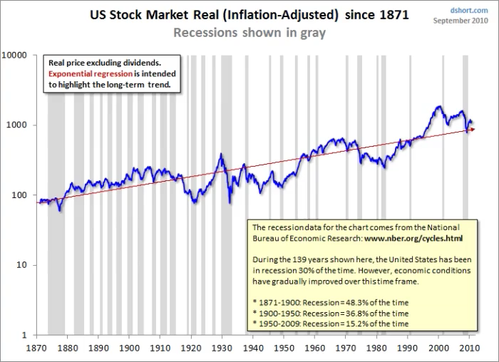
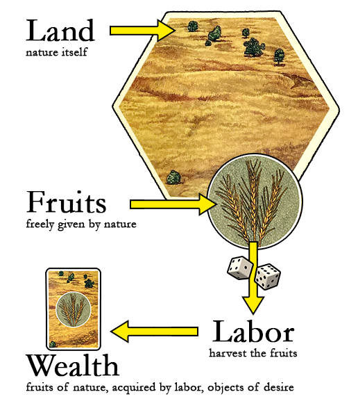
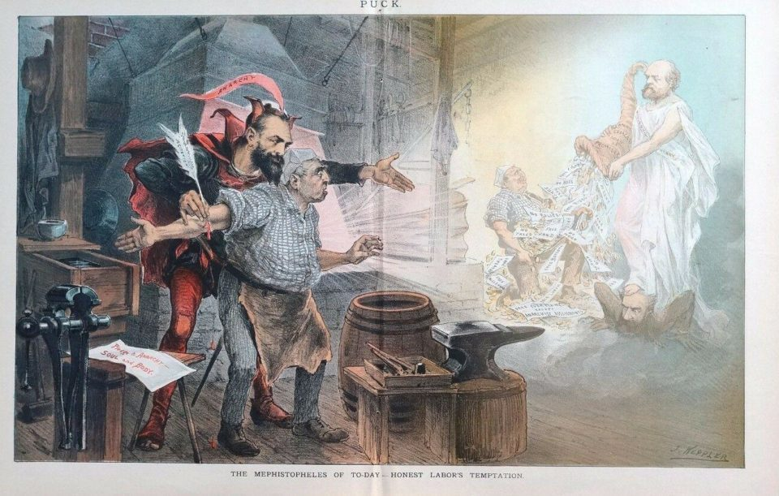
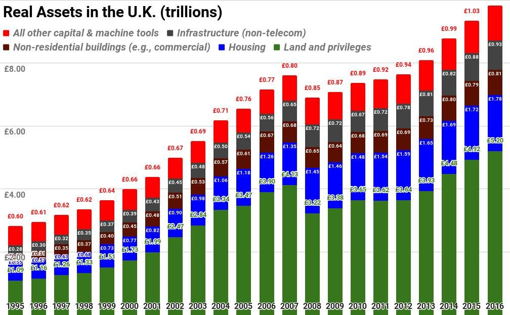
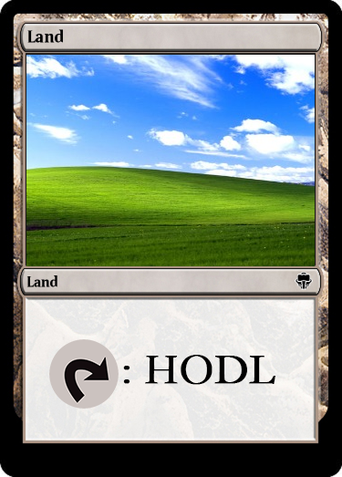
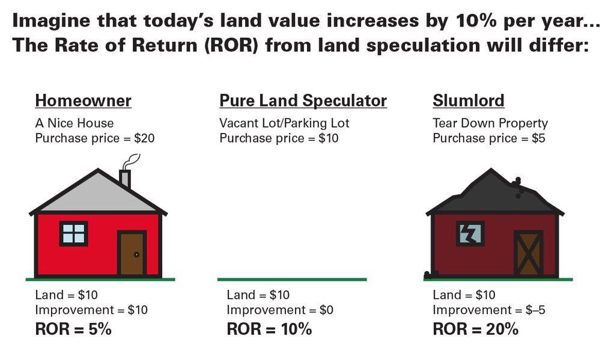
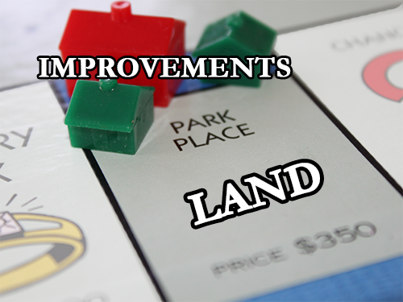
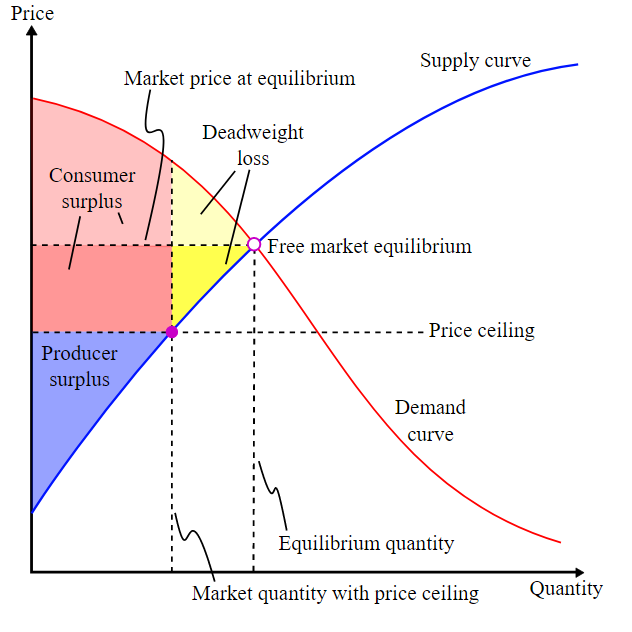
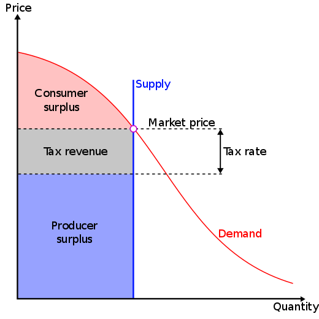
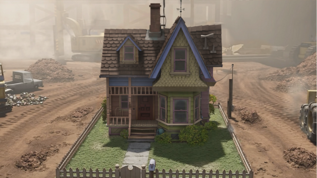

# Book Review: Progress and Poverty

by [Lars A. Doucet](lars_a_doucet), 2021

**Part 0 - Book Review: Progress & Poverty 👈** (You are here)  
[Part I  - Is Land Really a Big Deal?](is-land-a-big-deal)  
[Part II - Can Land Value Tax be Passed on to Tenants?](can-lvt-be-passed-on-to-tenants)  
[Part III - Can Unimproved Land Value be Accurately Assessed Separately from Buildings?](can-land-be-accurately-assessed)

## Listen
<iframe src="https://www.listennotes.com/podcasts/astral-codex-ten/your-book-review-progress-QFbzxZteIBS/embed/" height="180px" width="100%" style="width: 1px; min-width: 100%;" frameborder="0" scrolling="no" loading="lazy"></iframe>

## Introduction

In 1879, a man asked "How come all this new economic development and industrialized technology hasn't eliminated poverty and oppression?" That man was Henry George, his answer came in the form of a book called Progress & Poverty, and this is a review of that book.

Henry George is variously known for leading an early movement that popularized Universal Basic Income, sporting a fancy beard while shouting "The Rent Is Too Damn High!" and [inspiring a popular board game](https://web.archive.org/web/20210111131436/https://landlordsgame.info/) that was shamelessly ripped off and repackaged as Monopoly.

But he didn't just write a book. He also [ran for Mayor of New York city in 1886](https://web.archive.org/web/20200926024934/https://www.city-journal.org/html/1886-men-who-would-be-mayor-12622.html), beating out some rando Republican named "Theodore Roosevelt," but ultimately losing to the favored candidate of Tammany Hall, who saw George's radical economic ideas as a threat to their well-oiled political machine (Andrew Yang take note). He ran again in 1897 but died just 4 days before the election, prompting a national outpouring of mourning. According to Ralph Gabriel's Course of American Democratic Thought, in New York alone 200,000 people came to see his body lying in repose, half of which had to be turned away. For context, that one crowd was roughly the size of [10% of the entire population of New York at the time](https://web.archive.org/web/20210217140046/http://demographia.com/db-nyuza1800.htm).

I'm writing this book review for three reasons:

- George's arguments about land, labor, and capital present a fresh alternative to conventional ideas about "Capitalism" and "Socialism" (and whatever we mean by those on any given day)
- The book has timeless advice for navigating modern crises such as ever-rising rents, homelessness, and the [NIMBY](https://en.wikipedia.org/wiki/NIMBY) vs. [YIMBY](https://en.wikipedia.org/wiki/YIMBY) wars.
- This is a golden opportunity to shamelessly over-use the catchy phrase "By George!"

If I had to summarize the book in a single sentence I would put it this way:

> Poverty and wealth disparity appear to be perversely linked with progress, The Rent is Too Damn High, and it's all because of land.

## Table of Contents

- [Introduction](#introduction)  
- [The Book as a Book](#the-book-as-a-book)
- [Volume I](#volume-i)
  - [0. The Problem](#0-the-problem)
  - [I. Wages and Capital](#i-wages-and-capital)
  - [II. Population and Subsistence](#ii-population-and-subsistence)
  - [III. The Laws of Distribution](#iii-the-laws-of-distribution)
  - [IV. Effect of Material Progress upon the Distribution of Wealth](#iv-effect-of-material-progress-upon-the-distribution-of-wealth)
  - [V. The Problem Solved](#v-the-problem-solved)
- [Volume II](#volume-ii)
  - [Insufficiencies of Remedies Currently Advocated](#insufficiencies-of-remedies-currently-advocated)
  - [The Remedy](#the-remedy)
- [Further Reading](#further-reading)
  - [On Georgism](#on-georgism)
  - [On Distributism](#on-distributism-a-close-cousin-to-georgism)
- [Appendices](#appendices)
  - [Appendix A: George Dunks on Malthusianism](#appendix-a-george-dunks-on-malthusianism)
  - [Appendix B: George Dunks on the Conventional Laws of Distribution](#appendix-b-george-dunks-on-the-conventional-laws-of-distribution)
  - [Appendix C: The Insufficiency of Remedies Currently Advocated](#appendix-c-the-insufficiency-of-remedies-currently-advocated)

# The Book as a Book

*Progress and Poverty* is quite readable compared to other 19th-century economic tomes, but has a tendency to repeat itself. This isn't without purpose – George goes to great pains not to be misunderstood; rather than expecting his readers to tease out the meaning of dense prose and spending the next century arguing with each other about what he "really meant", he goes on for pages and pages beating a single concept to absolute death, just to be sure.

As a 19th century treatise of *[Political Economy](https://en.wikipedia.org/wiki/Political_economy)*, the book doesn't match what a modern reader might expect from a book on *[Economics](https://en.wikipedia.org/wiki/Economics)* because it's not packed to the gills with charts, graphs, tables, and statistics (though it does provide a good number of citations and figures). Nevertheless his argument was compelling enough to spawn an entire economic school of thought known variously as [Georgism or Geoism](https://en.wikipedia.org/wiki/Georgism) that persists to this day.

Nowadays Georgism gets slapped with the "heterodox" label, but it's still relevant enough to get the likes of [Paul Krugman](https://web.archive.org/web/20201108115738/https://psmag.com/news/this-land-is-your-land-3392) and [Milton Friedman](https://web.archive.org/web/20200723204745/https://econjwatch.org/File+download/66/2005-04-foldvary-tyranny-statquo.pdf?mimetype=pdf) to grudgingly agree to key points, and [Friedrich Hayek](https://onlinelibrary.wiley.com/doi/epdf/10.1111/1536-7150.00016) is alleged to have been inspired by it to pursue economics in the first place. Marx, on the other hand, [wasn't a fan](https://web.archive.org/web/20201203222039/https://www.marxists.org/archive/marx/works/1881/letters/81_06_20.htm), seeing it as a last-ditch attempt "to save capitalist domination and indeed to establish it afresh on an even wider basis than its present one... [George] also has the repulsive presumption and arrogance which is displayed by all panacea-mongers without exception." I guess you can't please everyone.

George spends the first few books of Volume I establishing terms and methodically tearing apart the prevailing economic theories of his day before presenting his own alternative theories about how the "three factors of production" – land, labor, and capital – relate to each other in the "laws of distribution." He then explains why the existing system causes poverty to advance alongside progress, and why we see industrial depressions. Then, he identifies the root cause of the problem (land ownership and speculative rent) and presents his solution (the Land Value Tax) in Volume II. He spends the entire second volume explaining why it is moral and just, how it should be applied, and why it will solve all of our problems.

For the sake of the reader's attention span, I'll just cover the chapters that constitute the core of George's philosophy. For sections I gloss over, I'll include a brief summary of the main point followed by a jump link to an appendix at the end of the article for those who want more detail. All block quotes are from Progress & Poverty unless otherwise marked.

Special thanks to my friend Adam Perry for helping me edit this piece, as well as to Nate Blair and blogger [BlueRepublik](https://bluerepublik.wordpress.com/) (who have actual degrees in this sort of thing) for fact checking and answering my technical questions in the vain pursuit of not embarrassing myself.

Alright, let's dive in.

# 0. The Problem

George opens by observing an unkept promise made by Industrialists:

> it was expected, that labor-saving inventions would lighten the toil and improve the condition of the laborer.

Industrialization should have freed humankind from drudgery and want. And yet George instead sees:

> complaints of industrial depression; of labor condemned to involuntary idleness; of capital massed and wasting; of pecuniary distress among business men; of want and suffering and anxiety among the working class

If we finally have the necessary material conditions and technology for utopia, why this suffering, waste, and inefficiency?

And what's the deal with industrial depressions? How can there be periods where laborers desperately want to work but can't find employment at the very same time capital sits around in useless piles, begging to be put to productive use?

Contra popular explanations at the time, George argues it "can hardly be accounted for by local causes" such as military expenditures, tariffs, type of government, dense vs. sparse populations, or paper money vs. hard currency. This is because he sees the same basic problem everywhere no matter how different the countries themselves are. Behind all of these troubles George says there must lie a common cause.

Pulling no punches, the man lays the blame at the feet of *progress itself*:

> that poverty and all its concomitants show themselves in communities just as they develop into the conditions toward which material progress tends - proves that the social difficulties existing wherever a certain stage of progress has been reached, do not arise from local circumstances, but are, in some way or another, engendered by progress itself

This is a pretty bold claim: namely, that the resilience of poverty, oppression, and inequality in the face of advancing economic development is not some embarrassing accident we'll eventually get around to fixing, it's an inescapable consequence of our socioeconomic system.

---

## A Brief Interlude from the Future

It's been over 140 years since he wrote the book, so let's hop in my time machine and see how much of George's complaint is still relevant.

Back then, the United States was still in the throes of the [Long Depression](https://web.archive.org/web/20201201000238/https://www.armstrongeconomics.com/history/americas-economic-history/the-long-depression-the-first-great-depression/), which according to the shortest estimate lasted from 1873 to 1879.

Below is a graph ([source](https://web.archive.org/web/20210216220345/https://www.nber.org/research/business-cycle-dating)) of the boom-bust business cycle going back to the 1870's - clearly, recessions were much more frequent and severe in George's time than they are today. The late 1800's were wracked with so many panics and crises in quick succession that some historians count the Long Depression as lasting for a full 23 years from 1873 to 1896!

After the Great Depression in the 1930's, we see a sharp decrease in the duration and frequency of recessions. They're still with us now (and the one we're currently in is the worst since the Great Depression), but you'd still rather be living in 2021 than 1879.

So, have we solved the problem? Is George's complaint obsolete?

I mean, this graph of GDP per capita from Stephen Pinker's Enlightenment Now makes it look like in many ways things are getting better:

And heck, [extreme poverty has been going down everywhere](https://ourworldindata.org/extreme-poverty):

But this can't be the entire picture, or nobody would be complaining about poverty and inequality.

Here - this graph ([source](https://web.archive.org/web/20210112150023/https://howmuch.net/articles/price-changes-in-usa-in-past-20-years)), shows that as consumer goods have gotten cheaper in the United States, health care, higher education, child care, etc., have skyrocketed in price, as examined in great detail in the article [Considerations on Cost Disease](https://slatestarcodex.com/2017/02/09/considerations-on-cost-disease/).

And what about Inequality? In the USA it seems to have reverted to levels not seen since the Great Depression, and even when it was at its lowest in 1978, the top 0.1% (not even the top 1%!) still enjoyed a massively disproportionate share of Wealth ([source](https://web.archive.org/web/20210202081558/http://gabriel-zucman.eu/files/SaezZucman2016QJE.pdf)):

And of course, The Rent Is Too Damn High:

([source](https://web.archive.org/web/20210216184021/https://www.apartmentlist.com/research/rent-growth-since-1960)):

([source](https://web.archive.org/web/20210208185441/https://observationsandnotes.blogspot.com/2011/06/us-housing-prices-since-1900.html)):

Although 2021 seems better than 1879 in absolute material terms, George's complaint still rings true: healthcare and higher education are increasingly unaffordable, inequality is as bad as it ever was, and The Rent Is Too Damn High.

And even if all of these measures had improved as well, we still have to contend with a fundamental complaint: how can human civilization have piled up an amount of wealth best described as absolutely *[banana pants insane](https://web.archive.org/web/20210208132052/https://www.credit-suisse.com/media/../assets/corporate/docs/about-us/research/publications/global-wealth-report-2020-en.pdf)*, and yetstill have poverty, oppression and cyclical recessions? Yes, greed, evil, and human nature will always be with us, but isn't it weird that we haven't eliminated these economic problems the same way we've eliminated Smallpox, Scurvy, and having to write your scathing polemics about Thomas Jefferson by candlelight with a goose feather?

---

Giving the mic back to George, he closes the chapter with this haunting quote, first written 142 years ago:

> If there is less deep poverty in San Fran Francisco than in New York, is it not because San Francisco is yet behind new York in all that both cities are striving for? When San Francisco reaches the point where New York now is, who can doubt that there will also be ragged and barefooted children on her streets?

I'll just leave this here:

[Number of Homeless Children in U.S. At All-Time High; California Among Worst States.](https://web.archive.org/web/20160324104539/https://sanfrancisco.cbslocal.com/2014/11/17/number-of-homeless-children-in-u-s-at-all-time-high-california-among-worst-states/)

# I. Wages and Capital

George insists sloppy terminology leads to sloppy thinking. Naturally, he spends an entire chapter beating words to death to correct this.

## The Meaning of the Terms

Let's start with **Wealth.**

The common usage, both then and now, is "anything with an exchange value." George doesn't like how this mixes dissimilar things.

By George, what is wealth?

Wealth is produced when **Nature's bounty** is touched by **human labor** resulting in a **tangible product** that is the object of **human desire.**

Labor is required, but the amount and type doesn't matter - George offers the example of simply picking a berry off a bush as an act that transforms nature's gifts into human wealth. Note particularly that human desire is an important requirement of wealth; it doesn't matter how much work someone put into something, if it doesn't gratify human needs or desires in some way, it's not wealth.

Speaking of human desire, let's talk about **Value.**

Where does a thing's value come from? The prevailing theory of the day was the [Labor Theory of Value](https://en.wikipedia.org/wiki/Labor_theory_of_value) which originated with Adam Smith and David Ricardo, which says that Labor is the source of value. The early formulations were a bit ambiguous, here's Smith in *Wealth of Nations* for instance:

> The value of any commodity ... is equal to the quantity of labor which it enables him to purchase or command. Labor, therefore, is the real measure of the exchangeable value of all commodities.

So... is a thing's value how much labor it takes to make the thing, or how much labor someone's willing to exchange for the thing?

Nowadays Labor Theory of Value is most commonly associated with Marx. Marx picks a lane and says the value of something is tied to the amount of "socially necessary labor" required to *produce* it.

George goes the other way:

> It is never the amount of labor that has been exerted in bringing a thing into being that determines its value, but always the amount of labor that will be rendered in exchange for it.

- Henry George, *The Science of Political Economy*, p. 253

In other words, "a thing's value is whatever someone is willing to pay for it." This is in line with the so-called [marginal revolution](https://en.wikipedia.org/wiki/Marginal_utility#Marginal_Revolution) (the movement, not the [blog](https://marginalrevolution.com/)) and modern theories of value.

**Labor**

Labor is the exertion of human beings. It's possible to labor to no avail (try punching a concrete wall), but typically humans labor towards an end, such as gaining wealth. But whether or not we accomplish anything with our efforts, George calls them labor. Labor isn't just making things, by the way – it's also moving or exchanging them.

**Production**

Production is labor applied "to the production of wealth." You know, productively. This is all human exertion that isn't punching a concrete wall and rewards you for your efforts with something that fits the definition of wealth. Said wealth is the "product of labor."

**Wages**

> whatever is received as the result or reward of exertion is "wages."

No distinction here is made between blue-collar work and white-collar work – whether one is called "hourly pay" and the other is called "annual salary," George calls them both "wages." It doesn't matter whether you receive them from your boss, from customers, or from nature. If you do work and get something from it, you have received "wages."

With those basics under our belt, let's circle back to **Wealth**:

What are some examples of wealth?

By George, Gold is wealth. Teddy bears are wealth. Tesla roadsters and candy canes and young adult vampire romance novels are wealth. The same goes for fish you've caught, deer you've hunted, and cool looking rocks you've picked up on your morning walk. The value of these things may differ, but as long as they're tangible, originate in nature, someone ever did a lick of work to make or acquire them, and a human being somewhere desires them for any reason, they're wealth.

It gets a little clearer when we ask what *isn't* wealth.

And by George, **Money** isn't wealth.

Articles of gold are wealth because they're tangible things that have been dug up, crafted, and fulfill certain human desires. But paper currency, digital currencies, and other things that aren't inherently valuable but merely _represent_ value are _not_ wealth (outside of putting their physical articles in coin collections or making paper airplanes, and so forth). Now don't get the man wrong, these things are certainly _valuable_. They're just not _wealth_. They are certificates that represent _claims_ on wealth. For any computer programmers in the audience, money is a _pointer_ to wealth.

Likewise **Stocks and Bonds** and other financial instruments are not wealth. These are also just claims on wealth. A creditor's title to **Debt** isn't wealth, either, it's just a claim on the debtor's (typically future) wealth. And, writing as he was not long after the Civil War, George points out that **Slaves** are not wealth either but, represent "merely the power of one class to appropriate the earnings of another class."

Wealth, thus defined, is the terminal "ground truth" bits of the economy, and all the financial layers on top are fancy IOUs that just encode various claims on it.

George offers a thought experiment to test if something is wealth: if you produce a pile of gold, fish, or Lego bricks, you've clearly increased the amount of wealth in the world. But if you produce a giant pile of IOUs that just records who owns what and who owes what to whom, it doesn't matter how many of them you pile up or how long the chains of ownership get, you still haven't increased the amount of real wealth in the world.

Again, this isn't saying the IOUs aren't valuable, they are. But they're only valuable because they ultimately point to real wealth. If you magically transported everyone over to a hypothetical Earth 2, carrying over all of Earth 1's money and financial instruments but none of Earth 1's tangible wealth, the value of all those IOUs would instantly evaporate.

Now what about digital goods? Leaving things like Bitcoin aside for the moment, let's consider the case of a digital image file:

By George, this is **wealth**.

Digital though it may be, it's physically encoded on a storage device somewhere, and is thus tangible (it's not a pure abstract concept flitting about in Platonic heaven) and has its origins in nature. Human exertion built the computer that encodes it, and clicking the button that saves it to disk or displays it on your screen is labor. Finally, it directly satisfies human desires (mine, at the very least). It's value may be negligible, but it's wealth.

By contrast, the digital bit sitting in some database that says I own a particular eBook or mp3 is just a digital IOU – a claim on the wealth that are the physical bits on my local storage device or remote server that digitally encodes the files. The fact that digital files don't _seem_ particularly physical, and that they can be trivially and endlessly copied, doesn't mean that Henry George, magically transported to today, wouldn't regard them as wealth.

Okay, so is there anything else that's not wealth?

By George, Bitcoin isn't wealth, in case you were wondering. It's just a (very fancy) financial instrument, a digital claim on wealth. And that goes for most crypto assets – a token on some blockchain that says I own a painting by Banksy is just another IOU, regardless of the technical sophistication of its distributed trustless ledger.

What about intellectual property? Copyrights, patents, and trademarks are all different forms of **Monopoly** – the exclusive, government-granted legal right to do a particular thing (publish a certain book, manufacture a certain product, use a certain name in business, etc). The exclusive right to do or produce a thing, valuable as it may be, is not the thing itself. By George, Monopoly is not wealth.

But there is something big that _is_ wealth – the C-word.

**Capital.**

By George, Capital is "wealth devoted to procuring more wealth", and it's the next thing he insists everyone is hopelessly confused about.

He quotes Adam Smith, agreeing with him thus far:

> That part of a man's stock which he expects to afford him revenue is called his capital.

...and also gives us a short etymology lesson on the origin of the term:

> The word capital, as philologists trace it, comes down to us from a time when wealth was estimated in cattle, and a man's income depended upon the number of head he could keep for their increase.

("Per capita" being the Latin for "by head")

By George, all capital is wealth, but not all wealth is capital.

George notes capital is often described as being "stored up labor", and endorses this view – but what it really means, is capital is stored up _production._ It's not literally the _labor_ that's stored up but the _wealth_ generated by it, set aside and then dedicated to the purpose of getting more wealth.

George insists that it is the owner's _intention_ that transforms wealth into capital. If you buy an old factory to throw parties in for your hipster friends, it's just wealth. But the minute you decide to put it to work to make something useful (or start charging your hipster friends a cover charge at the door), it becomes capital.

George therefore further insists that a laborer's daily bread and the clothes on their back do _not_ count as capital, because a person has to eat and wear clothes whether they work or not. The laborer's tools (and arguably their steel-toed work boots) can however be counted as capital, because their purpose is to assist the laborer in getting more wealth by working for wages, and the laborer wouldn't acquire, use, and maintain those things otherwise.

George has more exclusions:

> We must exclude from the category of capital everything that may be included either as land or labor.

Human exertion (labor) by itself can never be capital. The _products_ of human labor _become_ capital when they are stored up and set to the purpose of getting more wealth. To muddle this distinction defeats the point of having separate terms for those things at all, and prevents us from reasoning meaningfully about how they relate to one another. Labor is not capital, and neither is labor by itself wealth, it _produces wealth –_ and if it ain't wealth, it ain't capital.

And that brings us to land.

**Land, land, land.**

By George, land is not wealth.

And it's _definitely_ not capital.

The unique specialness of land is George's entire schtick and the very core of his philosophy.

> The term land embraces, in short, all natural materials, forces, and opportunities

That means that a field or a meadow is "land", as is a mountain. But so are the fish in the sea, the clouds in the sky, veins of gold in the earth's crust, and the oil deep under ground. These things aren't yet wealth – not until human beings both a) desire them and b) touch them with labor.

So... land is not wealth.

But... how come? I mean, look: land is tangible, it "comes from nature", humans are always productively applying their labor to it, and it certainly seems capable of gratifying human desires.

George sees this reasoning as understandable, but insists it's the root mistake that leads other political economists astray – because for George, land just _is_ nature itself.

Come again?

Land is the ultimate source of all wealth, but it's most useful to think of it as a _generator,_ acompletely separate entity from the wealth that human labor and desire draws from it. Players of _Magic: the Gathering_ and _Settlers of Catan_ should already have a solid grasp of this distinction:

In modern times, George would grant electromagnetic spectrum and orbital real estate for satellites the same status of "land" that already applies to farmland and terrestrial real estate. We don't even need to speculate about whether he'd attach this status to sunlight because he straight-up predicted solar power:

> Even the lack of rain which makes some parts of the globe useless to man, may, if invention ever succeeds in directly utilizing the power of the sun's rays, be found to be especially advantageous for certain parts of production.

(That's from _[Protection or Free Trade](https://oll.libertyfund.org/title/george-protection-or-free-trade), footnote 19)_

The important thing to grasp about land is that it comes before everything humans do or make, and is itself a thing no human can make.

Okay, smarty-pants, what about the Netherlands? They've been _making land_ for centuries! Well, land in the Georgist sense doesn't refer simply to "dry land", but also the sea bed, the oceans, and the skies above. The "new land" in the Netherlands counts as an _improvement_ to land that already existed. The seabed was always there, but by filling it in so you can walk around on it, now it's more useful to us (George has a lot to say about improvements to land, which we'll get to later).

Okay, what is land _not_?

> nothing that is freely supplied by nature can be properly classed as capital

By George, land is not wealth.  
And since it's not wealth, it's not capital.

Okay, we get it. Land is very special to Mr. George and we must never put it in the same category as wealth, labor, capital, wages, production, money, or anything else. Why exactly is this so damn important?

Well, by George, if you treat land the same way you would a bar of pig iron, an hour of work, or a dollar bill, before you know it you'll get poverty paradoxically advancing alongside progress, inexplicable bouts of industrial depression, literal genocides and holocausts (he's dead serious about this), and The Rent Being Too Damn High.

With terminology now firmly established, George moves on to the relationship between wages and capital.

## 3-for-1 special on Wages, Capital, and Labor

I'm condensing three chapters here because they all deal with the same basic thing.

The question George wants to answer is:

> Why, in spite of increase in productive power, do wages tend to a minimum which will give but a bare living?

The conventional wisdom of George's time is that wages are governed by a fixed ratio between the number of laborers and the amount of capital devoted to their employment, because "the increase in the number of laborers tends naturally to follow and overtake any increase in capital."

So it doesn't matter how much capital you throw at employing workers, it'll just attract even more workers splitting it up, so although wages might temporarily wiggle a bit in the long term they'll always settle back to a "natural" minimum. (As we'll see in the next section, this argument stems from Malthusianism).

George spends some time methodically poking holes in the theory (it's predictions don't line up with the facts he observes), and then sets out to prove his replacement theory (emphases mine):

> **wages**, instead of being drawn from **capital**, are in reality drawn from the **product of the labor** for which they are paid.

He pulls a G.K. Chesterton to make his point:

> During the time \[the laborer\] is earning the wages he is advancing capital to his employer, but at no time, unless wages are paid before work is done, is the employer advancing capital to him.

He starts by identifying the source of confusion:

> Because wages are generally paid in money, and in many of the operations of production are paid before the product is fully completed, or can be utilized, it is inferred that wages are drawn from pre-existing capital

I mean, the old theory seems sensible: the employer has capital and uses it to pay wages. But however you slice it, capital's investment gets paid back by production when it takes its cut, so does it even make a difference to talk about where wages are "drawn" from? Value goes out, value comes in, isn't it all a wash?

By George, it isn't: in the old theory, because capital "must come first", it follows that "industry is limited by capital - that capital must be accumulated before labor is employed", which leads to a reductio ad absurdum –

> We are told that capital is stored-up or accumulated labor – "that part of wealth which is saved to assist future production." If we substitute for the word "capital" this definition of the word, the proposition carries its own refutation, for that labor cannot be employed until the results of labor are saved becomes too absurd for discussion.

George anticipates the following rejoinder – Well, when we say 'labor is paid out of capital' we don't mean it as an absolute statement for all stages of human development (or else we have a chicken-and-the-egg problem and civilization could never have begun), we just mean it applies to, say, every civilization that's left the stone age.

George will have none of it and spends three entire chapters relentlessly beating to death the idea that wages are drawn from capital instead of from production.

He starts with the simple case where wages are paid in the form of direct, concrete wealth, then moves on to the more complex case where people are paid in money and other instruments.

**Laboring for wages:**

Imagine a fishing village where nobody cooperates – each person digs their own bait and catches their own fish. Then they discover labor specialization and realize they can catch more fish together if one specializes in digging and the other in catching. So the digger digs, the catcher catches, and they share the fish. The digger really contributes as much to the catch as the one who physically pulls the fish off the hook even though the digger never directly "caught" a fish, and the fish he gets for his work is directly paid out of his contribution to the total production. Later, our fisherfolk invent canoes, and one stays home making and repairing canoes. This increases the haul of the digger and catcher, and the canoe-er gets paid out of her contribution to the increased production. And so it goes as society continues to advance. The work the specialist puts in causes more fish to be caught, and that person's wages is drawn from the growing pile of fish. As George puts it: "Earning is making."

George gives another example:

> If I take a piece of leather and work it up into a pair of shoes, the shoes are my wages – the reward of my exertion. Surely they are not drawn from capital – either my capital or any one else's capital – but are brought into existence by the labor of which they become the wages; and in obtaining this pair of shoes as the wages of my labor, capital is not even momentarily lessened one iota... As my labor goes on, value is steadily added, until, when my labor results in the finished shoes, I have my capital plus the difference in value between the material and the shoes.

And another:

> If I hire a man to gather eggs, to pick berries, or to make shoes, paying him from the eggs, the berries, or the shoes that his labor secures, there can be no question that the source of the wages is the labor for which they are paid.

George goes on to say it doesn't matter if you're paid in money or directly in wealth, because the money is a direct claim on the underlying wealth. It also doesn't matter if you get paid on commission. Imagine a whaling ship where each crewman gets paid a share out of whatever the ship catches. When the ship sails back into port with a hold full of whale oil and bone, the crew gets paid in money, the owner simultaneously adds to his capital oil and bone. The crew's money directly represents their share of the concrete wealth that is the oil and bone. The owner's capital hasn't decreased, and the workers drew their wages directly from the production.

So let's get to the point, Mr. George – wages aren't drawn from capital but instead from production. Great, let's grant that – _so what?_

George hammers away at this because thinking wages are drawn from capital leads to a false conclusion, namely that "labor cannot exert its productive power unless supplied by capital with maintenance."

"Maintenance?" Well, workers need food and clothing and they get paid by their employers, so you could imagine capital as a limiting factor on labor. But by George, food and clothing isn't capital, it's just wealth, as we said before.

And with regard to wages, the point is that the employer always gets "paid" first, because the second the laborer produces value, the employer's capital increases:

> As in the exchange of labor for wages the employer always gets the capital created by the labor before he pays out capital in the wages, at what point is his capital lessened even temporarily?

Okay, but what if I'm just a terrible businessman and I pay somebody $500 an hour to smash Ming vases, then sell the fragments as aggregate to a construction crew for a few pennies a pound, all at a tremendous loss? Surely _then_ the laborer's wages must be drawn from my capital, because there's not enough productive value generated by the labor to draw them from!

George says okay, sure, but only because I'm an idiot and will soon be out of business:

> Yet, unless the new value created by the labor is less than the wages paid, which can be only an exceptional case, the capital which he had before in money he now has in goods – it has been changed in form, but not lessened.

Fair enough, Mr. George, but what if I'm building some enormously expensive multi-decade project, like a dam or a nuclear power plant or a cathedral? The kind of thing we call a "capital-intensive" project? What do you have to say to that?

George points out that as laborers labor, they progressively add value to whatever they're producing. Take the case of a shipwright building ships for an employer – even if the boss can't sell a half-finished ship, it still holds value (for one, it costs less to finish a half-finished ship then no ship at all). And with every stroke of the laborer's work, the employer who owns the shipyard gets an incremental increase in his stock of capital.

> It is not the last blow, any more than the first blow, that creates the value of the finished product – the creation of value is continuous, it immediately results from the exertion of labor.

A pedant would point out that the "last hit" that finishes the product which makes it ready for market adds disproportionate value, but George's point is just to establish that value is continuously created, and doesn't magically come into being allat once right at the end.

George further points out that if you look at things like agriculture you'll see the market directly acknowledging his theory:

> As a plowed field will bring more than an unplowed field, or a field that has been sown more than one merely plowed... It is tangible in the case of orchards and vineyards which, though not yet in bearing, bring prices proportionate to their age.

George freely admits that capital can be _required_ for certain kinds of work, but he disagrees with what its purpose is. It's _not_ a pool that wages get paid out of.

He goes on for another chapter on "The Maintenance of Laborers Not Drawn From Capital" but I think we can safely skip it and move on. TL:DR – George hammers to absolute death the idea that Laborers derive their own maintenance (food/shelter/clothing/etc) from their wages, with George insisting it is drawn from production and... you guessed it, _not from capital._

At least some of George's ideas will not seem so radical to modern readers (especially those already critical of capitalism or neoclassical economics), but it's important to understand that at the time almost everything he was saying was considered deeply radical and shocking. Capital was the fundamental driving force of the economy and labor was utterly dependent on it, and the Malthusian theory of overpopulation was the accepted explanation for why wages were low and workers were starving.

Political Cartoon literally demonizing Henry George – Puck magazine Oct. 20, 1886

## The Real Functions of Capital

Okay, Mr. George. You've spent three whole chapters beating me over the head with what the functions of capital _aren't_. So what _are_ the functions of capital?

Capital "increases the power of labor to produce wealth."

How?

*   By enabling labor to apply itself more effectively (power tools go brrrr)
    
*   By availing labor of the reproductive forces of nature (cows make baby cows)
    
*   By making possible the division & specialization of labor (you dig bait, I'll catch fish)
    

Capital is a _force multiplier_ that supercharges the productive power of labor. It doesn't supply labor with raw materials (nature does), nor does it provide for the maintenance of workers (who eat bread by the sweat of their own brow).

George says this is why capital isn't a limit on industry.

...okay, George grants that capital may limit the _form_ of industry. You can't plow without a plow or milk without a cow. George also grants that the lack of specialized tools _can_ greatly limit productivity because you don't get the benefit of the force-multiplying effect of capital.

Um... aren't you contradicting yourself here, Mr. George? You spent all this time hammering home your doctrine of wages to prove that capital doesn't limit industry, but you just said its absence can limit both the form _and_ the productivity of labor!

Time to unpack what we mean by "limit" and be super clear about it from now on:

> But to say that capital may limit the form of industry or the productiveness of industry is a very different thing from saying that capital limits industry.

Okay, what do you mean?

> For the dictum of the current political economy that "capital limits industry," means not that capital limits the form of labor or the productiveness of labor, but that it limits the exertion of labor.

Okay, I think I see what he's saying. The existing school of thought says that _because_ capital provides labor with both materials and maintenance, _therefore_ if capital dries up, labor productivity must go down because workers will have nothing to work on, and nothing to eat or wear. Labor is thus "limited" by capital, for without it is literally and metaphorically _starved_ for capital.

But George says no – the only way capital actually "limits" productivity in real life is in the degrees by which it force-multiplies labor's productivity and unlocks certain forms of labor in the tech tree. The kind of "limit" George objects to is the idea that you need capital just to get any work done at all, or that without capital to sustain it, labor will shrivel up. Instead, capital is rocket fuel that labor supplies to itself by investing a portion of its wages.

And yet, with all the awesome slots we've unlocked on the tech tree, and barrels and barrels of rocket fuel to fire up eager laborers, we still find our economy sinking into mysterious depressions. _Something_ is gumming up the works, but it's not a simple scarcity of capital:

> the real limitation is not the want of capital, but the want of its proper distribution

Or as G.K. Chesterton said, "Too much capitalism does not mean too many capitalists, but too few capitalists." This might seem like a pedantic distinction – misallocated capital could be said to be "scarce" capital – but they're not the same thing at all. As [Francis Bacon said in 1625](https://quoteinvestigator.com/2016/02/05/muck/):

> Riches were like \[Manure\]: When it lay, upon an heape, it gave but a stench, and ill odour; but when it was spread upon the ground, then it was cause of much fruit.

Because the prevailing theories of George's time are based on incorrect ideas about the relation between wages and capital, "all remedies, whether proposed by professors of political economy or workingmen, which look to the alleviation of poverty either by the increase of capital or the restriction of the number of laborers or the efficiency of their work, must be condemned."

In short, more investment, more protectionism, and more efficiency programs can't, won't, and haven't fixed poverty and industrial depressions because they all proceed from false premises.

Having finally beaten the nexus of wages, capital, and labor into a bloody pulp, George turns his eyes towards another leading theory for why everything is terrible: the specter of overpopulation.

# II. Population and Subsistence

The entire second book might as well be titled "Why Malthus is Dumb and Wrong and Bad."

It's dedicated to dunking on [Malthusianism](https://en.wikipedia.org/wiki/Malthusianism), a philosophy that ascribes economic crises to the exponential growth of the human population, which must necessarily end in catastrophe.

> according to Malthusian theory, poverty appears as increase in population necessitates the more minute division of subsistence.

George attacks Malthusian ideas not just because they're wrong, but because they make it easier to accept the prevailing theory of wages (as more capital is allocated, laborers will keep popping up like weeds to gobble it up, so wages must eternally stagnate). George draws a straight line between these faulty ideas and holocausts and genocides – specifically citing how colonial oppression in China, India, and Ireland were explicitly justified on Malthusian grounds. _One million_ people died in the [English-engineered Irish potato famine](https://www.theirishstory.com/2016/10/18/the-great-irish-famine-1845-1851-a-brief-overview/) alone, and when you add in those who fled the entire population declined by _25% percent_. And this isn't a tenuous link either – George directly connects the completely avoidable famine to his favorite bugbear, private landownership and extortionate rent.

Given that Malthusianism is now widely discredited I'm just going to skip this chapter, but if you want to hear George in all his righteous fury, check out Appendix A (there's a link that returns here at the end):

[Appendix A: George Dunks on Malthusianism](#appendix-a-george-dunks-on-malthusianism)

* * *

# III. The Laws of Distribution

When society produces wealth, who gets different shares of it, and why?

Let's start by beating some words to death.

By George, we're told that there are three factors in production: **Land, Labor,** and **Capital**. For each of these terms there must be a "law of distribution" that explains how each gets compensated for its part in production.

The reward you get from production by owning **Land** is called **Rent.**  
The reward you get from production by supplying **Labor** is called **Wages.**  
The reward you get from production by supplying **Capital** is called ... um, what?

We're looking for a term that clearly expresses the return to capital alone and _nothing_ else.

The closest thing we have is **Interest**, and that's probably good enough.

George gives the common definition of interest as "the return for the use of capital, exclusive of any labor in its use or management, and exclusive of any risk, except such as may be involved in the security." This is pretty close to what we want – something that expresses the _sole_ return to capital without mixing in anything else.

But ... what about **Profits**?

Profits is "almost synonymous" with **revenue,** assuming you have some left after you deduct expenses. It means a gain in money or wealth, but the trouble is this gain is a mix of **rent**, **wages**, and "compensations for the risk peculiar to the various uses of capital." What we want is a term that means the return to capital _alone,_ totally separate from the return to laborers and landowners.

> To talk about the distribution of wealth into rent, wages, and profits is like talking of the division of mankind into men, women, and human beings.

George spends a few pages talking about how everyone from Adam Smith on down got confused about this (spoiler: it's tied up with thinking wages are drawn from capital), before presenting his model for how it all works. If you want to see him knock that stuff down, see Appendix B (there's a link that returns here at the end):

[Appendix B: George Dunks on the Conventional Laws of Distribution](#appendix-b-george-dunks-on-the-conventional-laws-of-distribution)

* * *

Here's George's model for how it all works:

**Land** is"all natural opportunities or forces" and its return is **rent**  
**Labor** is "all human exertion" and its return is **wages**  
**Capital** is"all wealth used to produce more wealth" and its return is **interest**

George says the false assumption at the root of the old theories is in thinking of "capital as the prime factor in production, land as its instrument, and labor as its agent or tool."

George makes the following assertions:

1.  "Labor can be exerted only upon land"
    
2.  "It is from land that the matter which it transmutes into wealth must be drawn"
    
3.  "Capital is not a necessary factor in production"
    

Therefore, we should always put land first in all our inquiries rather than capital, which ought to come last.

George then sets out his three laws of distribution.

## The Law of Rent

Let's be careful about the word "Rent." In modern usage, there is the concept of "Economic Rent" as well as "Rent" in the everyday sense of regular payments you make in exchange for the use of something that you are "renting." The modern definition of "Economic Rent", per Wikipedia is:

> economic rent is any payment ... to an owner or factor of production in excess of the costs needed to bring that factor into production

To be clear, Economic Rent is a bad thing – all taking, no giving.

When George uses the word "Rent", he specifically means the return to land, and this is what he says it is:

> Rent, in short, is the share in the wealth produced which the exclusive right to the use of natural capabilities gives to the owner.

Land has zero cost of production because it's already there and you can't make it. This means that any payment or benefit you can realize by excluding others from using land (or its fruits) is necessarily "in excess of the costs needed to bring that factor into production."

**By George, all land rent is Economic Rent.**

Furthermore, any piece of land has only one seller, and no producers. This further meets the definition of **[Monopoly](https://en.wikipedia.org/wiki/Monopoly)**– Greek for "one seller." This is why you hear Georgists talking about "Land Monopoly."

Land has value because people are willing to pay you for the privilege of using it.  
The price of rent derives from the most marginal land available.  
  
I'll explain with an example. Let's grade some imaginary lots according to their productivity by using abstract utility points, or "utils".

Lot A is good fertile land worth 100 utils.  
Lot B is just as good, also worth 100 utils.  
Lot C is crappy land worth 10 utils.  
  
Let's say I own Lot A. I won't be able to charge you any rent to work on Lot A, if Lot B is freely available for anyone to use. Why would you pay even 1 util worth of rent if you could just work on Lot B, earn 100 utils, and keep it all?

But once I buy Lot B, now if you want access to 100-util Land you have to pay me. How much can I charge? Well, you could always work on Lot C for free, and it'll yield 10 utils. So the most I can charge is 90 utils (100 - 90 = 10).

So here's the Law of Rent – **rent is determined by the** "**margin of production"** (AKA the "margin of cultivation") – the difference between how much you can produce from a particular piece of land (Lot A or B) compared to the least productive alternative (Lot C).

Notice that I as the landlord am not really doing anything here other than owning the land, and yet I can extract a huge amount of value, because unlike capital, land is a hard limit on labor – you can't work without a place to work or without material that comes from nature. And so I take my share first without really contributing anything to production other than gatekeeping access to land.

> Rent, in short, is the price of monopoly, arising from the reduction to individual ownership of natural elements which human exertion can neither produce nor increase.

**C'mon, is land really such a big deal?**

In the popular imagination we pit "capitalists" against "laborers" but a lot of those "capitalists" are landowners in disguise, because in non-Georgist frameworks land is typically considered a kind of capital. George says landowners oppress both labor _and_ capital, cheating both hard work and investment out of their fair share.

Source: can't find the author of this image, closest I can get to its origin is [this blog](https://henrygeorgedevon.wordpress.com/2014/02/02/the-left-and-an-anti-rentier-agenda/)

Okay, but is this still relevant in the modern age, with the internet and work-from-home? Obsessing about land just feels so 19th century. Well, in Silicon Valley rents are famously off the charts, and those and all other rents seep into the economy at every level. Workers priced out of living close by have to spend more time and money commuting longer distances to work, and businesses must devote an increasingly larger share of their production to landowners who aren't actively contributing anything to productivity. What else could explain how a family of four making $100,000 in San Francisco is considered to be living [below the poverty line?](https://sfgov.org/scorecards/safety-net/poverty-san-francisco#:~:text=For%20example%2C%20HUD%20defined%20%E2%80%9CLow,for%20a%20family%20of%20four.)

Here, take a look at this chart ([source](https://web.archive.org/web/20200519142916/https://wid.world/news-article/new-paper-long-run-accumulation-wealth-spain-1900-2014-wid-world-working-paper-2018-5/)):

I found this in a tweet by [Thomas Piketty](https://twitter.com/PikettyLeMonde/status/963093728150933505), and it shows the breakdown of personal assets in Spain over the last 100+ years. The bulk of the value of personal assets is from landownership. This is still the case even though the chart includes "financial assets" – which are just IOUs that ultimately have something real (e.g. land or wealth) underpinning their value. If we exclude those, the true portion of overall value represented by land is even higher than this graph first implies.

And this isn't just Spain. Here's a graph Nate Blair made for the UK, excluding all financial instruments and only looking at real assets:

Based on data from the United Kingdom National Accounts: The Blue Book 2017. Published Oct 31, 2017. Revision Period: Beginning of each time series. Date of next release: July 2018. The "privileges" in "Land and privileges" are things like taxi medallions and patents, that were worth "almost zero" according to Nate.

No matter how hard you try, "there is no occupation in which labor and capital can engage which does not require the use of land." Whenever anyone does labor, the owner of some piece of land – whether it's the farm in the middle of Kansas that grows your food, the lot upon which the server farm sending you these bytes sits, or the ground that right now sits beneath your feet – is sticking their finger in the pie.

George reminds us that labor and capital will have to share whatever landowners take off the top of production in rent:

> As Produce = Rent + Wages + Interest,  
> Therefore, Produce - Rent = Wages + Interest

So... what happens when the productivity of land goes up?

Let's go back to Lot A and Lot B, both 100-util fields. Let's say they belong to different landlords, and I'm a tenant on Lot B. I improve the soil of the field I'm working on so now it's worth 110 utils. What happens?  
  
My landlord raises the rent, of course!

The only way wages (the return to labor) and interest (the return to capital) can go up as productivity increases, is if land values fail to rise at the same rate.

## The Law of Interest

George wants to find the fundamental reason capital is able to produce wealth and justly claim a fair share of production.  
  
Remember that capital is wealth devoted to getting more wealth. So if capital is wealth that begets wealth, it makes sense that if I lend it out to you, I miss out on the potential for it to grow while it's out of my hands. George says I am justly entitled to ask for more back than I originally gave you.

Let's say I loan you some corn seeds for a season. Had I not leant them to you, in a season's time I could have grown my own crop of corn and been left with more seed than I started with. So in a perfectly square deal, you need to give me back what I started with _and_ what I could have expected to gain from natural increase (less the value of the labor required to get things started).

Likewise with any other article of capital – say bricks or lumber. In the time I've spent without it while it was in your possession, I could have found someone else who had a better use for it than I did and exchanged it for something of theirs that I had a better use for, leaving me with capital of greater value. George says the act of progressively exchanging things in a way that increases subjective value for all involved is analogous to the natural forces of nature that make living capital (like corn and cows) grow over time.  
  
Remember, "subjective value" is _real value_. In a game of _Settlers of Catan_, if I have two bricks and you have two lumber, neither of us can build anything. The simple act of trading one brick for one lumber means _both_ of us are better off because each of us can now build a road. The amount of bricks and lumber in the world didn't increase, but the amount of _roads_ (or potential roads) did, and that represents a real increase in wealth.

Interest thus springs from the "reproductive" powers of capital, whether that's biological reproduction, or the more abstract reproductive force of exchanging things so that you have a more valuable distribution of capital than you started with.

As for how it relates to the other two returns to production – the more powerful the "power of increase" the capital has, the greater return interest can claim compared to wages. If you're ploughing a field and I lend you a tractor which makes you ten times as productive, I can justly claim more compensation for that than if I lend you a mule that only makes you twice as productive. However, rent still holds the whip hand, so the margin of cultivation determines how much return is left over to divvy up between interest and wages.

This is because the net "reproductive" value of capital goes down given rent is a general tax on overall productivity. The amount I would have gained by using the thing productively over the period of time it was out on loan (the amount I can justly charge in interest) is reduced by how much I have to pay in rent.

## The Law of Wages

Wages, like interest, are limited by the margin of production. Within that limit there's not much to understand about how wages work except that people seek to satisfy their desires "with the least exertion," which is a fancy way of saying people don't like to get ripped off. If two bosses offer the same exact job, but one offers higher pay, I'm taking that gig. If two bosses pay the same, but one is asking for twice as much work, I'll tell that boss where he can stick it.

> Wages depend upon the margin of production, or upon the produce which labor can obtain at the highest point of natural productiveness open to it without the payment of rent.

So with all three laws established George sums it up like so:

> Where land is free and labor is unassisted by capital, the whole produce will go to labor as wages.  
>   
> Where land is free and labor is assisted by capital, wages will consist of the whole produce, less that part necessary to induce the storing up of labor as capital.  
>   
> Where land is subject to ownership and rent arises, wages will be fixed by what labor could secure from the highest natural opportunities open to it without the payment of rent.  
>   
> Where natural opportunities are all monopolized, wages may be forced by the competition among laborers to the minimum at which laborers will consent to reproduce.

This is the reason George says that wages are so high in "new countries" where there's more land available than in countries where it's been locked up for centuries.

Here's how it all fits together:

> Though neither wages nor interest anywhere increase as material progress goes on, yet the invariable accompaniment and mark of material progress is the increase of rent – the rise of land values.

And:

> where the value of land is highest, civilization exhibits the greatest luxury side by side with the most piteous destitution

# IV. Effect of Material Progress upon the Distribution of Wealth

As a society undergoes material progress, the rent goes up. Why?

Let's break it down. Three things contribute to material progress:

*   Increasing population
    
*   Technological advance
    
*   Improvements in the social fabric
    

"Social fabric" is my term, George calls it "greater knowledge, education, government, police, manners, and morals, so far as they increase the power of producing wealth."

How does **Population growth** affect the distribution of wealth?

Generally speaking, as you get more people your productivity grows exponentially rather than linearly:

> The labor of 100 men ... will produce much more than one hundred times as much as the labor of one man

That's thanks to specialization and division of labor. This happens without needing any technological advance. And as labor's productivity goes up, it makes it worth developing on more marginal (ie, less productive) lands, pushing the margin of production down (and outward geographically), which gives landlords more room to jack up rents.

A bustling town is a more valuable and productive place to live than a tiny hut in the middle of a remote forest. In the town there's a butcher, a baker, a candlestick maker, and others to supply you with whatever your heart desires. In the middle of the forest you have to do everything yourself, regardless of how abundant the natural resources might be. Every neighbor that moves in to town makes you "richer" in this sense because they contribute to the total productive potential of your community.  
  
Population increase also drives productivity by making things valuable that were useless before. Let's say there's some resource on some land, say iron ore. Even if you have all the technology to mine and smelt it, you probably aren't capable of doing this whole operation yourself, and if nobody else lives there you don't have anybody to sell the iron to. It's the presence of a civilization that will give that ore its value, and for that you need to increase the population. Until population shows up to give it value, the ore is "latent potential" in the land.

By George, increasing population increases the share of rent (and decreases the share of interest and wages) in two ways:

1.  It lowers the margin of production
    
2.  It brings out the latent potential of land
    

* * *

How does **Technological advance** affect the distribution of wealth?

Tech saves labor. It lets you accomplish the same thing with less work, or more things with the same amount of work. This leads to more wealth being produced. Now, what do you _need_ to produce more things? Capital is nice to have, but the two things you _must_ have are labor, and land. So wanting to make more things means more demand for land, because you can't labor without it. And when you reach the productive limit of the land available to you, you seek out more marginal lands, extending the margin of production. Demand for land goes up, land values go up, and soon enough The Rent Is Too Damn High.

This means that as you introduce advanced machinery, the extra productivity they bring gets soaked up in rising land values, which gets extorted as rent.

> every labor-saving invention, whether it be a steam plow, a telegraph, an improved process of smelting ores, a perfecting printing press, or a sewing machine, has a tendency to increase rent.

As a historical aside, I'll point out an extreme example of this: the [cotton gin](https://web.archive.org/web/20210203005127/https://www.archives.gov/education/lessons/cotton-gin-patent). This device massively decreased the amount of labor required to process cotton, which ironically _increased_ the spread of slavery (slaves being laborers compelled to pay all their wages in rent). As the amount of slave labor required to process a unit of cotton went down, the margin of production was extended to more marginal lands. This caused the rents on the best lands to go up, further enriching slave-owning plantation landowners and increasing their influence. With the margin extended, demand shot up for land previously deemed unsuitable for cotton production, increasing the pressure to admit new states to the union as slave states.

The gin's effect on entrenching slavery was so profound that it's commonly blamed for prolonging the institution and laying the foundations for the Civil War.

* * *

How does improved **"social fabric"** affect the distribution of wealth?

Improvements to the social fabric that just make society generically better do the same thing. If the people in a neighborhood are nicer and more helpful, provide a robust network of mutual aid, start a bowling league and book club, etc, land values rise. That's because it's more desirable and productive to live in a place where you can e.g. trust your neighbor to watch your kid for an hour while also teaching them to whittle. Land value goes up, and so does the rent.

Now, let's talk about the **expectations raised by material progress**.

What happens when people _know_ something will increase in value?

That's right, they buy it up in a speculative frenzy and hold on to it forever, further driving the price up. With conventional speculative instruments like [beanie babies](https://web.archive.org/web/20210214110406/https://slate.com/technology/2015/02/beanie-babies-bubble-economics-and-psychology-of-a-plush-toy-investment-craze.html) or [tulips](https://web.archive.org/web/20210216123829/https://www.investopedia.com/terms/d/dutch_tulip_bulb_market_bubble.asp), the bubble eventually pops. But Land has unique properties that allow this vicious cycle to continue more or less indefinitely.

What happens when a city is growing, technology is advancing, improvements are being made to land, and so forth? Land values go up. Sure, speculators can still lose their shirts if a city falls into decline, but this isn't nearly as hard to predict as volatility in penny stocks or what [next year's hot Christmas toy will be.](https://web.archive.org/web/20201231131002/https://www.timesunion.com/life/article/Remember-the-Tickle-Me-Elmo-craze-Hot-10781630.php)

So as soon as there's a whiff of progress in a given area everyone starts HODLing land, but not to use it themselves. In fact speculators often keep it _out_ of use, because this forces people to use less valuable land instead, pushing the margin of production down even _further_, forcing land values up, and now The Rent Is Too Damn High.

Georgist pundit geoliberal explains the mindset of a speculator:

> The only thing investors actually maximize is risk adjusted rate of return. When you know rents will increase, your best return comes from buying extra land, not improving the land you have

Illustration courtesy of geoliberal

This is how it's possible to have urban blight and slums in areas with extremely high land values. Even if there's a temporary dip in prices, speculators know that if they just keep HODLing the general trend – absent a local collapse – is that land value always goes up.

Here's George:

> Take now... some hard-headed business man, who has no theories, but knows how to make money. Say to him: "Here is a little village; in ten years it will be a great city—in ten years the railroad will have taken the place of the stage coach, the electric light of the candle; it will abound with all the machinery and improvements that so enormously multiply the effective power of labor. Will in ten years, interest be any higher?" He will tell you, "No!" "Will the wages of the common labor be any higher...?" He will tell you, "No the wages of common labor will not be any higher..." "What, then, will be higher?" "Rent, the value of land. Go, get yourself a piece of ground, and hold possession."  
>   
> ...without doing one stroke of work, without adding one iota of wealth to the community, in ten years you will be rich! In the new city you may have a luxurious mansion, but among its public buildings will be an almshouse.

I don't think it's a coincidence that real estate is one of the oldest investments on Earth and the principal concern of basically every war ever.

# V. The Problem Solved

We had two questions at the beginning of this book: why are there industrial depressions, and why poverty seems to advance alongside progress.

You guess it, it's all because of land and rent.

**By George, industrial depressions are caused by land speculation**

Speculation has a tendency to press the margin of production down until it's just past its limit, forcing labor and capital to accept returns so small that it actually hinders production or ceases altogether.

The saving grace is that as long as the population is growing and/or technology is improving, productivity will go up, and production will start again. But soon enough the land values go up. This drives speculators bidding up the price of land, anticipating future even higher land values, which stresses the productive margin again.

So you get a cycle – productivity rises, economy booms, land values rise, production stagnates or stops. No matter how complicated or sophisticated the economy gets with layer upon layer of financialization and abstraction, when you unravel it all George says this is the ultimate cause.

> Periods of industrial activity always culminate in a speculative advance of land values, followed by symptoms of checked production

This is how you get the baffling situation where able hands are eager and willing to work, capital is ready to employ them, natural materials are abundant, and yet the laborers are idle and the factories stand empty.

So that's it for industrial depressions. What about the other paradox of poverty advancing alongside progress?

**By George, poverty advances alongside progress because of rent**

> The reason why, in spite of increase of productive power, wages constantly tend to a minimum which will give but a bare living, is that, with increase in productive power, rent tends to even greater increase, thus producing a constant tendency to the forcing down of wages.

George backs this up with several pages of specific regional figures demonstrating how land values have continued to explode all over the world.

By George, on average and in the long run, no amount of hard work from labor, no force multiplication from capital, no increased gain from co-operation and specialization, no labor-saving invention or increase in personal efficiency, work ethic, or morals, can escape the long reach of rent.

> In short, increased power of production has everywhere added to the value of land; nowhere has it added to the value of labor;

George notes that the mass die-off of the Black Death in England in the 1300's significantly reduced the productivity of the individual laborer, and yet wages went _up_. That's because the decreased population also caused a massive drop in competition for land, in turn causing rents to plummet. (For more detail on this read about the [Peasants' revolt](https://www.jstor.org/stable/j.ctt5vkz35), also known as Wat Tyler's rebellion).

George says the opposite happened during the reign of Henry VIII, who seized the lands of the church and those held in common by the peasants, and handed them out to newly minted aristocrats, which was followed by suppressed wages.

> In the reign of Henry VII., half a bushel of wheat would purchase but little more than a day's common labor, but in the latter part of the reign of Elizabeth, half a bushel of wheat would purchase three day's common labor.

He sums it all up like this:

> Material progress cannot rid us of our dependence upon land; it can but add to the power of producing wealth from land; and hence, when land is monopolized, it might go on to infinity without increasing wages or improving the conditions of those who have but their labor.

So there's our answer: the monkey wrench that causes the boom-bust cycle of industrial depressions is rent, and even though we have more than enough material wealth to provide for everybody's needs, rent prevents us from distributing it fairly and equitably.

# Volume II

Okay, The Rent Is Too Damn High, and now we finally know why. What are we going to do about it?

## Insufficiencies of Remedies Currently Advocated

George goes down the list of everything we've already tried and why it hasn't worked (or has worked, but less well than we hoped), which you can read about in Appendix C (there's a link that returns here at the end):

[Appendix C: The Insufficiency of Remedies Currently Advocated](#appendix-c-the-insufficiency-of-remedies-currently-advocated)

## The Remedy

George says the solution is to make land common property.

He doesn't want to confiscate land, or force everyone to live on some giant hippie commune. He proposes instead to let everyone continue to "own" land exactly as they do now, but we should impose a special tax to neutralize the perverse incentives of land rent.

He anticipates a lot of pushback on this, and promises that his remedy:

*   Is just
    
*   Can actually be practically applied
    
*   Will solve all our problems once and for all
    

## Why the Remedy is Just

George asks, "what constitutes the rightful basis of property?" What gives you the right to say "this is mine?"

George asserts as self-evident the principle that a person is entitled to the fruits of their labor. What you make on your own time with your own resources, is yours to do with as you please – use it, give it away, trade it, destroy it. You don't harm anyone else doing so.

It follows that neither I nor anyone else am entitled to the product of _your_ labor. If we're both independent hunter-gatherers, and you pick some berries from a bush, I don't have any fundamental right to demand them from you.

If you improve land in some way, you're entitled to own and use that, of course. That's the product of your labor. But to claim exclusive and permanent ownership of the land itself – from which all wealth springs and without which labor is impossible – is to demand the product of other's labor. So to invoke the sanctity of private property to defend private land ownership is self-refuting.

But what about the right of "I was here first?" Well, George points out that in most cases someone was there before you were, too (and often they were removed by force). Just because you arrived one second, one minute, one year, or one decade before someone else doesn't give you some fundamental right to exclude others from access to nature's free gifts. (Note: this doesn't give people the right to just come in your house and rifle through your underwear drawer at any time of day, we'll get to that).

And what about native populations? Isn't this just an excuse for colonialists to come in and steal their land by denying their claim of being on the land first? By George, no – this is a good time to point out that many Native Americans already had a roughly Georgist understanding of land – [treating it as common property](https://web.archive.org/web/20210222090841/https://shec.ashp.cuny.edu/items/show/1543), and it was precisely the colonialists' conception of land as private property that was the mechanism by which the indigenous population was expelled and their lands seized.

The English first practiced this on their own people – once upon a time wide swaths of land in England were held in common until the government privatized those lands and gave them out to well-connected gentry in a process called [Enclosure](https://en.wikipedia.org/wiki/Enclosure). If you've ever heard of the [Luddites](https://www.amazon.com/Rebels-Against-Future-Industrial-Revolution/dp/0201407183), you should know they weren't merely rebelling against the march of technology, they were also fighting against the forcible seizure of their lands by industrialists, who far from being salt-of-the-earth free-enterprise entrepreneurs, were in actual fact crony capitalists stealing the people's land with the aid of anti-free-market subsidies and armed thugs, all supported by Big Government™.

As a practical matter though, if you want to impose a Georgist policy, that only applies to territory your state has authority over. Indian reservations in the United States are supposed to be sovereign enclaves with their own jurisdiction. Native Americans should decide for themselves whether they want to adopt any particular policy.

The other reason the remedy is just, is that private ownership of land leads to serfdom.

> The essence of slavery is that it takes from the laborer all he produces save enough to support an animal existence, and to this minimum the wages of free labor, under existing conditions, unmistakably tend.

George points out that even though Slavery was abolished, the Southern landowners just changed the brand name to "sharecropping" and were able to continue to extract tremendous wealth from "free" Black Americans in the form of rent.

Okay, but excluding evil Southern plantation owners, don't landlords deserve compensation for their work? What about Ms. Nguyen, the nice lady who manages your apartment block and went the extra mile for you when your A/C went out last summer?

I like Ms. Nguyen too, but let's contrast her with Mr. Slumlord, who owns the apartment block next door that's superficially identical, but who _won't_ help you when your A/C goes out in the middle of summer.

Ms. Nguyen charges higher "rent" for her much better maintained units because part of that "rent" is actually her justly compensated _wages_ for her _labor_ in managing them, as well as _interest_ from returns on the _capital_ she's invested in their ongoing improvement and maintenance. She also collects a good bit of true Georgian rent because she is, after all, a landlord.

Mr. Slumlord puts in as little work as he can get away with and invests as little capital into maintenance as will keep the state off his back. His return is almost entirely _rent_. And the only reason he can charge rent in the first place is because of the valuable location – value the _community_ produced, not him.

And that's the real injustice of land rent – the community produces the value, but the landlord charges rent to access it.

## Practical Application of the Remedy

Okay, land as common property, rent must die, I'm sold. How do we actually do it?

George proposes a [land value tax](https://en.wikipedia.org/wiki/Land_value_tax), or LVT.

Note I didn't say _property_ tax. Property tax is a tax on the value of a piece of land _and_ it's improvements. So if you're a homeowner, when you pay property tax, you pay tax for _both_ the value of your house _and_ the lot it's sitting on.

With land value tax you _only_ pay tax on the "ground rent", which is the value of your land, but not the improvements.

What's an **improvement**?

By George, a little green house is an improvement. A fancy red hotel is an improvement. A garage, a sidewalk, a public park, a Starbucks, a hotdog stand, are all improvements. Installing a bunch of dikes in the Netherlands and dumping landfill into the seabed to turn wet land into dry is an improvement. All improvements come from labor, and optionally capital, and so its fair for those factors to take their return. If I "rent" you my hotdog stand (but _not_ the lot it sits on) my return would be classified as interest in George's framework because the hotdog stand isn't land, it's capital – the stored-up fruits of my labor that I'm using to get more wealth.

(Modified from [source](https://www.flickr.com/photos/9731367@N02/6988181354/in/photolist-bDwfRq-bSr87x-QkCs2c-cvB5Dd-5AauFs-6sC1An-6H2XFG-2i7YxPR-iKTC2Q-9VxavH-eZmHq7-qhw3QS-5VUCha-2iQHBP3-2iWFjty-8p4miF-fJNDWe-cCNRHd-5VUCbT-5VUCjv-6KqdcF-pb33VZ-UDTXXN-a4MWP9-iUZh8o-fJNFje-mPqyQn-bQwKik-mPsa89-24hisqk-mPs6Jq-mPqvo2-fQ59KS-fK6ecC-3JKX1h-2LEWJW-9VzZf3-mPqwtD-mPqh7K-b385pi-5VYXA9-mPqs3z-az2VaR-mB8hbY-mPs5bL-bDwk63-jaQiXT-jaP52F-jaQzUT-jaPeu8), CC BY 2.0, author: [Philip Taylor](https://www.flickr.com/photos/9731367@N02/))

The problem with our current system is that when anyone in the community builds improvements, it makes adjoining land more valuable, and then those adjoining landlords jack up the rent. This makes things worse for everybody but the landlords. George's insight is that extra value from my improvement "spills over" from my land and is soaked up by the ground rent of your land.

So under a land value tax, we can correct for the perverse economic incentives, distortions, and oppressions that come from land rent, without having to actually take your land from you.

> We may safely leave them the _**shell**_, if we take the _**kernel**_. It is not necessary to confiscate land — only to confiscate rent.

You also are 100% the owner of the improvements on your land, which _won't_ be taxed. This is why Georgism doesn't mean people have the right to barge into your house in the middle of the night even though land is "held in common." Your house is still private property, but the _value_ of the land it sits on is common property.

What if I plant some nice trees, and invest in some landscaping to stop erosion? Where's the line between "improvements" and "ground rent?" In most cases it's pretty straightforward to separately assess the value of a plot from the value of what sits on it (modern [property tax assessors do this already](https://web.archive.org/web/20201215230813/https://www.investopedia.com/articles/tax/09/calculate-property-tax.asp)), but George grants that in some edge cases with the passage of time at least some improvements will be subsumed into the land value and that's okay:

> But it will be said: There are improvements which in time become indistinguishable from the land itself! Very well; then the title to the improvements become blended with the title to the land; the individual right is lost in the common right. It is the greater that swallows up the less, not the less that swallows up the greater.

Okay, ground rent bad. How much should we tax it?  
  
By George, _One Hundred Percent_.

Take the rent the tenant has to pay each month, calculate the portion attributable to the value of the unimproved land itself, and send it to the taxing agency.

## Effects of the Remedy

Wow! 100% tax rate on ground rent! Can we really do that? In practice Georgists often talk about rates closer to 85+% given real-world limitations in assessment, but the point is to hit it as hard as you possibly can. Get close enough and you still have good effects.  
  
Won't land taxes jack up land prices? No, actually - in fact it will do the opposite, because such a tax is laser-calibrated to eliminate speculation, which makes up the bulk of inflated land values, and thus rent. Tax land for the full ground rent and you make real estate _more_ affordable, not less_._

Won't it enable an all-powerful centralized nanny state? Quite the opposite – land value assessment is a fundamentally bottom-up, localized task, so it naturally empowers local municipalities at the expense of distant central authorities. Also, income taxes, wealth taxes, investment taxes, etc, require an ever-vigilant centralized bureaucracy peeking into every aspect of an individual's life to catch tax evaders, who have every incentive to hide their assets or even just flee.

Perversely, the IRS currently [audits the poor at the same rate as the top 1%](https://www.propublica.org/article/irs-now-audits-poor-americans-at-about-the-same-rate-as-the-top-1-percent), even though higher earners are responsible for withholding the vast majority of tax money in fraud.

Land can't move or hide, and nowadays we have tools like [GIS](https://en.wikipedia.org/wiki/Geographic_information_system) to make it even easier to assess. Under land value tax, nobody needs to pry into your personal life or impose burdensome accounting rules on your small business that actually entrench the power of giant corporations (who have entire departments devoted to serving up the [Double Irish with a Dutch Sandwich](https://www.investopedia.com/terms/d/double-irish-with-a-dutch-sandwich.asp)).

* * *

### A Brief Interlude From the Future

Today land value tax is widely considered to be the only tax that doesn't suffer from [Deadweight Loss](https://en.wikipedia.org/wiki/Deadweight_loss).

Deadweight Loss is the lost economic activity or value caused by some policy. It's often summarized by the phrase "If you want less of something, tax it."

Look at this chart, for example:

([source](https://commons.wikimedia.org/wiki/File:Deadweight-loss-price-ceiling.svg), CC BY-SA 2.5, author: [SilverStar](https://en.wikipedia.org/wiki/User:SilverStar))

The place where the demand curve (red) and supply curve (blue) meet is the equilibrium point that the market naturally tends towards. But if we impose a price control lower than what the market will bear, the yellow area of the curve shows economic activity that can't happen. If you put price controls on gasoline, for instance, you'll get shortages because there's more demand than supply, and supply can't profitably rise to meet the extra bit of demand that's willing to pay a little more.

But here's how things look with a land value tax, notice that the supply curve is _vertical_ – that's weird, what does that mean?

([source](https://en.wikipedia.org/wiki/File:Perfectly_inelastic_supply.svg), CC BY-SA 3.0, author: Explodicle)

A vertical supply curve means no matter what the price of land is, the same amount will always be supplied. This is because you can't make land – the supply is effectively fixed. Remember, the Netherlands doesn't count because the sea bed is land, and filling it in is just an improvement to land that already existed. And even if we granted "The Netherlands occasionally makes land" for the sake of argument, the amount of land "created" in this way is pretty darn negligible in the grand scheme of the economy, and almost exclusively the domain of governments or state-owned actors.

The supply of land being fixed has some really interesting properties. By contrast, consider oil, the supply of which is not fixed. If we tax oil, some of the more marginal wells will be too expensive to operate and make a profit, so producers shut those down and the supply of oil decreases. Deadweight loss comes from a producer's ability to change the amount of product they supply in response to price signals. You'll notice the above graph of land tax has no deadweight loss at all!

Since nobody produces land, it's the one thing you can tax without getting less of it. This drives out speculators entirely. Speculators can no longer distort rents by bidding up the price of land and holding it out of use, and can no longer compete with those who actually intend to _use_ the land. This restores the proper balance of land, labor, and capital.

Now if you work harder, or invest more capital, you can actually expect to see an increasing return without it all being gobbled up by ever-increasing rent.

If you think about it this way, land value tax has _negative_ deadweight loss, because it eliminates the speculative distortion that is the unearned privilege of landownership.

Okay, but won't the landlords just pass the land tax on to their tenants?

By George, no. Rent is a price, and price is governed by supply and demand. Supply of land is fixed, so land value tax has no effect on supply. What about demand? Except in cases where it causes the economy to boom (a good thing), land value tax won't increase land value – what it always does, however, is _reduce_ the demand for land by speculators. If it costs nothing to hold on to land, of course I'm going to want to grab some and HODL. If the rent I could hope to gain is taxed away, I won't bother.

Consider the case of oil again, where a tax reduces the supply. Reduced supply, given unchanged demand, causes a rise in price. And you'll find the increase in price tracks very closely with the amount of tax.

Land value tax is just about the _only_ kind of tax that _can't_ be passed off to someone else. For more on deadweight loss and the land value tax, see [Welfare Economics of the Land Value Tax](https://bluerepublik.wordpress.com/2019/07/31/welfare-economics-of-the-land-value-tax/) by BlueRepublik.

So does this mean there can never be profitable landlords ever again? Of course not – they just have to earn their living honestly like everyone else. Remember, we don't tax the _improvements_, just the "ground rent." So Ms. Nguyen still gets paid for all her honest work and judicious investments, but Mr. Slumlord doesn't make a dime until he gets off his lazy butt and does something productive.

This is really important, because aside from speculation, the principal cause of land value increase is _the productivity of your neighbors._ An empty lot in the middle of nowhere is worthless, but an otherwise identical empty lot in the middle of New York city is priceless. As they say in real estate - "location, location, location." The reason location is valuable is because of the activity and contributions of the community, and yet the landlord claims the right to seize it all as rent.

Modern economists have some interesting things to say about George's ideas, too. In 1977 Joseph Stiglitz demonstrated that land rents have a tendency to almost _perfectly equal_ the value of investment in public goods. He called this the [Henry George Theorem](https://web.archive.org/web/20201226155417/https://link.springer.com/chapter/10.1007%2F978-1-349-02917-4_12). Milton Friedman famously called land value tax the "Least Worst" tax.

But one of my all-time favorite endorsements will always be that one time the economist Ramin Shokrizade unwittingly re-derived land value tax from first principles [to (successfully!) fix recessions in EVE Online](https://www.gamasutra.com/blogs/RaminShokrizade/20130405/189984/How_I_Used_EVE_Online_to_Predict_the_Great_Recession.php).

* * *

Okay, so we tax all the ground rent. It will remove the speculative component of the rent (because there will no longer be any incentive to jack the prices up artificially), but it won't drive the price down to zero. That's because 100% LVT is only achievable on a frictionless plane populated by spherical cows; here in the real world you'll be left with a small sliver of land value. And of course regardless of the LVT rate, houses and buildings will still have a price. And that's fine.

Land in Times Square will still be a lot more _valuable_ than land in Podunk, Saskatchewan, but both will approach the same _price_ as the LVT rate gets closer to 100%. This encourages people to actually make use of valuable land rather than holding it out of use, blighting the urban core and forcing development to sprawl out for miles in every direction, leading to worse transportation and more pollution.

But... doesn't this mean that if people aren't putting land to productive use, they'll eventually be pressured to sell it off to someone who will?

George sees this as a _good_ thing.

Without land value tax you get situations where somebody can anticipate that an empty lot will become valuable in the future, buy it, HODL forever, lobby against future development that would depress their property values, and now you have the Bay Area's housing crisis.

Or buy an apartment block, do the absolute minimum the tenants will tolerate without killing you, constantly jack up the rent as the city grows, and you get slums.

As BlueRepublik observes in _[No, Georgism is Still Sane](https://bluerepublik.wordpress.com/2020/04/28/no-georgism-is-still-sane/):_

> If you look at the commercial blight in New York City ([http://www.vacantnewyork.com/](http://www.vacantnewyork.com/)) 90%+ is from landlords refusing to lease out to small businesses, waiting for a larger bank or big business to pay a higher rent bill. This causes property values of nearby businesses to drop, equity value to drop, and businesses to move out from the city center, increasing urban sprawl and urban blight. It’s a massive drain on personal wealth, and is very highly linked with poverty and higher crime rates. It’s also not a great model for having a stable social fabric.

In a fit of performance art, a Georgist by the name of Fay Lewis once famously bought an empty lot and stuck a big sign on it to demonstrate the principle in action:

Okay, but isn't building too much stuff bad for the environment? Won't this encourage over-development?

By George, no. What's bad for the environment is _sprawl_, which the current system encourages and which the land tax would directly attack. If you want dense, walkable cities that don't depend on cars to get around, you should eliminate land speculation.

A stronger objection to land value tax is when it's not some shifty speculator or a genocidal English landlord who suffers the brunt of it, but, say, this guy:

The premise of Pixar's movie _Up_ is that Carl Fredricksen, a lovably grumpy pensioner, is the last holdout standing in the way of developers bulldozing the rest of his neighborhood in the name of Progress™. He refuses to sell because he can't bear to part with the house which for him is tied up with all the cherished memories of his departed wife.

This isn't just sentimental fiction, this is something that [really does happen](https://www.goodthingsguy.com/people/house-inspired-disney/).

Isn't Georgism just going to price the poor Carl Fredricksens out of their homes so that someone with a more """productive""" use can have it instead?

There's several good response to this.

For starters, if you're worried about kindly old people losing their homes, that's a thing that's happening already, and most of the time it's because The Rent Is Too Damn High, and our existing system is net worse on this score. We are currently facing an unprecedented [crisis of evictions](https://www.statista.com/chart/22385/eviction-crisis-us/) in tandem with the COVID pandemic, and it's not like things were peachy before. And even though homelessness seems to be declining in the US overall, it's [getting worse in the most prosperous cities](https://www.economist.com/united-states/2019/10/19/homelessness-is-declining-in-america), exactly as George predicted.

Okay, maybe it's better for renters, but what about people who _own_ their homes, like Carl? Isn't it unfair to stick them with land taxes that might kick them out? What if they're retired?

Remember, let's not confuse land tax with land confiscation, Here's George (emphases mine):

> I do not propose either to purchase or to confiscate private property in land. The first would be unjust; the second, needless. Let the individuals who now hold it still retain, if they want to, possession of what they are pleased to call their land. Let them continue to call it their land. let them buy and sell, and bequeath and devise it. **We may safely leave them the shell, if we take the kernel. It is not necessary to confiscate land; it is only necessary to confiscate rent.**

Okay, but you have to admit that even if the state isn't confiscating everybody's land, if you can't pay your land taxes you have no choice but to sell your land, right? Isn't this _morally_ unjust to the Carl Fredricksens of the world?

First, it's not a given that Mr. Fredricksen will be worse off on net: he already pays income and sales taxes, capital gains on any investments, as well as property tax which taxes both land value _and_ the value of his house. As speculators leave the real estate market the land tax that replaces his property tax drop will drop, and his house is an improvement that goes entirely untaxed.

Also, if the speculators holding onto all the most valuable real estate in the downtown districts are forced to give it up, there won't be as much competition for land and so there's a good chance developers won't be interested in trying to buy up land in a bedroom community in the first place.

BlueRepublik further points out that LVT can be used to fund a Universal Basic Income, which should soften the blow considerably:

> Keep in mind also that the Georgist Land Value Tax is pair with a "Citizen's Dividend" or what we see as UBI, so that it's not the government claiming land rent, rather the land rent is taxed and split up equally for all men.

But as a matter of political practicality, in the rare event that after all that Mr. Fredricksen still somehow finds himself in the hole after LVT is applied, Nate Blair suggests a deferment option to grandfather the Carls of the world through the transition:

> The LVT gets assessed annually for everyone, but owner occupiers (businesses and homeowners) can apply to defer the sum of those payments until they sell or transfer the land. Government can charge a nominal interest.

A final point of modern application of land value taxes is to level the playing field between different areas by eliminating "cost of living" discrepancies that arise entirely from speculative rent. This is pretty relevant given the ["location pay" debate going on in Silicon Valley](https://news.ycombinator.com/item?id=26131138) right now in response to increased remote work as a direct consequence of the COVID pandemic.

* * *

Back to George.

Great, we've taxed ground rent at 100% and eliminated speculation and all other manner of social ills. Now what do we _do_ with the money?

Lots of things!

For one, you can get rid of some other taxes. Back in George's day it was even argued that a 100% land value tax on ground rents should be the _only_ tax – the "Single Tax," replacing all other tariffs, duties, and other taxes (keep in mind this was in the late 1800's and Federal income tax wasn't introduced until the 16th amendment in 1913).

Remember, all these other taxes have deadweight loss. Income tax is a tax on labor, and so taxing it means we really do get less productive labor. The portion of property tax that targets improvements punishes you for investing in improvements, and sales tax is just straight up regressive, hitting the poor harder than the rich.

There's some argument today about whether the "Single Tax" would be enough to fund the modern US budget, with some Georgists saying it would be sufficient and others saying we would still need some other taxes but could at least significantly offset what we already have.

But by George, another thing we could do is just give all the money back to the people, as BlueRepublik mentioned above. This could be used as a straightforward Universal Basic Income – what George calls a [Citizen's Dividend](https://en.wikipedia.org/wiki/Citizen%27s_dividend#:~:text=Citizen's%20dividend%20is%20a%20proposed,land%20and%20other%20natural%20resources.), or what Andrew Yang calls [the Freedom Dividend](https://2020.yang2020.com/policies/the-freedom-dividend/). It could also be used for the funding of public goods. George doesn't see this as an act of charity on the state's behalf – the value of the land has its origin in the productive labors of the entire community, so it's a simple act of justice to give the returns to those who actually produced the value, which is society at large.

Another effect George asserts is that once land is no longer monopolized, labor is no longer forced into one-sided competition, so wages start to go up. Even better, laborers now have far more opportunity to go into business for themselves, which spurs innovation and investment.

So to sum up, if we tax the ever loving hell out of ground rent, George says we'll see the following benefits:

*   Make housing much more affordable
    
*   Eliminate perverse incentives and speculation
    
*   Encourage the most efficient use of land
    
*   End wage slavery and rack-rents
    
*   Encourage investment and innovation
    
*   Fund a Universal Basic Income and public goods
    
*   Lower or eliminate some other unpopular taxes
    
*   Not hand everything over to a centralized planned economy that probably won't work
    

The Rent is Too Damn High, but, by George,  
it doesn't have to be.

Next: [Part I  - Is Land Really a Big Deal?](is-land-a-big-deal)  

* * *

# Further reading:

----------------

## on Georgism:

*   [Complete list of works](https://web.archive.org/web/20210220202946/https://www.biblio.com/henry-george/author/42457) by Henry George
    
*   [Wikipedia article on Georgism](https://en.wikipedia.org/wiki/Georgism) and [Land Value Tax](https://en.wikipedia.org/wiki/Land_value_tax)
    
*   [Georgism / LVT FAQ](https://bluerepublik.wordpress.com/2020/04/28/georgism-lvt-faq/) by [@BlueRepublik](https://twitter.com/BlueRepublik)
    
*   [No, Georgism is Still Sane](https://bluerepublik.wordpress.com/2020/04/28/no-georgism-is-still-sane/) by [@BlueRepublik](https://twitter.com/BlueRepublik)
    
*   [Welfare Economics of the Land Value Tax](https://bluerepublik.wordpress.com/2019/07/31/welfare-economics-of-the-land-value-tax/) by @BlueRepublik
    
*   [If the Land Tax Is Such A Good Idea, Why Isn’t It Being Implemented?](https://www.strongtowns.org/journal/2019/3/8/if-the-land-tax-is-such-a-good-idea-why-isnt-it-being-implemented) by [Strong Towns](https://www.strongtowns.org/)
    
*   [The Consequences of Land Speculation are Tenantry and Debt on the Farms,  
    and Slums and Luxury in the Cities](https://books.google.com/books?id=isYCAAAAMAAJ&pg=PA2&lpg=PA2&dq=The+Consequences+of+Land+Speculationare+Tenantry+and+Debt+on+the+Farms,and+Slums+and+Luxury+in+the+Cities&source=bl&ots=95-zsanxSs&sig=ACfU3U3lkh9lRjX7cwynf0psfQIFTLmhVw&hl=en&sa=X&ved=2ahUKEwjU6tuHqPnuAhUBGs0KHXPqC2YQ6AEwAnoECAUQAw#v=onepage&q=upton%20sinclair&f=false) by Upton Sinclair
    

## on Distributism (a close cousin to Georgism):

*   [Wikipedia article on Distributism](https://en.wikipedia.org/wiki/Distributism)
    
*   [Front Porch Republic](https://www.frontporchrepublic.com/) on [Distributism](https://www.frontporchrepublic.com/tag/distributism/)
    
*   [Georgism and Distributism](https://www.cooperative-individualism.org/medaille-john_georgism-and-distributism-2012-sep.pdf) by John Medaille
    
*   [Towards a Truly Free Market](https://www.amazon.com/Toward-Truly-Free-Market-Distributist-ebook/dp/B00JUC6PN0) by John Medaille
    

* * *

# Appendices

These are optional elaborations on sections I glossed over because the Book Review Is Too Damn Long.

## Appendix A: George Dunks on Malthusianism  

Malthusianism in George's time was wildly popular, and often invoked by the ascendant proponents of [Social Darwinism](https://www.britannica.com/topic/social-Darwinism) who took Charles Darwin's theory of "survival of the fittest" and recast it as a moral justification for the [Just World Hypothesis](https://en.wikipedia.org/wiki/Just-world_hypothesis/). Essentially, those that are doing well do so because they are more "fit", and those that are less "fit" tend to perish, and furthermore, this brutal process will actively "improve" the human race. This philosophy was the energizing intellectual force behind both the [Eugenics](https://en.wikipedia.org/wiki/Eugenics) movement and Nazi Germany.

George clearly hates everything about this philosophy but attempts to steel-man it anyways:

> The Malthusian doctrine, as at present held, may be thus stated in its strongest and least objectionable form:  
>   
> That population, constantly tending to increase, must, when unrestrained, ultimately press against the limits of subsistence, not as against a fixed, but as against an elastic barrier, which makes the procurement of subsistence progressively more and more difficult. And thus, wherever reproduction has had time to assert its power, and is unchecked by prudence, there must exist that degree of want which will keep population within the bounds of subsistence.

The weak form of Malthusianism is "people are as dumb as deer and will breed endlessly until there's not enough food and everyone starves to death."

The strong form of Malthusianism is, "of course people aren't mindless deer charging into a brick wall, but there is a firm upper limit that can only give so much before nature will cull the herd without mercy."

And by George, we can't just dismiss the strong form out of hand: "what seems clearer than that there are too many people?"

However, George is suspicious of how easily the Malthusian theory justifies contemporary economic assumptions and assuages the moral sensibilities of the establishment:

> The great cause of the triumph of this theory is that, instead of menacing any vested right or antagonizing any powerful interest, it is eminently soothing and reassuring to the classes who, wielding the power of wealth, largely dominate thought... It furnishes a philosophy by which Dives as he feasts can shut out the image of Lazarus who faints with hunger at his door;

He points out how it lets self-styled "Good Christian Men" reframe their own greed and indifference as just plain good sense:

> In this view, he who in the midst of want has accumulated wealth, has but fenced in a little oasis from the driving sand which else would have overwhelmed it. He has gained for himself, but has hurt nobody. And even if the rich were literally to obey the injunctions of Christ and divide their wealth among the poor, nothing would be gained.

(Aside: I've heard this _exact_ defense offered by many of my fellow Christians)

Okay, George makes a strong _moral_ case. But a moral case isn't enough, and I think this is where many activists of all political stripes go wrong. If you attack the premises of an idea as "dangerous" because it could lead to bad consequences, you're still stuck with a real problem if the premises that animate that "dangerous" idea turn out to be _actually true._ If they're true we're stuck with them, and unless your competing policy admits to the same grim facts, your opponent will just dismiss your entire argument and more importantly, so will their audience.

But if the premises _aren't true,_ then the dangerous and scary policy prescription – say, "let the Irish starve to death" – is both evil _and_ unnecessary. History has shown that many officials will shrug their shoulders at "evil" policies [so long as they believe them to be "necessary."](https://web.archive.org/web/20201124061457/https://aphelis.net/destroy-village-order-save-unknown-1968/)

Cool, we've established that Malthusianism is bad.  
  
Now let's establish that it's _wrong_.

* * *

### A Brief Interlude from the Future

From where we're sitting in 2021, we don't even need George to refute Malthusianism, history has done that for us.

Instead of increasing at an exponential rate, [fertility rates are crashing all over the world](https://ourworldindata.org/fertility-rate). Not in one country, but in virtually _every_ country, and in many the birth rate is already below replacement. Fertility rates have been crashing so hard that some are calling it a "[Global Fertility Crisis](https://web.archive.org/web/20210218012301/https://www.bbc.com/news/health-53409521)." The absolute size of the human population is still growing, but this is just due to inertia; the [human population will peak](https://en.wikipedia.org/wiki/Projections_of_population_growth) somewhere between 9 and 10 billion in the 2060's, and then decline from there.

The two main things Malthus got wrong were failing to anticipate 1) advances in food production technology like the [Green Revolution](https://en.wikipedia.org/wiki/Green_Revolution), and 2) that humans can control their own fertility rates.

* * *

George's strongest arguments against Malthusianism strike directly at the _provably false_ claims of its 19th century proponents and provide some extremely salient applications of George's philosophy.

George takes up the cause of India, China, and Ireland, which were often cited as examples of "overpopulated" countries where many have starved and been forced to emigrate. Per the Malthusians, this is the fault of too many of these poor, ignorant, and deficient people crammed together in too small a space.

By George, it can't be the fault of population density – in his time, Germany, Belgium, England, Netherlands and Italy all have _higher_ population densities than India, China, and Ireland, and could therefore support higher populations with the right conditions. And there's certainly nothing wrong with the people themselves:

> This arises from no innate deficiency in the people, for the Hindoo, as comparative philology has shown, is of our own blood, and China possessed a high degree of civilization and the rudiments of the most important modern inventions when our ancestors were wandering savages.

Instead:

> It arises from the form which the social organization has in both countries taken, which has shackled productive power and robbed industry of its reward.

India is poor not because it has too many Indians, but because it is oppressed by too many Englishmen:

> The millions of India have bowed their necks beneath the yokes of many conquerors, but worse of all is the steady grinding weight of English domination... India now is like a great estate owned by an absentee and alien landlord

George gives us lots of details about the plight of India, China, and Ireland, but for the sake of brevity I'm just going to present the heartbreaking case of the [Great Irish Potato Famine](https://www.theirishstory.com/2016/10/18/the-great-irish-famine-1845-1851-a-brief-overview/) and let it stand in for all three.

To sum up, from 1845 to 1852 there was a period of mass starvation and disease in Ireland. About one _million_ people died, and another million fled the country. The entire population dropped by about 25%:

> The extreme poverty of the peasantry and the low rate of wages there prevailing, the Irish famine, and Irish emigration, are constantly referred to as a demonstration of the Malthusian theory worked out under the eyes of the civilized world.

Many prominent intellectuals of the day looked at the crisis, shook their heads, and said – what do you expect when those ignorant Irish Catholics breed like rabbits and strain Ireland's carrying capacity to its limit? It's just natural selection at work!

George will have none of it:

> The laborer was just as effectually stripped by as merciless a horde of landlords, among whom the soil had been divided as their absolute possession, regardless of any rights of those who lived upon it.

Okay, they had to pay some rent, so what? Didn't they bring their suffering on themselves? Why, the intellectuals ask, didn't the Irish work harder, why did they not improve their local economy and agricultural base? And most importantly, why did they depend on a single monoculture crop (the potato) if a single blight could knock out their entire food supply?

By George, because _The Rent Was Too Damn High!_

> tenants... even if the rack-rents which they were forced to pay had permitted them, **did not dare to make improvements** which would have been **but the signal for an increase of rent.** Labor was thus applied in the most inefficient and wasteful manner.

(emphases mine)

The Irish were really trapped. Working harder to improve the farmland to increase its yield could actually leave them _worse_ off. Any increase in their land's productivity goes to the landlord in the form of increased rents. But even this structural impoverishment of the land wasn't sufficient to cause the famine. Ireland still produced enough food to feed its people:

> For when her population was at its highest, Ireland was a food-exporting country. Even during the famine, grain and meat and butter and cheese were carted for exportation along roads lined with the starving and past trenches in which the dead were piled.

People were literally starving and dying, but because of the structure of land ownership they couldn't even pay their rent, let alone purchase the food grown from their own lands and raised with their own hands. Since the local population couldn't afford it, the (English) landlords sold it abroad to the highest bidder.

> It went not as an exchange, but as a tribute – to pay the rent of absentee landlords; a levy wrung from producers by those who in no wise contributed to production... they lived on the potato, because rack-rents stripped everything else from them.

The Rent Is Too Damn High, and it's not because the designated underclass of the day have too many babies or are too uneducated, too ignorant, too religious, too lazy, or too foreign.

George gets _really_ mad about this, and calls out John Stuart Mill and Henry Thomas Buckle by name for lending credence to the Malthusian explanation of Ireland's suffering.

> I know of nothing better calculated to make the blood boil than the cold accounts of the grasping, grinding tyranny to which the Irish people have been subjected, and to which, and not to any inability of the land to support its population, Irish pauperism and Irish famine are to be attributed; and were it not for the enervating effect which the history of the world proves to be everywhere the result of abject poverty, it would be difficult to resist something like a feeling of contempt for a race who, stung by such wrongs, have only occasionally murdered a landlord!

* * *

[Return to III. The Laws of Distribution](#iii-the-laws-of-distribution)

## Appendix B: George dunks on the Conventional Laws of Distribution  

**Conventional Law 1: Wages** aredetermined by the ratio between capital devoted to the payment & subsistence of labor, divided up by the number of laborers.  
  
**Conventional Law 2: Rent** is determined by something called the "margin of production," AKA the "margin of cultivation."  
  
What's that?  
  
Let L be some land.  
Let W be the worst land available.  
Let A = the produce L makes.  
Let B = the produce you get applying the same amount of labor and capital to W.  
The Rent of L is given by A - B.

The margin of production/cultivation is the difference between how much you can produce from a particular piece of land compared to the least productive alternative.

This is the only conventional law of distribution that George accepts as correct.

**Conventional Law 3: Interest** is the ratio between capital demanded by borrowers and supplied by lenders, falling as wages rise and vice versa. To quote Mill, interest is determined "by the cost of labor to the capitalist."

The problem with these three laws is if Land, Labor, and Capital are the only three factors of production, and each gets its own return, than the three returns should balance. In other words:

Return to Production = Rent + Wages + Interest

If your three returns sum to more or less than 100% of the return to production, something's off, and George says the old laws don't add up – the only one of these he accepts is the law of rent. What's wrong with the other two?

First we've got to stop using "profits" to mean a return to capital. If we look into a profit stream, we see more than one kind of thing. Conventional economists list the following:

1.  Wages of "superintendence"
    
2.  Compensation for risk
    
3.  Return for the use of capital
    

"Superintendence" is a fancy word for management. White-collar though it may be, it's still labor, and it's compensation is **wages**. That's not a return to capital.  
  
As for compensation for risk, George says that risk averages out and disappears when you take the God's eye view and sum all of society's transactions together. If I take the winning side of a bet and you take the losing side, I enjoy gain, you suffer loss, but the amount of wealth in the world hasn't actually increased as a result of our bet.

That leaves return for the use of capital, which George calls **interest.**

> "I shall therefore, consistently with the definitions of political economists, use the term interest as signifying that part of the produce which goes to capital."

* * *

[Return to III. The Laws of Distribution](#iii-the-laws-of-distribution)

## Appendix C: The Insufficiency of Remedies Currently Advocated

Things we've already tried that George says aren't sufficient:

*   Austerity measures & smaller government
    
*   Improved education & worker training
    
*   Labor unions
    
*   Co-ops
    
*   Government redistribution of wealth
    
*   Land redistribution
    

Why they're insufficient:

Austerity & smaller government may help balance the budget, but it is not government spending but rather rent that limits workers' wages.

Education can help an individual, but when land is monopolized workers still compete with each other for labor, so if you send everyone to college all that's changed is now the minimum requirement for every job is a bachelor's degree, and rent still limits wages. What about vocational schools and direct worker training? Even if these are more relevant to teaching relevant skills that raise productivity, the same thing happens; land is monopolized, laborers compete with one another, rent soaks up the gains.

Unions can actually increase wages, because it's one of the few forces strong enough to stand against the power of rent. The problem is that unions face a never-ending uphill battle. We often think of "labor versus capital" but what we often call "capital" is just landowners in disguise (because conventional theories include land as a kind of capital). And landowners have a huge structural advantage in negotiations. Labor is the most vulnerable and will quickly starve if idle, but idle capital likewise earns nothing and is actively eaten away by maintenance costs and depreciation. Landowners however can just sit back and collect rent. Given that land is fixed, it's way easier for landowners to collude than it is for either labor or capital (sans land) to unionize.

Co-ops come in two forms: supplier co-ops and producer/worker-owner co-ops. The former can only lower the cost of exchanges by cutting out middlemen, and the latter just changes the structure of wages (profit-sharing instead of fixed pay). These are good things that help, but don't attack land monopoly and thus can't resist the power of rent.

Government redistribution of wealth through high taxes (presumably income or wealth) have two well known problems. First, you massively increase the size and scope of government, inviting corruption, an invasive surveillance state, and power-hungry politicians. Second, by taxing income or wealth you're also taxing production, creating "Deadweight loss." Also, given labor and capital can move, if you try to tax them more than they like they will just go somewhere else (note that land alone _cannot_ do this). George grants that this kind of brute-force redistributive policy may well be better than the status quo, but we can do a lot better. George further predicts that trying to implement Socialism will lead to demagoguery and dictatorship in actual practice. He admires the ideal, but says that such a society must "grow" rather than be "manufactured."

As for land distribution, George finds fault with it. No matter how you tinker with the rules of who can own land and how or whether it can be sold, in the long run every system tends towards the consolidation of land ownership. Even if you go to the extreme, chop it all up and parcel it out, ownership will inevitably concentrate again.

Ultimately George says all of these remedies are insufficient because they don't address land monopoly and do little or nothing to attack the power of rent.

[Return to The Remedy](#the-remedy)

Next: [Part I  - Is Land Really a Big Deal?](is-land-a-big-deal)  