# 땅은 정말로 중요한 문제인가?

저자: [Lars A. Doucet](lars-a-doucet), 2021

[제0부 - 책 리뷰: 진보와 빈곤](progress-and-poverty-review)  
**제1부  - 땅은 정말로 중요한 문제인가? 👈** (현재 위치)  
[제2부 - 토지 가치 세금이 임차인에게 전가될 수 있을까?](can-lvt-be-passed-on-to-tenants)  
[제3부 - 건물과 분리하여 미개량 토지 가치를 정확히 평가할 수 있을까?](can-land-be-accurately-assessed)  
 

_특별한 감사를 드립니다: Count Bla와 Alexandra Elbakyan_

## 듣기
<iframe src="https://www.listennotes.com/podcasts/astral-codex-ten/does-georgism-work-is-land-wpAtQT8zYbM/embed/" height="180px" width="100%" style="width: 1px; min-width: 100%;" frameborder="0" scrolling="no" loading="lazy"></iframe>

저는 원래 [Astral Codex Ten](https://astralcodexten.substack.com/)의 책 리뷰 콘테스트를 위해 헨리 조지의 [진보와 빈곤](progress-and-poverty-review)을 리뷰했습니다. 헨리 조지는 [조지즘](https://en.wikipedia.org/wiki/Georgism)이라는 경제 철학의 창시자로, 무제한적인 지대 수취자들에 의해 초래되는 박탈에 주로 초점을 맞추고 있습니다. 조지는 두 가지 구체적인 정책을 주창한 것으로 유명합니다: 토지 가치 세금(LVT)과 시민 배당금(현재 우리가 보편적 기본 소득이라고 부르는 것).

아스트랄 코덱스 텐의 독자들이 저를 우승자로 선정했다는 소식에 놀랍고 겸손해졌습니다. 더욱 놀라운 것은 전 세계에서 많은 사람들이 이 기사에 대한 관심을 표현하며 저에게 연락을 주셨다는 점입니다. 가족, 친구, 지인들은 물론, 전혀 모르는 사람들–기업주, 활동가, 팟캐스터, 온라인 게임 디자이너, 투자자, 심지어 전 세계의 정부 관계자들도 포함되었습니다. 스콧의 블로그는 제가 생각했던 것보다 훨씬 더 넓은 영향력을 가지고 있습니다.

이것은 저에게 책임감을 느끼게 합니다. 제 글이 정책 결정에 영향을 미칠 가능성이 있다면, 제가 설득력 있는 논리에 속지 않았는지 확인해야 하며, 그 논리가 진실인지 반드시 확인해야 합니다. 따라서 아래 내용은 조지주의 운동의 주장이 비판에 견딜 수 있는지 공정하고 엄격하며 (가능한 한) 실증적인 평가를 시도한 것입니다.

먼저 편향을 인정하겠습니다. 저는 조지스트이며, 이 철학이 진실이라면 기쁘고, 거짓이라면 슬플 것입니다. 하지만 조지, 정말로 슬픈 것은 조지즘이 틀렸는데도 불구하고 제가 그걸 믿으며 살아가는 세상입니다. 그 세상에서 저는 최악의 경우 사회에 해를 입히는 정책을 옹호하는 데 시간과 에너지를 낭비하게 될 것입니다. 저는 여기서 최선을 다해 검토해 보겠습니다. 댓글 작성자들이 제 맹점을 지적해 주시길 바랍니다. 이 글이 어느 정도 옹호적 글로 보일 수밖에 없지만, 비판자들에게 공격할 수 있는 충분한 여지를 제공할 것을 약속합니다.

* * *

책 리뷰를 읽은 일부 독자들은 조지즘이 실제로 작동한다는 점에 대해 이해할 수 있는 회의감을 보였습니다. 따라서 이번 주에는 가장 자주 제기되는 ‘빅 쓰리’ 비판을 실증적으로 평가해 보겠습니다:

1. 1879년에는 토지가 큰 문제였지만, 오늘날에는 별로 중요하지 않습니다

2. 토지 소유주들은 토지 가치 세금(LVT)을 임차인에게 전가할 것이기 때문에 작동하지 않을 것입니다

3. 현실에서는 토지 가치를 개선 사항과 분리해 정확히 평가할 수 없기 때문에, LVT가 이론상 작동하더라도 실천에서는 작동하지 않을 것입니다

오늘은 첫 번째 비판점인 1번을 다룰 것이며, 다음 두 날에 게시될 후속 기사에서는 2번과 3번을 다루겠습니다. 이 주제에 대해 추가로 글을 쓸 수도 있지만, 그때까지 Astral Codex Ten에서 제 글이 환영받지 못할 수도 있다는 점을 미리 밝힙니다.

[책 리뷰](https://astralcodexten.substack.com/p/your-book-review-progress-and-poverty)를 아직 읽지 않으셨다면, 관련 개념의 간략한 요약을 아래에 게시했습니다. 그렇지 않다면 다음 섹션으로 바로 넘어가셔도 됩니다.

## 목차

- [소개](#introduction)  
- [간단한 요약](#a-brief-recap)  
- [토지는 정말 중요한 문제인가?](#is-land-a-really-big-deal)  
- [1. 도시 부동산의 가치 대부분은 토지입니다](#1-most-of-the-value-of-urban-real-estate-is-land)  
- [2. 미국의 토지 임대료는 정부 지출의 상당 부분을 차지합니다](#2-americas-land-rents-equal-a-sizable-of-government-spending)  
  - [토지 임대료 vs. 예산](#land-rents-vs-budgets)  
  - [토지 임대료로 얼마나 많은 돈을 모을 수 있을까요?](#how-much-money-can-we-raise-from-land-rents)  
  - [ATCOR와 헨리 조지 이론](#atcor-and-the-henry-george-theorem)  
- [3. 토지는 주요 은행 대출의 상당 부분을 차지합니다](#3-land-represents-a-significant-of-all-major-bank-loans)  
- [4. 토지는 개인 총자산의 상당 부분을 차지합니다](#4-land-represents-a-significant-of-all-gross-personal-assets)  
- [5. 토지 소유권은 부유층에 극도로 집중되어 있습니다](#5-land-ownership-is-highly-concentrated-among-the-wealthy)  
 

# 간략한 요약

조지즘은 [정치 경제학](https://en.wikipedia.org/wiki/Political_economy)의 한 학파로, 특히 임대료가 너무 높다는 점에 대해 강하게 비판합니다. 이 학파는 희소한 “생산되지 않은 자산”에 대한 접근을 통제하는 자들로부터 노동과 자본을 모두 해방시키려는 목표를 가지고 있습니다. 예를 들어 토지와 자연 자원 등, 동시에 노력과 자유 기업 정신의 가치를 인정합니다. 조지(George)는 '토지'라는 용어를 단순히 일반적인 토지를 의미하는 것이 아니라 인간과 그들이 생산하는 것 외부의 모든 것을 가리키며, 결국 자연 자체를 의미합니다.

조지즘의 주요 통찰은 경제 이론을 두 요인 모델(노동과 자본)에서 세 요인 모델(토지, 노동, 자본)로 전환하는 것입니다. 그 주요(하지만 유일한 것은 아닌) 정책 제안은 **토지 가치 세금**(LVT)으로, 부동산을 그 “토지 임대료”의 100%에 가깝게 과세하는 것입니다(건물 등 “개량”을 제외한 토지 자체에 대한 임대료 금액). 실제 적용에서는 대부분의 조지주의자들은 85%가 합리적인 목표치라고 생각합니다.

이 용어들에 대한 혼란이 자주 발생하기 때문에, 각각의 의미를 명확히 설명하겠습니다.
 

“**토지 가치**”는 다양한 맥락에서 서로 다른 의미로 사용되는 용어입니다. “토지 가치 세금”이라는 용어에서 “토지 가치”는 토지의 *임대 가치*를 의미합니다. 이는 토지가 시장에서 창출할 수 있는 _반복적 소득_입니다. 이 소득(토지 임대료 또는 “지대”)은 건물과 같은 개선 사항을 제외하고 토지의 독점적 사용에 대해 사람들이 지불하려는 금액입니다. 이에는 “추정 임대료”(자신에게 임대주와 임차인의 역할을 동시에 수행하는 소유주가 자신에게 지불하는 임대료)도 포함됩니다. 이 반복적 소득은 토지의 위치와 자연적 특성(농업적 비옥도, 물, 광물 등 자원의 풍부함 등) 때문에 사람들이 토지를 사용하기 위해 지불하려는 의지에서 비롯됩니다.
 

임대 가치는 *판매 가치*와 관련이 있지만 구분됩니다. 판매 가치는 사람들이 일상적으로 “토지 가치”라는 용어를 사용할 때 의미하는 것입니다. 토지의 판매 가치는 단순히 토지의 판매 가격입니다. 그러나 *완전한* 판매 가치는 현대 평가에서 “완전 시장 가치”라는 용어와 동일합니다. 이는 특정 부동산이 공개 시장에서 제3자 간 거래에서 얻을 수 있는 가격을 의미합니다. 정보가 충분하고 강제되지 않은 당사자 간에 이루어지는 거래에서 해당 부동산이 받을 수 있는 가격입니다. 즉, 토지의 “완전한 판매 가치”는 “공정”하고 개방된 시장 조건 하에서의 구매 가격을 의미하며, 예를 들어 아버지가 귀하에게 귀중한 부동산을 $1에 선물로 주는 경우와 같은 경우는 해당되지 않습니다.

토지 가치 세금은 임대 가치를 포착하기 위해 설계되었습니다. 이는 부동산의 시장 구매 가격에 부과되는 세금이 아니며, 토지 면적당 고정된 세금이 아닙니다. 대신 토지 임대료의 흐름을 재분배하는 세금입니다. 정확히 평가될 경우, LVT가 100%에 가까워질수록 토지의 시장 판매 가치는 0에 가까워지지만 임대 가치는 동일하게 유지됩니다(토지 가격과 임대료의 관계에 대한 자세한 내용은 다음 기사에서 설명됩니다).
 

“100%”라는 숫자에 혼란스러워하지 마세요. 토지 구매 비용이 $10,000이고, 연간 $500에 임대된다면년, LVT가 토지 임대료의 100%를 포착한다면 LVT는 $500/년이며, 이는 판매 가치의 5%에 해당하는 연간 세금입니다.

LVT는 _재산세_와 혼동해서는 안 됩니다. 재산세는 토지와 개선물(일반적으로 건물)을 고려합니다. LVT는 토지만을 고려합니다.

조지스트들은 이 방식으로 토지를 충분히 과세한다면 주택 위기를 종식시킬 뿐만 아니라 뿐만 아니라 경제적 진보와 함께 빈곤이 지속되는 원인이 되는 잘못된 인센티브를 수정할 수 있으며, 동시에 판매세나 소득세와 같은 효율성이 낮은 다른 세금을 낮추거나 심지어 폐지할 수 있는 상당한 세수를 확보할 수 있다고 주장합니다.

이는 거의 모든 경제학자가 LVT가 ‘사망 부담’(경제에 부담을 주어 특정 활동을 더 이상 수익성 없게 만드는 것)이 전혀 없다고 동의하기 때문입니다. 사망 부담이 없는 다른 세금에는 [피고비안](https://www.investopedia.com/terms/p/pigoviantax.asp) 세금(교통 체증이나 오염과 같은 해로운 것에 부과되는 세금)이 있습니다.

하지만 토지 소유주들이 LVT를 보상하기 위해 임대료를 인상해 세금 부담을 임차인에게 전가하지 않을까요? 조지스트들은 아니라고 주장합니다. 왜냐하면 토지는 희소성이라는 특수성을 지니고 있어 누구도 추가로 만들 수 없기 때문입니다. 실제로 LVT는 경제를 활성화시키는 드문 형태의 세금입니다. 왜냐하면 LVT는 임대료 추구와 투기를 억제하기 때문입니다. 일부 조지스트들은 LVT가 모든 다른 비효율적인 세금을 대체할 만큼 충분한 세수를 창출할 수 있다고 주장하며, 이를 '단일 세금'이라고 부르지만, 이는 현대 조지스트들 사이에서 보편적으로 받아들여지는 견해는 아닙니다. 명확히 말해, 현대의 ‘단일 세금’ 지지자들은 LVT가 모든 공공 목적에 _충분_하며, 소득세, 자본세, 관세 등 다른 세금은 세금 수입을 위해 _필요하지 않다_고 믿습니다. 다만 그들은 탄소세나 특정 행위를 억제하기 위한 ‘죄악세’ 등 다른 세금을 다양한 이유로 지지할 수 있습니다.

그러나 조지즘은 LVT로 시작되고 끝나는 것이 아니며, 이 운동은 부동산과 세금 수입에만 국한되지 않습니다. 헨리 조지는 우리가 현재 “보편적 기본 소득”이라고 부르는 것을, 그가 “시민 배당금”(자연스럽게 LVT로 자금 조달)이라고 불렀던 것을 조기 지지했습니다. 하지만 LVT 수익의 모든 돈을 바다에 버린다고 해도, 이 정책의 도시 확산 방지 효과만으로도 [YIMBY](https://en.wikipedia.org/wiki/YIMBY)와 [Strong Towns](https://www.strongtowns.org/landvaluetax) 같은 도시주의자들의 지지를 얻을 만큼 매력적입니다.

조지즘을 자연스러운 결론까지 밀어붙이면, 정부에 의해 강제된 독점권에 대해 의문을 제기하게 될 것입니다. 예를 들어 전자기 스펙트럼, 물, 광물 권리, 위성용 궤도 부동산과 같은 다른 종류의 “토지”에 대한 독점권, 그리고 [연구 논문](https://www.nature.com/articles/nature.2017.22196)과 같은 지적 재산권 게이트키퍼가 초래하는 사적 과세 효과(deadweight loss) 등이 포함됩니다.

그리고 제 본업이 비디오 게임 산업 분석가라면, 언젠가 [MMO(다중 사용자 온라인 게임)의 주택 위기](https://www.gamedeveloper.com/business/digital-real-estate-and-the-digital-housing-crisis)를 [주요 블록체인 게임](https://naavik.co/business-breakdowns/axie-infinity)의 가상 부동산 판매에 적용하게 될 것입니다.

일부 사람들은 소득세와 자본세에 대한 반감 때문에 조지즘에 접근합니다. 일부는 LVT를 통해 풍족한 사회 프로그램을 자금 조달하기 위해, 일부는 환경적 효과의 이점을 위해, 일부는 단순히 '임대료가 너무 높다'고 생각하기 때문입니다. 정치적 스펙트럼의 어디에 서 있든, 당신에게 맞는 클럽 소다와 조지즘의 조합을 찾을 수 있을 것입니다.

# 땅은 정말 중요한 문제인가?

[폴 크루그먼](https://psmag.com/news/this-land-is-your-land-3392)은 주류 경제학자들의 의견을 대변하며 조지주의 분석이 타당하다고 인정하지만, 현대 경제에서 토지가 더 이상 중요하지 않기 때문에 이는 의미 없는 논쟁이라고 주장합니다:

> 믿기 어렵겠지만, 도시 경제학 모델은 실제로 조지주의 세금이 도시 성장 자금 조달에 적어도 적절한 접근 방식임을 시사합니다. 하지만 저는 단순히 말하겠습니다: 현대 복지 국가를 운영하기 위해 토지를 세금으로 걷는 것만으로는 충분한 자금을 모을 수 없습니다. 그건 단순히 충분히 큰 문제가 아니기 때문입니다.

조지, 만약 땅이 그렇게 중요하지 않다면 LVT는 많은 자금을 모을 수 없고, 투기적 땅 소유의 문제는 과대평가되었으며, 이 기사를 읽을 필요가 없습니다.

조지주의자와 마르크스주의자 및 신고전주의자 사이의 주요 갈등은 후자 두 그룹이 토지를 크게 경시하고 논의의 중심을 노동과 자본에 두는 점입니다. 조지주의자에게는 토지가 경제 전체를 이해하는 열쇠입니다.

크루그먼의 주요 비판은 LVT가 충분한 자금을 조달할 수 없다는 점으로, 이는 특히 “단일 세금” 운동에 대한 응답입니다. 조지 시대에는 100% 토지 가치 세금과 모든 다른 세금의 폐지를 동시에 주장하는 것이 인기 있었습니다. 조지 시대에는 연방 소득세가 없었고, 주와 연방 지출도 훨씬 낮았기 때문에 LVT가 충분한 자금을 조달할 수 있는지 여부는 오늘날만큼 논란의 대상이 되지 않았습니다.

하지만 현대의 “단일 세금”이 연방 예산을 충당하기에 충분하지 않다고 가정하더라도, 크루그먼은 핵심을 놓치고 있습니다. LVT의 목적은 단순히 세금을 모으는 것이 아니라 투기, 임대료 추구, 부담스러운 주택 가격, 환경 파괴적인 무분별한 도시 확산을 종식시키는 것입니다. LVT는 이러한 긍정적인 효과만으로도 도입할 가치가 있습니다. 그것이 창출하는 세금이 정부 지출의 모든 비용을 직접적으로 충당하지 않아도 여전히 승리입니다. 이것이 바로 조지스트 경제학자 테렌스 듀이어가 LVT를 “중립보다 낫다”고 부르는 이유입니다.

진보적 크루그먼과 보수적 [밀턴 프리드먼](https://www.youtube.com/watch?v=yS7Jb58hcsc)은 모두 LVT가 [사망 부담](https://www.investopedia.com/terms/d/deadweightloss)이 없다고 동의합니다.asp#:~:text=A%20deadweight%20loss%20is%20a,an%20inefficient%20allocation%20of%20resources.), 이는 LVT가 소득세나 자본세와 달리 생산성에 부담을 주지 않는다는 의미입니다. 이는 LVT를 통해 충분한 자금을 조달할 수 있다면, 정부 지출을 유지하면서 노동세와 같은 비효율적인 세금을 일부 줄일 수 있다는 의미입니다. 이는 정치적으로 인기가 있을 뿐만 아니라 경제에도 도움이 될 것입니다.

이것이 조지스트들이 주장하는 내용입니다. 이 주장이 사실인지 확인해 보겠습니다.

다음은 토지가 '정말 중요한 요소'라는 점을 다양한 측면에서 포착하는 몇 가지 검증 가능한 가설입니다:

1. 도시 부동산 가치의 대부분은 토지에 있습니다

2. 미국의 토지 임대료는 정부 지출의 상당 부분을 차지합니다

3. 토지는 주요 은행 대출의 상당 부분을 차지합니다

4. 토지는 개인 총자산의 상당 부분을 차지합니다

5. 토지 소유는 부유층에 집중되어 있습니다

이 가설들을 절대적으로 증명하려는 것은 아닙니다. 단순히 증거의 대부분이 토지를 현대 경제에서 미미한 문제로 치부하는 주장을 반박하는지 확인하려는 것입니다.

## 1. 도시 부동산 가치의 대부분은 토지입니다

뉴욕 시 중심부에서 사는 것이 네브라스카 중간 지역에서 사는 것보다 더 비쌉니다. 이는 뉴욕의 건설 비용이 네브라스카보다 수십 배 더 비싸기 때문이 아니라, 토지 가격이 수십 배 더 비싸기 때문입니다.

미국 최대 100개 메트로 지역의 토지 가격 지도를 미국 기업 연구소(American Enterprise Institute)에서 제공했습니다. 가장 가치 있는 부동산은 해안 도시 지역에 집중되어 있음을 확인할 수 있습니다.

출처: [미국 기업 연구소](https://www.aei.org/housing/land-price-indicators/) ([방법론](https://www.aei.org/wp-content/uploads/2021/05/AEI-adjusted-Land-Price-and-Land-Share-Indicators-Methodology.pdf?x91208'))

다음은 동일한 지도이지만 '토지 비중'을 나타낸 것입니다. 토지 비중은 부동산 가치 중 토지 자체에 기인하는 비율을 의미합니다. 사막에 움막을 지으면 부동산 가치의 거의 100%가 움막에서 비롯됩니다. 왜냐하면 토지는 가치가 없기 때문입니다. 하지만 샌프란시스코에 움막을 지으면 부동산 가치의 거의 전부가 토지에서 비롯됩니다. 해안선을 따라 대도시로 갈수록 토지 점유율이 100%에 가까워지는 것을 확인할 수 있습니다.

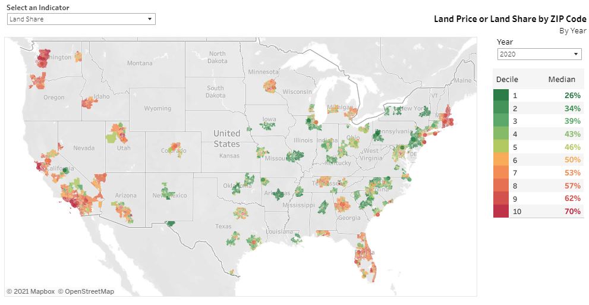

이는 대규모 인구 중심지나 경제 활동과 상업이 활발한 지역 근처에서 토지에 대한 수요가 증가하기 때문입니다. 토지의 가치 상승은 특정 개인 때문이 아니라, 해당 지역을 개발하는 데 기여한 전체 커뮤니티의 공동 노력 때문입니다. 이는 종종 [집적 효과](https://en.wikipedia.org/wiki/Economies_of_agglomeration)라고 불립니다.

그럼에도 불구하고 미국 기업 연구소(American Enterprise Institute)의 데이터를 신뢰하지 않고 다른 사람들의 의견을 듣고 싶을 수도 있습니다.

2014년 맨해튼 섬의 '개발 가능 토지'만으로도 약 $1.74조 달러의 가치를 지닌 것으로 추정되었습니다. 이는 [Barr, Smith, and Kulkarni](https://www.sciencedirect.com/science/article/abs/pii/S0166046217300820)의 자료에 따른 것입니다(단순히 토지 가치만).

2005년부터 2010년까지 뉴욕 시 전체의 도시 용지(매매) 가치는 약 $2.5조 달러로 추정되었습니다. [Albouy, Ehrlich, and Shin](https://web.archive.org/web/20180517024758/http://davidalbouy.net/landvalue_index.pdf)에 따르면 (단순히 토지 가치만).

2020년 기준 뉴욕 시의 모든 부동산 가치는 약 $2.7조 달러로 추정됩니다. [LendingTree](https://web.archive.org/web/20200716152956/https://www.lendingtree.com/home/mortgage/lendingtree-reveals-the-most-valuable-cities-in-america/)에 따르면 2020년 뉴욕시 전체 부동산의 가치는 약 $2.7조 달러였습니다(토지 + 건물).
 

하지만 직접 확인해 보겠습니다. 뉴욕이나 샌프란시스코 같은 대도시에서 [Zillow](https://www.zillow.com) 또는 [Redfin](https://www.redfin.com)에 접속해 간단한 확인을 해보세요. 먼저 도심 중심부에 위치한 빈 부지를 검색하고 매매 가격을 기록하세요. 그 다음, 빈 부지 옆에 위치한 비슷한 크기의 부지에 건물이 있는 곳을 찾아보세요. 최근 몇 년 내에 판매된 경우 마지막 판매 가격이 표시되어 있을 것입니다. 두 가격을 빼면 건물이 있는 부지의 땅값 비율을 대략적으로 계산할 수 있습니다.

샌프란시스코 중심부에 위치한 빈 부지 매물 목록입니다(개인 정보 삭제). $1.99백만 달러를 요구하고 있으며, 해당 지역 다른 매물과 판매 기록을 고려할 때 이 가격에 팔릴 가능성이 높습니다.

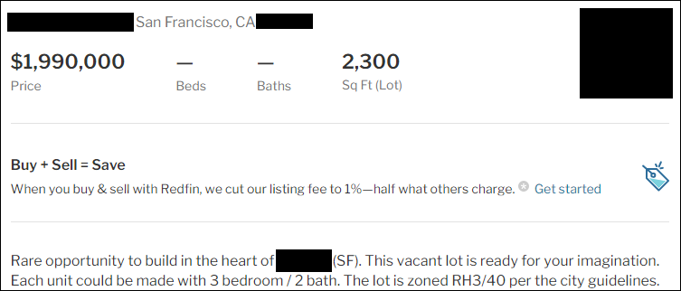 

바로 옆에 위치한 타운하우스는 지난해 판매되었으며, 거의 동일한 크기의 부지에 위치해 있습니다. “Redfin Estimate”는 무시하고, 하단에 표시된 “이 주택의 마지막 판매 가격”인 약 $2.4백만 달러만 참고합니다.

 

이 정보만으로도 현장 점검에 충분합니다. 먼저 면적을 조정합니다. 두 번째 부동산의 부지 면적은 빈 부지의 88% 크기이므로, 빈 부지 가치($1.99M)에 88%를 곱해 $1.75M을 구합니다. 이제 차이를 계산합니다: $2.32M - $1.75M = $568K, 건물의 추정 가치입니다. 이는 총 부동산 가치의 24%가 건물에서, 76%가 토지에서 비롯된다는 것을 의미합니다. 이는 단순 계산이지만, AEI가 2020년 샌프란시스코 카운티의 평균 토지 비중으로 제시한 70.9%와 일치합니다.

우리의 확인 결과는 연구 결과와 AEI의 데이터셋과 일치합니다. 도시 지역의 부동산이 비싼 이유는 토지 때문이며, 가장 가치 있는 토지는 도시 지역에 있습니다.

믿지 못하신다면, [네바다주 게르라흐](https://web.archive.org/web/20210809032137/https://landequities.com/nevada/061-020-55)에 팔 수 있습니다. 하지만 걱정 마세요–가격은 $0.0054/제곱피트입니다. 반면 샌프란시스코의 빈 땅은 $865.21/제곱피트에 거래되고 있으며, 이는 159,000배 이상 비쌉니다.

다양한 토지(매매) 가치 추정 연구와 AEI와 같은 데이터베이스의 증거, 그리고 간단한 확인이 얼마나 쉬운지 고려할 때, 저는 확신합니다.

**결론:** 도시 부동산의 대부분 가치는 실제로 토지에 있습니다.

## 2. 미국의 토지 임대료는 정부 지출의 상당 부분을 차지합니다

크루그먼과 다른 회의론자들은 LVT만으로 현대 국가를 운영할 만큼 충분한 자금을 조달할 수 없다고 주장합니다. 반면 노아 스미스는 [토지는 부의 원천으로 과소평가되고 있다](https://www.bloomberg.com/opinion/articles/2018-01-02/land-is-underrated-as-a-source-of-wealth)고 주장합니다. 누가 옳든 LVT는 다른 모든 세금을 대체하지 않아도 충분한 세수를 확보할 수 있다면 여전히 도입할 가치가 있습니다. 그렇다면 얼마나 모을 수 있을까요? 계산해 보겠습니다.

**스포일러 경고:**
 
보수적인 추산에 따르면 **국방, 사회보장, 또는 메디케어+메디케이드 중 하나를 토지 임대료만으로 완전히 충당할 수 있습니다**. 그리고 낙관적인 추산은 단일 세금(모든 노동과 자본 세금을 토지 임대료 세금으로 대체하는 것)에 도달할 수 있는 범위 내에 있다는 것을 보여줍니다(연방 수준에서至少).

**수학 주의:**
이제 위 주장을 뒷받침하는 모든 연구 논문과 계산에 들어가겠습니다. 계산 과정을 보고 싶지 않고 결론으로 바로 가고 싶다면 다음 섹션으로 이동하세요, **토지 임대료로 얼마나 많은 돈을 모을 수 있을까요?**

* * *

먼저 특정 용어를 매우 정확히 정의해 보겠습니다:

요약하자면, **토지 소득** 또는 **토지 임대료**는 토지 자체가 생성할 수 있는 반복적인 수익 금액입니다. 이는 토지가 제공하는 혜택(작물을 재배할 수 있는 능력, 원하는 직장에 가까운 위치 등)에서 파생되는 임대 가치이며, 사람들이 그 토지에 일정 기간 접근하기 위해 지불할 의향이 있는 최대 금액(전통적인 ‘임대료’)입니다. 결국 토지 소득이 판매 가치를 결정하며, 그 반대는 아닙니다.

**토지 가격** 또는 **판매 가치**는 토지를 구매하는 데 드는 비용입니다. 그러나 **완전 판매 가치**는 “공정”하고 개방된 시장 조건 하에서의 토지 가격을 의미합니다. “불공정”한 조건이란 무엇일까요? 예를 들어, 아버지가 귀중한 부동산을 $1에 선물로 줄 수는 있지만, 개방된 시장에 내놓으면 그보다 훨씬 높은 가격에 팔릴 것입니다. 同様に、압류된 부동산이 급히 경매에 부쳐진 후 경매 승자가 공개적으로 더 높은 가격에 재매각하는 경우도 드물지 않습니다.

좋아요, 그럼 미국 전체의 땅은 얼마나 될까요? 더 정확히 말하면, 미국 전체 땅의 **전체 판매 가치**는 얼마일까요?

다음은 12가지 다른 추정 방법을 바탕으로 한 미국 전체 토지의 총 판매 가치 변화를 시간별로 나타낸 그래프입니다. 자료 출처는 [린컨 연구소](https://web.archive.org/web/20171121002821/http://datatoolkits.lincolninst.edu/subcenters/land-values), [Larson (2015)](https://www.bea.gov/system/files/papers/WP2015-3.pdf), [Albouy, Ehrlich, and Shin (2018)](https://web.archive.org/web/20191217113256/http://davidalbouy.net/landvalue_index.pdf), [미국 기업 연구소](https://www.aei.org/housing/land-price-indicators//), [PLACES Lab](https://placeslab.org/fmv_usa/), [연방준비제도](https://web.archive.org/web/20131211071139/http://www.federalreserve.gov/releases/z1/Current/z1.pdf)를 통해 [매트 이글레시아스](https://slate.com/business/2013/12/value-of-all-land-in-the-united-states.html), [Larson (2019/2020)](https://www.fhfa.gov/PolicyProgramsResearch/Research/PaperDocuments/wp1901-1028.pdf), 그리고 Jeffrey Johnson Smith의 2020년 저서 _[Counting Bounty: The Quest to Know the Worth of the Earth](https://bookshop.org/books/counting-bounty-the-quest-to-know-the-worth-of-earth/9781634242981)._

폴드바리, 스미스, 티데만, 가프니, 코드의 데이터 포인트는 모두 _Counting Bounty_에서 비롯됩니다. 스미스는 자신의 추산치인 $44조 달러를 제시하며, 니콜라우스 티데만이 개인적 서신으로 보낸 $31조 달러 추산치를 언급합니다.

Smith는 Fred Foldvary가 토지 임대료가 국가 소득의 약 1/3에 해당한다고 지속적으로 언급했다고 추가로 언급합니다. Foldvary의 저작물을 간단히 검색해 보면 이 점이 확인됩니다. 여기서 “Foldvary” 라인은 제 개인적인 해석으로, 각 연도의 [GNI](https://fred.stlouisfed.org/series/A023RX1Q020SBEA)의 1/3을 각 연도에 적용한 후 이를 10배로 곱하는 방법입니다(스미스의 토지 임대료를 토지(판매) 가치로 변환하는 방법). 스미스는 메이슨 가프니의 토지 임대료 추산치 $5.3조 달러(총 가치 $53조 달러)를 인용하지만, 해당 원천 자료를 확인하지는 못했습니다. 마지막으로, 스미스의 2020년 단일 데이터 포인트를 다른 데이터 세트의 성장 추세에 따라 5년 전으로 추산했습니다.

이로써 2020년 미국 전체 토지의 (판매) 가치에 대한 엄청난 차이를 보여줍니다.

그래서... 여기서 누구를 믿어야 할까요?

먼저 폴드바리의 추정치부터 시작해 보겠습니다. 폴드바리는 호주에서 테렌스 듀이어가 2003년에 발표한 논문의 결과를 바탕으로, 듀이어가 지적한 동일한 패턴이 미국에서도 적용될 가능성이 높다고 주장합니다.

참고로 테렌스 듀이어는 조지주의자로, 호주 재무부 세무관으로 수년간 근무했으며 총리 및 내각 자문관을 역임했고 세금 정책에 대해 광범위하게 저술했습니다. 그의 논문은 [The Taxable Capacity of Australian Land and Resources](https://www.prosper.org.au/wp-content/uploads/2007/11/dwyer-tax-resources.pdf)입니다.

미국과 달리 호주는 토지 과세와 상세한 토지 평가 기록의 오랜 역사를 가지고 있으며, 드와이어는 이를 바탕으로 토지 소득과 호주 전체 세수 비교를 위한 네 개의 표를 작성했습니다. 호주는 토지 평가와 LVT의 역사를 오늘날까지 이어오고 있지만, 완전히 자동화된 럭셔리 스페이스 조지즘에는 크게 미달하며, 전통적인 자본과 노동 세금에 크게 의존하고 있습니다.

Dwyer의 네 번째 표에서 최근 10년간의 데이터를 보면, 토지 임대료가 호주 전체 세금 수입의 70~75%에 달할 수 있음을 보여줍니다.

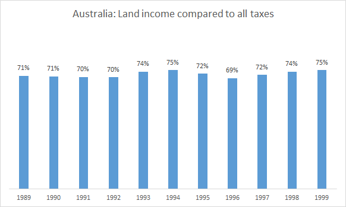 

호주의 토지 소득을 호주 기업 및 개인 소득세로 수집된 세금 수입과 비교하면, 이를 완전히 대체하고 여전히 잉여를 창출할 수 있을 만큼 충분합니다.

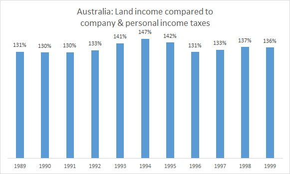

Dwyer의 방법은 타당해 보입니다. 이는 호주의 상세한 토지 및 재산 가치 기록을 호주의 공개된 예산 자료에 직접 적용한 것입니다. Dwyer는 특히 '토지 가치 세금의 동적 효과'에서 발생하는 잠재적 수익을 고려하지 않았습니다. 이는 그의 수치를 더 높일 뿐입니다. 호주에게는 좋은 소식이지만, 적어도 Dwyer와 그의 데이터 출처를 믿는다면 말이죠.

하지만 미국에 대해 말해볼 수 있는지 확인해 보겠습니다. 국가 소득 비율을 빠르게 확인해 보죠. 1999년 Dwyer는 토지 소득을 $132.7억 AUD로 제시했습니다. 1999년 Macrotrends에 따르면 [호주 국민총소득](https://www.macrotrends.net/countries/AUS/australia/gni-gross-national-income)은 $405.5억 USD였으며, [1999년 환율](https://www.macrotrends.net/2551/australian-us-dollar-exchange-rate-historical-chart)를 적용하면 $623.9억 AUD가 됩니다. 이는 토지 임대료 대 GNI 비율이 21.3%입니다. 1991년을 확인해 보면 20.8%로, 약 비슷합니다.

이 수치는 Foldvary의 “1/3” 추정치와는 상당히 차이가 있지만, Steven Cord의 추정치와 유사합니다. Cord는 토지 임대료를 [국가 소득의 약 24%](https://cooperative-individualism.org/barron-ian_steven-cord-challenges-economists-on-the-lack-of-land-value-data-1988-sep-oct.pdf)로 추정했습니다. 스미스의 방법을 적용하면 약 $47조 달러가 됩니다. 폴드바리가 자신의 출처(드와이어)와 모순되기 때문에, 현재는 그의 선을 제외하고 코드용 새로운 선을 구축해야 하며, 폴드바리가 의도한 것을 더 잘 반영하기 위해 미국 GNI의 21%를 사용한 “드워어-미국” 선도 작성해야 합니다. 만약 호주 패턴이 미국에도 적용될 수 있다고 가정한다면, 새로운 차트는 다음과 같이 보일 것입니다:

 

Cord와 Dwyer-USA 선은 단순히 GNI를 단순하게 추적하기 때문에 2005-2008년 주택 버블을 일부 가리지만, 상한선을 제공해줍니다. 이제 세 개의 선이 나타나고 있습니다. 이는 방법론의 차이를 반영할 수 있을까요?

네.

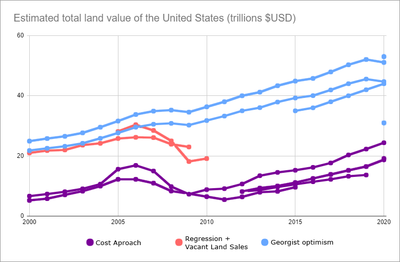

제3부에서는 토지 가치를 정확히 평가하는 방법을 자세히 살펴보겠지만, 현재는 여기에서 사용된 추정 방법 간의 주요 차이를 살펴보겠습니다.

보라색으로 표시된 비관적 값들은 모두 “비용 접근법” 또는 “토지 잔여 가치법”이라는 방법을 기반으로 합니다. 이 방법은 건물을 재건하는 데 필요한 추정 비용을 계산한 후, 건물의 연령에 따른 감가상각을 적용해 이를 뺀 값을 부동산의 총 시장 가치에서 차감해 토지(매매) 가치를 산출하는 방식입니다.

Larson(2019)은 이 방법을 사용했으며, AEI의 수치는 이 결과에 약간의 상향 조정을 가한 것입니다. Lincoln Institute와 연방준비제도(Federal Reserve)의 수치는 동일한 기본 접근법을 사용하며, 공식적인 건설 비용 및 주택 가격 추정치에 의존합니다. 유일한 예외는 PLACES lab의 추정치로, 기계 학습 모델을 사용하지만 단일 연도 결과를 제공하며 네 가지 비용 접근법 선과 일치합니다.

파란색의 낙관적 값은 스미스의 책에 인용된 다양한 조지스트들의 추정치에서 비롯되었으며, 제가 상한선을 설정하기 위해 단순하게 역추산했습니다.

붉은색 중간 값에는 라슨(2015)이 ‘헤도닉 회귀’ 모델을 사용한 결과와 알부이가 빈 땅 판매만 분석한 모델을 사용한 결과가 포함됩니다.

결론적으로, 비용 접근법에 대한 설득력 있는 비판이 많았습니다. 결국 스미스의 추정이 가장 진실에 가깝다고 생각합니다. 라슨, 알부이, 연방준비제도(Fed) 자료를 살펴보며 왜 그런지 이해해 보겠습니다.

### 두 라슨의 이야기

라슨은 자신과 의견이 다릅니다. 이 불일치를 강조하기 위해 다른 줄을 대부분 회색으로 표시하겠습니다.

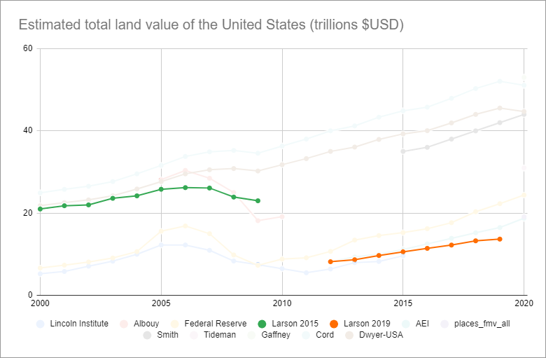

라슨(2015)은 라슨 혼자 작성했으며, [쿠미노프와 포프(2013)](https://doi.org/10.3368/le.89.1.1)에서 설명된 것과 유사한 ‘헤도닉 회귀’ 접근법을 사용했습니다.. 이 방법에서는 부동산의 모든 특성을 기록한 후 컴퓨터 모델을 사용하여 각 요인이 최종 시장 가치에 미치는 개별 기여도를 추출합니다. 이 논문의 데이터는 다양한 출처에서 수집되었으며, 빈 땅 판매, 개발된 부동산 판매, 감정 평가의 공식 통계 등이 포함됩니다.

반면 라슨(2019)은 데이비스, 올리너, 슈이와 공동으로 작성되었으며 비용 접근법을 독점적으로 사용합니다. 중요한 점은 라슨(2019)이 데이터셋에서 모든 빈 땅 판매 데이터를 명시적으로 의도적으로 _배제_했다는 점입니다. 이 추정치는 따라서 시장으로부터의 땅에 대한 실제 데이터와의 _가장 적은_ 직접적인 접점을 가지고 있습니다.

### Albouy의 놀라운 부록

우리는 모두 땅의 판매 가치를 측정하는 가장 순수한 방법은 땅 위에 아무것도 없는 땅을 찾아 시장에서의 판매 가격을 관찰하는 것임을 동의할 수 있을 것입니다. 이러한 데이터 포인트가 충분히 모이면, 그 사이를 보간하여 토지(판매) 가치의 부드러운 그라데이션 지도를 생성할 수 있으며, 이는 대규모 지역의 총 판매 가치를 추정하는 데 충분할 수 있습니다.

불행히도 이 방법은 도시 중심부에서 순수한 토지 판매 사례가 충분하지 않기 때문에 도시 토지(판매) 가치를 모델링하는 데는 작동하지 않습니다.

아니면 있을까요?

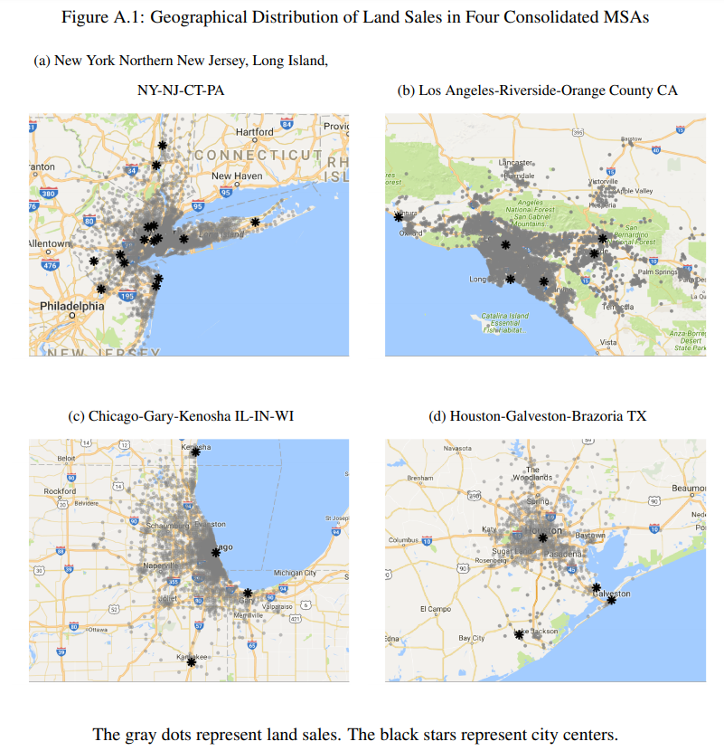 

이 놀라운 수치는 "[온라인 부록](https://mitp.silverchair-cdn.com/mitp/content_public/journal/rest/100/3/10.1162_rest_a_00710/2/rest_a_00710-esupp.pdf?Expires=1640585859&Signature=gnRHP4gjxtsswGVrzQOb98gdycV2TnrrU0Yn5u4C2v7anb7GB-QGQLL7ULbfdAqPDBawButRVxu4PeN35kWbJz5He1I66v02mATLL-MZ6YpoyVWizynxpUq4~I8wfF~yCEaIK5fsVgTOg45xemzQLXWpI311M2I5NBCyz~A2mWV0s8hI71wURagJ-aksPe0F-Wv~xbTZaN2yAAPNbsJxQ4sf8nZl2~1tjLN~h9keA6MU4d70v~gk~7GL9B3dnnfBpLggb1oU3JLZMd5IT1zzG56gVrV-tbZRiXqh05mI8GbixZOYyGVVLXWTP-zVhlEjyPZj9ziDBaN7AYsxEE4GKA__&Key-Pair-Id=APKAIE5G5CRDK6RD3PGA)" 알부이의 논문에 인용된 내용으로, 본 논문의 각주에서 간략히 언급되었습니다. 도시 지역에서 순수 토지 판매가 외곽 지역보다 더 많다는 것입니다. 제가 확인할 수 있는 한, Albouy는 순수 토지 판매 데이터만을 사용해 통계 모델을 구축했으며, 구조물이 있는 토지 판매는 모두 제외했습니다. 그럼에도 불구하고 그의 데이터 포인트는 주요 도시 중심지에 가장 밀집되어 분포되어 있습니다. 이는 이 접근 방식이 정반대의 결과를 초래할 것으로 예상했기 때문입니다.

알부이와 라슨(2015)은 모두 빈 땅 판매를 포함한 회귀 모델을 사용하지만, 알부이는 빈 땅 판매만 고려합니다. 반면 라슨(2019)은 비용 접근법을 사용하며 빈 땅 판매를 명시적으로 제외합니다. 연방준비제도(Federal Reserve) 방법은 어떨까요?

### 모호한 연방준비제도

“연방준비제도” 선은 제 개인적인 해석입니다. 매튜 이글레시아스는 2013년 _[미국 땅의 가치는 얼마인가?](https://slate.com/business/2013/12/value-of-all-land-in-the-united-states.html)_에서 이 방법을 설명하며 $15조 달러라는 결과를 도출했습니다. 이 방법에서는 연방준비제도의 연간 [자금 흐름 보고서](https://www.federalreserve.gov/releases/z1/)에 기재된 재무제표를 살펴보고, 부동산 보유 총액에서 모든 구조물의 대체 가치를 차감합니다. 이 방법이 추정치를 너무 낮게 산출한다는 근거가 충분합니다.

스미스는 연방준비제도의 데이터를 비판하는 데 많은 시간을 할애하며, 이는 마이클 허드슨이 2001년 기사 [Where Did All the Land Go?](https://michael-hudson.com/2001/03/where-did-all-the-land-go-the-feds-new-balance-sheet-calculationsa-critique-of-land-value-statistics/) 허드슨의 발언은 다음과 같습니다:

> 연방준비제도의 방법론을 부문별 분석을 통해 검토했을 때, 토지와 구조물 간의 구분에서 심각한 문제가 발견되었습니다. 예를 들어, 1993년까지 연방준비제도이사회(FRB)는 모든 비금융 기업이 보유한 토지의 가치를 $40억 달러의 음의 가치로 추정했습니다.

이 결과는 실제로 맞습니다. Fed는 이 결과에 당황스러워서 이후 보고서에서 토지(매각) 가치 추정을 보고하지 않았기 때문에, 현재는 이를 자체적으로 계산해야 합니다.

이것은 두 가지 질문을 제기합니다: 1) 이러한 문제들이 오늘날에도 여전히 존재하는지, 2) Fed가 과거에 그렇게 무능했다면, 후속 추산치가 단순히 잘못된 것이 아니라 반대 방향으로, 즉 토지(매각) 가치의 극단적인 과대 추산일 가능성은 없는지?

Smith와 Hudson의 비판 및 제 자신의 데이터 분석에 따르면, 답변은 다음과 같습니다: 1) 현재 문제는 과거보다 덜 심각해 보입니다(부정적인 토지 [판매] 가치가 더 이상 없습니다!), 하지만 어느 정도는 여전히 존재할 가능성이 있습니다. 2) 편향은 가장 가능성이 높은 방향은 하향 방향입니다.

이 모든 것은 비용 접근법의 한계와 관련이 있으며, 이 문제는 많은 논문에서 명시적으로 제기되고 있습니다–라슨(2019)도 포함됩니다.. 건물은 시간이 지나면서 자연스럽게 감가상각되지만, 토지는 일반적으로 가치가 상승합니다. 동일한 디자인의 새 건물을 건설하는 데 드는 비용은 감가상각을 고려하더라도 기존 건물의 실제 가치보다 훨씬 높을 것입니다. 이는 시장이 건물을 건설하는 데 든 비용에 관심이 없기 때문이며, 현재 조건에서 제공하는 가치에만 관심을 갖기 때문입니다.

다음은 인공적인 예시입니다. 10년 전에 $10M을 들여 놀이공원을 건설했다고 가정해 보겠습니다. 이제 잠재적 구매자들이 이를 철거하고 아파트를 건설하려는 경우, 당신의 롤러코스터는 $10M에서 10년 감가상각을 뺀 금액이 아닙니다. 오히려 상태가 괜찮더라도 가치가 제로입니다. 그 이유는 이제 근처에 더 새롭고 좋은 놀이공원이 생겨서 당신을 거의 파산 직전으로 몰아넣었기 때문입니다. 잠재적 구매자들은 놀이공원을 운영하려는 의향이 전혀 없습니다. 그들이 원하는 것은 단지 땅입니다. 당신의 구조물은 철거 비용이 들기 때문에 오히려 _부정적_ 가치를 가질 수도 있습니다.

요약하자면, 비용 접근법은 부동산의 전체 시장 가치에서 부풀려진 건물 가격을 빼는 방식으로 구조물을 과대평가하고 토지를 과소평가하기 때문에 결함이 있습니다.

하지만 방정식의 다른 요소인 부동산의 전체 시장 가치(토지 + 건물)는 어떻게 될까요? 연방준비제도(Federal Reserve)가 이 수치를 평가 가치에 기반해 산정한다면, 그 수치가 너무 낮다는 근거가 있습니다. 첫째, 미국 주와 캐나다 주 중 [연간 재산 가치를 재평가하는](https://www.iaao.org/wcm/Resources_Content/PTAPP.aspx) 곳은 소수에 불과합니다.

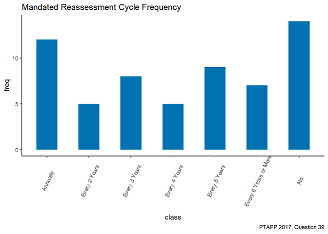

출처: [2017 PTAPP 조사](https://www.iaao.org/wcm/Resources_Content/PTAPP.aspx) 국제 평가관 협회

둘째, 재산세 평가에는 공식 통계를 낮추는 다양한 면제 및 예외 조항이 존재합니다. 캘리포니아의 [Proposition 13](https://en.wikipedia.org/wiki/1978_California_Proposition_13)의 유산을 잠시 제쳐두고, 맨해튼의 이 부동산과 같은 사례의 판매 기록과 세금 기록을 비교해 보겠습니다:

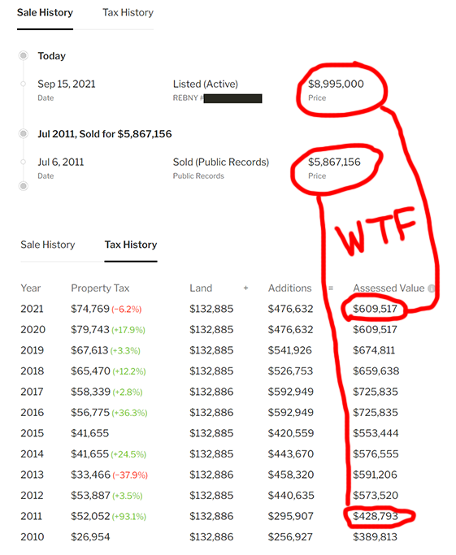

평가 가치가 명백한 시장 가치의 10% 미만

10년 전 580만 달러에 판매되었고 현재 900만 달러에 매물로 나와 있습니다. 그럼에도 불구하고
“평가 가치”는 단 $600K입니다. 무슨 일이 일어나고 있는 걸까요? 평가관은 분명히 이 명백히 수백만 달러 가치의 부동산의 시장 가치가 $600K라고 말하고 있지 않습니다. 대부분의 경우 평가관은 “시장 가치”에 대한 최선의 추정을 제시한 후, 주 법규가 평가관에게 별도의 “평가 가치”를 기재하도록 강제하기 때문에, 이 평가 가치는 특정 할인율을 적용한 값입니다. 하지만 이 세금 평가 기록의 진짜 문제점은 토지 가치 평가가 전혀 변하지 않았다는 점입니다. 10년 동안 가격이 300만 달러 이상 올랐는데, 땅(매매) 가치가 전혀 변하지 않았다고요? 말도 안 돼요.

재산세를 많이 부과하지 않는 기관들은 정확한 평가를 위해 노력할 강력한 동기가 없습니다. 이로 인해 공식 통계가 심각하게 저평가되는 악순환이 발생하며, 같은 통계가 토지가 중요하지 않다는 증거로 사용됩니다.

연방준비제도(Fed)의 총 부동산 가치 데이터가 공식 출처의 재산 가치에 기반을 두고 있다면, 우리는 1) 데이터가 오래되었고 2) 면제, 상한선, 기타 문제로 인해 부동산의 총 시장 가치를 할인했을 것이라고 예상할 수 있습니다(스미스는 Fed와 라슨의 데이터 모두에 대해 동일한 비판을 제기합니다).

개선 비용을 단순한 대체 비용 + 감가상각 공식에 따라 과대평가하고 실제 현재 시장 가치를 반영하지 않는다는 점을 고려할 때, 연방준비제도가 미국 전체 토지(매매) 가치를 $24조로 추정하는 방법은 **보수적인 하한선**이며, 비용 접근법을 사용하는 다른 방법들도 마찬가지입니다.

### 알부이에서 스미스로

좋습니다, 이제 Smith의 방법을 살펴보겠습니다. 새로운 연구를 진행하는 대신, 그는 Albouy의 방법을 가장 우수한 것으로 선정하고 일부 조정을 가했습니다. Albouy는 도시 토지의 판매 가치만을 추정했으며, 연방 토지, 농업용 토지, 수자원 권리 및 자연 자원 등 임대 수익을 창출하고 Georgists가 '경제적 토지'로 분류하는 요소들을 제외했습니다.

Smith는 Albouy가 마지막으로 제시한 수치를 현재 시점으로 외삽하기 위해 주택 시장의 성장률(토지 판매 가치의 상승으로 추정됨)을 적용합니다. 그 다음, 다른 기존 추정치들을 활용해 누락된 토지 유형의 가치를 추가합니다. 이 모든 것이 $44조로 집계됩니다.

우리는 그의 계산을 빠르게 확인할 수 있습니다. 스미스에서 나온 것이 아닌 지난 10년간의 모든 수치는 매우 유사한 성장률을 보이며, 연방준비제도(Federal Reserve)의 수치는 평균적으로 연간 약 $1.4조씩 안정적으로 증가했습니다. 따라서 알부이의 추정을 동일한 성장률로 외삽해 보겠습니다:

 

흥미롭게도 이 결과는 티데만(Tideman)의 추정치보다 약간 높지만 스미스의 최종 가치보다 약 $11조 부족합니다. 미국 농무부(USDA)는 2020년 농지 평균 가치를 [$3,160 / 에이커](https://www.nass.usda.gov/Publications/Todays_Reports/reports/land0820.pdf)입니다. 이 값을 [896.6백만 에이커](https://www.statista.com/statistics/196104/total-area-of-land-in-farms-in-the-us-since-2000/)를 곱하면 $2.8조 달러가 됩니다. 스미스는 2015년 연방 정부의 토지와 광물 매장지 가치를 [$5.5조 달러](https://www.fff.org/explore-freedom/article/there-is-no-social-security-santa-claus/)로 추산한 리처드 에벨링을 인용합니다.. 스미스는 이 가치를 2020년으로 추산하기 위해 외삽법을 적용해 $6.6조 달러로 추정했습니다.

알부이의 외삽선 위에 $2.8T + $6.6T를 추가하면 다음과 같습니다:

이 결과는 스미스의 추산치와 상당히 근접합니다. USDA의 수치는 신뢰할 수 있습니다. 대부분의 농경지는 구조물이 없으며 순수한 땅이기 때문입니다. USDA는 시장 거래를 관찰함으로써 땅의 가치를 평가할 수 있습니다. Ebeling의 경우, 그가 방법론을 제공하지 않기 때문에 그의 말을 믿어야 합니다. Ebeling은 연방 땅을 모두 매각해 세금 납부자에게 보상하자는 극단적인 자유주의자입니다(Smith가 그의 추정을 조지즘을 옹호하는 데 사용한 것을 보면 그가 어떻게 생각할지 궁금합니다!). 하지만 어쨌든, 모든 것을 받아들인다면 스미스의 $44T 추산치에 상당히 가까워집니다. 이 추산치는 스미스의 10:1 비율을 적용해 토지 임대료를 토지 판매 가치로 환산했을 때, 드와이어가 호주에서 관찰한 토지 임대료가 국민소득의 21%라는 비율과도 가깝습니다.

원본 연구 중에서는, 알부이(Albouy)의 방법론이 가장 설득력 있으며, 스미스의 추가 분석과 추론은 합리적입니다. 하지만 공정성을 위해 스미스($44T)를 상한선, 연방준비제도($24T)를 하한선으로 설정합시다.

여기서 주의할 점은 이 땅의 상당 부분이 이미 재산세를 납부하고 있으며, 이는 부분적으로 토지 가치 세금(Land Value Tax)에 해당한다는 점입니다. 연구 결과에 따르면 토지 가치 세금은 토지 가격에 '자본화'됩니다. 이 부분은 다음 번 Part II에서 설명하겠지만, 간단히 말해, 연간 $10,000의 소득을 창출하는 토지가 있다면, 그 토지를 소유하는 특권으로 연간 $5,000를 내야 한다는 것을 알고 있다면, 세금이 존재하지 않는 경우보다 절반의 가격에 구매할 가능성이 높을 것입니다. 이 분석의 목적은 포괄적 LVT가 얼마나 많은 세수를 거둘 수 있는지 추정하는 것이므로, 기존 토지 세금이 현재 토지 가격을 얼마나 억제했는지 계산하고 이 수치를 상향 조정하여 전체 토지 임대료의 더 정확한 추정치로 조정하는 더 엄격한 연구가 필요합니다.

### 토지 임대료 vs. 예산

이제 토지(판매) 가치를 토지 임대료로 변환해야 합니다. 토지 임대료는 토지가 매년 창출할 수 있는 소득 금액입니다.

토지(판매) 가치와 토지 임대료를 변환하려면 **[자본화율](https://en.wikipedia.org/wiki/Capitalization_rate),** 또는 “캡 레이트”를 사용해야 합니다. 토지가 $1M에 구매되었고 연간 $50K의 수익을 창출한다면, 캡 레이트는 $50K/$1M, 즉 5%입니다. 이는 토지 한 필지에서 발생하는 순 운영 수익($50,000)과 그 시장 가치($1,000,000)의 비율입니다.

[출처](https://arbor.com/research/q1-2021-single-family-rental-investment-trends-report/#leadbot-0e2c1a70-f989dce9-fb3c0420-b714fff4)에 따르면 [다양한](https://mapping.cbre.com/maps/caprate/app/) [sources](https://web.archive.org/web/20210806054719/http://cbre.vo.llnwd.net/grgservices/secure/US%20Cap%20Rate%20Survey%20Q3%202020.pdf?e=1628228873&h=a614ce876e66ea42c9785fbba27a658c), 미국에서의 자본수익률은 부동산 유형에 따라 3.5%에서 최대 11%까지 다양합니다(사무실은 높은 비율, 주거용은 낮은 비율 등). 그러나 미국에서 거래되는 토지 (매매) 가치는 도시 지역에 집중되어 있으므로, 자본수익률을 도시 지역 수치에 가중하여 적용해야 합니다. 최저 5%, 최고 8%로 가정해 보겠습니다. 스미스는 일괄적인 캡 레이트 10%를 제안하지만, 저는 보수적으로 접근하고 있습니다.

2005년 연방 예산은 $2.5조 달러의 지출을 기록했으며, 2019년에는 $4.4조 달러로 증가했으며, 코로나19로 인해 2020년에는 $6.6조 달러로 급증했습니다. ([출처](https://www.presidency.ucsb.edu/statistics/data/federal-budget-receipts-and-outlays)). 평가 방법에 관계없이 미국의 총 토지(매매) 가치($24-44조)는 연간 연방 예산보다 현저히 높다는 점이 즉시 명확합니다. 하지만 우리는 토지 '임대료'에 관심이 있을 뿐, 토지 '판매 가치'에는 관심이 없습니다. 미국 토지를 모두 팔아서 몇 년간의 지출을 충당하려는 계획은 아니니까요.

연방준비제도(Federal Reserve)와 스미스(Smith)의 데이터를 적용하면 미국 연간 토지 임대료(조 달러)는 다음과 같습니다:

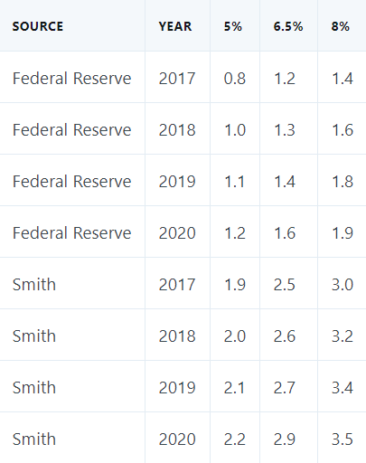

좋습니다. 모든 수치를 계산한 끝에 LVT가 얼마나 많은 자금을 조달할 수 있는지 보여주는 표를 드디어 얻었습니다. 낙관적인 수치조차 동적 효과를 반영하지 않으며, 광물권, 수자원권 등 '경제적 토지'의 다른 모든 출처를 반드시 반영하지 않습니다. 또한, 제한적인 구역 지정 조례가 폐지될 경우 토지 가치가 얼마나 상승할지에 대한 추산도 적용되지 않았습니다.

이제 이 수치를 미국의 예산 수치와 비교해야 합니다.

* * *

### 토지 임대료로 얼마나 많은 돈을 모을 수 있을까요?

미국 연간 토지 임대료는 연방 지출의 18%-40% (연방 정부)와 34-78% (스미스)를 충당할 수 있습니다. 낮은 수치는 2020년으로, 코로나19로 인해 연방 지출이 크게 증가한 예외적인 해입니다.

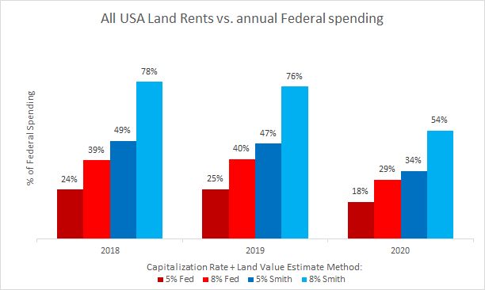

이 금액을 맥락에 맞게 설명하자면, [2019년 연방 예산](https://www.cbo.gov/publication/56324)에서 총 지출은 $4.4조 달러였습니다. 국방에 $676억(15%), 사회보장(Social Security)에 $1조(23%), 메디케어 + 메디케이드(Medicare + Medicaid)에 $1.05조(24%)를 지출했습니다. 이제 연간 토지 임대 가치에 대한 네 가지 개별 추정치와 비교해 보겠습니다:

 

가장 낮은 추산치인 연방준비제도(Federal Reserve)의 5% 자본수익률(cap rate)을 적용한 방법만으로도 국방, 사회보장, 메디케어 + 메디케이드 중 어느 하나를 단독으로 충당할 수 있습니다. 만약 스미스(Smith)의 8% 자본수익률 추산치를 믿는다면, 이 세 가지를 모두 충당하고도 나머지 지출의 3분의 1을 충당할 수 있는 금액이 남습니다.

또 다른 비교 포인트입니다. 미국에는 [745명의 억만장자](https://www.nytimes.com/2021/10/28/business/america-billionaires.html)가 있으며, 일부 사람들은 이들을 세금으로 부과해 모든 지출을 충당해야 한다고 주장합니다. 억만장자들이 아무리 부유하더라도, 국가를 대규모로 운영하기 위해 필요한 자금 규모는 훨씬 더 엄청납니다. 만약 억만장자들의 재산을 강제적으로 몰수해 100% 세금으로 징수한다면, 한 번에 약 $5조 달러의 일시금을 모을 수 있을 것입니다. 이는 엄청난 금액입니다! 하지만 토지 임대료는 비교할 때 매년 22~44% 더 많은 금액을 모을 수 있으며, 이는 낮은 자본 수익률 기준입니다.

이것은 억만장자에 대한 세금을 반대하는 주장이 아닙니다(부자들이 공정한 몫을 내는 데는 문제가 없습니다). 단순히 땅 임대료가 사람들이 인식하는 것보다 훨씬 더 큰 가치를 대표한다는 점을 보여주기 위한 것입니다. 또한, 일회성 개인 재산 몰수와 달리 땅 임대료는 매년 반복됩니다. 게다가 땅은 자본과 달리 국가를 떠나 투자와 산업을 함께 가져갈 수 없습니다.

흥미로운 사실: 모든 억만장자의 재산을 몰수하는 것은 미국 연방 땅과 광물 매장지를 모두 매각하는 것보다 약간 적은 금액을 마련할 수 있습니다(Ebeling의 추산). 따라서 자유주의자의 취향(연방 땅 매각)이나 좌파의 취향(부자 세금 인상) 중 어느 쪽을 선택하더라도, 2020년 예산 규모로 한 해 지출을 충당하는 데는 최대 한 해 분에 불과합니다.

하지만 기다보세요, [주 예산](https://higherlogicdownload.s3.amazonaws.com/NASBO/9d2d2db1-c943-4f1b-b750-0fca152d64c2/Uploaded../images/SER%20Archive/2021_State_Expenditure_Report_S.pdf)? 많은 주들은 재산세로 자금을 조달하기 때문에, 토지 가치 세금으로 전환하려면 주들도 고려해야 합니다. 따라서 주 예산을 계산에 포함시키겠습니다(연방 정부의 주 지원금은 제외하여 중복 계산을 방지합니다). 이를 적용하면 연방 정부 지출은 18-30%, (Smith)로 감소합니다.

 

모든 주 예산의 순 지출(50개 주 정부의 모든 지출에서 주에 대한 연방 자금을 제외)만을 살펴보면, 토지 임대료로 67~121% (연방) 또는 142-230% (Smith)를 충당할 수 있으며, 이는 특히 대도시를 가진 주들이 LVT만으로 자체 재정을 쉽게 충당할 수 있음을 의미합니다.

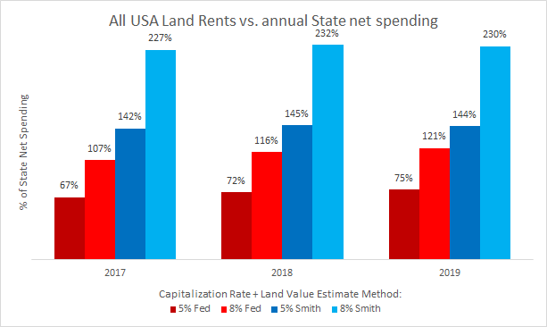

하지만 다른 방식으로 살펴보겠습니다. 연방 정부는 [1998년 한 번을 제외하고는](https://www.fool.com/investing/general/2013/09/30/was-americas-budget-really-balanced-in-the-90s.aspx) 균형 예산을 편성하지 않았습니다 이후로 균형 예산을 달성하지 못했기 때문에, LVT를 현 상태와 비교할 때 총 연간 지출이 아닌 총 연간 세수(tax receipts)와 비교하는 것이 적절합니다. 이 기준에 따르면, 미국의 모든 토지 임대료는 연방 정부의 경우 30-56%, (Smith)의 추산에 따르면 60-103% (Smith)에 달할 수 있습니다.

 

주 세금 수입을 추가하면 19-36%(연방)와 41-68% (Smith)에 달할 수 있습니다. 주 세금 수입에 대한 정확한 자료는 찾지 못했지만, 대부분의 주는 균형 예산을 운영해야 하기 때문에 위의 주 예산 지출 금액이 수입과 동일하다고 가정했습니다. 적자 예산을 운영하는 몇몇 주에서 더 정확한 수치를 얻을 수 있다면, 이는 해당 주들의 세금 수입 추정치를 줄이는 데만 기여할 것이며, 이는 여기서 제시된 비율을 높일 수 있습니다.

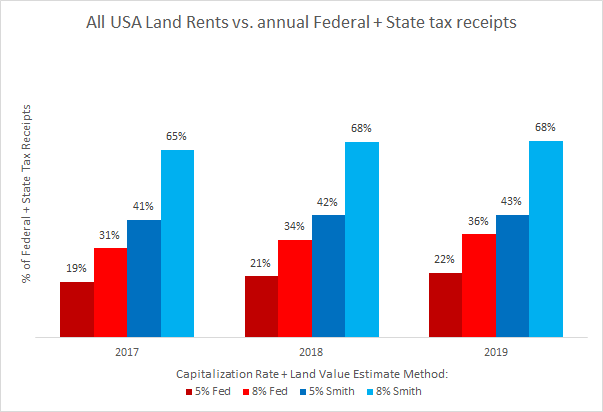
 

마지막으로 [지방 정부](https://state-local-finance-data.taxpolicycenter.org/pages.cfm)는 어떻게 될까요? 현재 대부분의 재산세는 이미 이곳으로 흘러가고 있으며(판매세나 복권세 같은 역진적 세금도 포함됩니다). 모든 지방 정부의 세금을 추가로 반영하고 연간 토지 임대료와 비교하면, 연방 정부 수입의 14-26% 또는 스미스 추산 29-49%로 감소합니다. 이 계산에는 이미 주 및 지방 재산세 부담이 반영된 재산 가치가 포함되지 않았다는 점을 유의해야 합니다. 이를 반영하면 이 수치는 크게 증가할 것입니다.

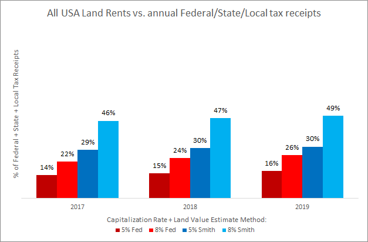

어떤 방식으로 계산하더라도, 연방, 주, 지방 세금 수입의 14-26%라는 가장 낮은 추산치는 엄청난 금액입니다. 특히 이 금액이 매년 반복되며 연방 예산의 단일 대규모 항목을 모두 커버할 수 있다는 점을 고려하면 더욱 그렇습니다. 스미스의 토지 임대료가 모든 정부 수준 세수 합계 대비 29~49%라는 수치는 상식 밖입니다.

연방 수준에만 한정하더라도 스미스의 60-103% 추정치는 저소득층의 개인 소득세를 완전히 폐지하는 데 충분합니다(2019년 연방 세수 약 [50%](https://www.govinfo.gov/content/pkg/BUDGET-2019-BUD/pdf/BUDGET-2019-BUD.pdf))의 저소득층에 대한 개인 소득세를 완전히 폐지하는 데 충분하며, 고소득층에 대한 완전한 연방 단일 세금 도입도 명확히 가능할 수 있습니다.

물론 스미스가 틀렸고 연방준비제도(Federal Reserve)의 데이터가 정확하다고 생각한다면, 단일 세금 꿈은 실현 불가능할 수 있습니다.

이 문제가 얼마나 중요한지는 균형 예산에 대한 당신의 견해에 달려 있습니다.

[현대 통화 이론](https://www.investopedia.com/modern-monetary-theory-mmt-4588060)을 믿는다면 균형 예산을 운영하는 것에 신경 쓰지 않습니다. MMT에 따르면, 자체 화폐를 발행하는 주권 정부는 생산 능력과 물리적 자원에 의해만 제한되며, 이는 케인스의 유명한 명언 “우리가 할 수 있는 것은 무엇이든 감당할 수 있다”로 요약됩니다. 저는 개인적으로 이 견해를 옹호하거나 반대하지 않습니다–단지 MMT 진영에 있다면 이미 세금으로 모은 수입과 정부 지출을 100% 일치시키는 것에 신경 쓰지 않는다는 점을 지적하는 것입니다.

하지만 MMT가 틀렸고, 동시에 연방준비제도(Fed)의 통계를 고수한다면 어떻게 될까요? 그럼 두 가지 선택지가 남습니다: 교조적인 단일세제론이 미국에서는 적어도 끝났다는 것을 인정하면서도 LVT를 균형 예산 정책의 일부로 받아들이거나, Dwyer의 호주 데이터가 의도적으로 제외시킨 “동적 효과”를 살펴보는 것입니다. 특히 [Mason Gaffney](https://www.masongaffney.org/workpapers/WP096%202005%20The%20Physiocratic%20Concept%20of%20ATCOR.pdf) 와 가장 자주 연관되는 유혹적인 이론이 있습니다.에서 [ATCOR](http://www.wealthandwant.com/themes/ATCOR.html)라고 불리는 이론입니다. “모든 세금은 임대료에서 나온다.”

### ATCOR와 헨리 조지 이론

ATCOR는 소득과 자본에 대한 세금을 줄이는 것–다른 정책 개입과 무관하게–이 실제로 토지 가치를 _상승_시키는 비율로 증가시킨다고 가정합니다. 이는 LVT 정책이 토지 가격을 하락시킬 것이라고 가정하는 조지주의자들이 주의해야 함을 의미합니다. 노동과 자본에 대한 세금을 폐지하지만, 토지에 대한 세금을 충분히 인상하지 않는다면, 토지 가격 (및 임대료)는 실제로 상승할 것입니다. 왜냐하면 해당 토지에서 일하는 사람이 더 많은 소득을 가져가게 되므로 더 많은 임대료를 지불할 수 있게 되기 때문입니다([리카르도의 임대법](https://www.youtube.com/watch?v=jiGKwi43R0Q) 참조). 그러나 적절한 정책을 통해 이는 좋은 결과로 이어질 수 있습니다.

ATCOR가 진실이라면 단일 세금 정책은 항상 작동합니다. 자본세와 소득세를 폐지하면 잃은 세금 수입은 상승하는 토지 가치에 흡수되며, 이를 100% LVT로 회수할 수 있습니다. 이전과 동일한 세수를 확보하면서도 소득세와 자본세를 폐지함으로써 노동과 투자에 대한 부담을 줄이고, LVT는 주택 가격과 임대료를 안정시켜 경제를 활성화하고 생활 비용을 낮춥니다. 이 경제 활성화는 다시 토지 가치를 상승시키며, 이는 LVT를 통해 완전히 회수되어 토지 가치를 안정화시킵니다.

헨리 조지 정리가 있습니다. 노벨상 수상자 조셉 [스티글리츠는 1979년에 이를 발표했습니다](https://academiccommons.columbia.edu/doi/10.7916/D8JM2M80)에 발표되었으며, 특정 조건 하에서 공공재 지출이 토지 임대료에 의해 흡수되어 100% LVT가 모든 공공재 지출을 영구히 재정적으로 충당하기에 _필수적으로_ 충분하다는 내용을 담고 있습니다. 순수한 “공공재”는 “비배제성”과 “비경합성”을 갖춘 것입니다. 비배제성은 당신이 그것을 사용하는 것이 내가 사용하는 것을 방해하지 않는다는 의미이며, 비경합성은 일단 제공되면 누구도 그것을 사용하는 것을 막을 수 없다는 의미입니다. 대표적인 예로는 불꽃놀이, 국가 방어, 깨끗한 공기가 있습니다. HG 정리는 대중 교통과 같은 다른 형태의 공공 지출에는 적용되지 않습니다. 대중 교통은 일정程度上 배제 가능하고 경쟁적입니다. (대중 교통은 용량 한계가 있으며, 인종 차별적 [Jim Crow](https://en.wikipedia.org/wiki/Jim_Crow_laws) 법이 폐지되었다고 해도, 그런 법이 존재했다는 사실 자체가 배제 가능성을 증명합니다.)

그러나 “순수 공공재”가 아닌 공공 지출이 토지 가치를 상승시킨다는 강력한 증거가 있습니다[토지 가치 상승](https://www.apta.com/wp-content/uploads/The-Real-Estate-Mantra-Locate-Near-Public-Transportation.pdf), 다만 그 정도는 다를 수 있습니다. 니콜라우스 티데만(Nicolaus Tideman)에게 문의한 결과, 순수 공공재가 아닌 경우에 적용되는 HG 정리의 변형이 존재하며, 이는 “토지 가치 상승과 한계 비용에 해당하는 요금의 조합이 이러한 지출을 자금 조달할 수 있다”고 주장합니다. 그러나 “사람들의 선호도가 다르거나 혜택이 거리와 함께 감소하지 않는 경우 두 정리는 적용되지 않는다”고 합니다. 저는 그가 대부분의 공공 사업은 생성하는 토지 가치 상승으로 완전히 자금 조달될 수 있으며, 소규모 사용료로 보완될 수 있다고 말하는 것 같습니다. 또한 그가 말하는 것은 공공 사업의 종류에 따라 다르다는 점입니다. 공공 자금을 정말로 흉한 예술 설치물에 지출한다면, 그

세 사람만 좋아한다면, 이는 토지 가치를 상승시키지 않을 것입니다. 그리고 공공 사업이 거주지에 관계없이 모든 사람에게 동일한 혜택을 제공한다면, 그 역시 토지 가치를 상승시키지 않을 것입니다. 왜냐하면 어떤 위치도 다른 위치보다 더 많은 혜택을 받지 않기 때문입니다.

어쨌든 현재 상황은 공공 지출로 창출된 대부분의 외부 효과 가치가 사적 토지 소유주에 의해 흡수된다는 것입니다. 정부는 다음 단계의 개선을 위해 시민의 노동과 자본에 세금을 부과하거나, 적자 지출과 채권 발행(인플레이션을 유발하면 저축에 대한 숨겨진 세금)을 통해 부채를 늘려야 합니다.

ATCOR, 헨리 조지 이론, 순수 공공재 지출이 아닌 지출에 대한 관찰을 결합하면, 정부 투자가 경제에 부담을 주지 않고 자체적으로 자금을 조달하며 _적자 지출이나 부채 없이_ 지속 가능한 선순환을 이룰 수 있다는 가설을 제기할 수 있습니다.

하지만. 이러한 효과 중 어떤 것도 기대하지 않더라도, 위의 수치는 이미 매우 놀랍습니다. 특히 연방준비제도(Fed)의 보수적인 자본화율을 적용한 경우에도 말이죠.

이 모든 내용을 실제 정책 보고서 형태로 정리해 경제를 활성화하기 위한 소규모 토지 가치 세금 도입, 소득세 폐지, 그리고 예산 균형을 동시에 달성하는 방안을 제안한 논문을 보고 싶다면, 니콜라우스 티데만(Nicolaus Tideman)이 저에게 보낸 논문을 확인해 보세요: _[포스트 코로나 균형 예산 초강력 경기 부양책: 세금을 토지에 전환하는 경우](https://papers.ssrn.com/sol3/papers.cfm?abstract_id=3954888) (_쿠모프, 허드슨, 고드하트와 공동 집필).

니콜라우스 티데만이 누구인지 궁금하신 분들을 위해, 그의 [위키피디아 페이지](https://en.wikipedia.org/wiki/Nicolaus_Tideman)에서 간단한 소개를 첨부합니다:

> 티데만은 1969년부터 1973년까지 [하버드 대학교](https://en.wikipedia.org/wiki/Harvard_University) 경제학 부교수로 재직했으며, 이 기간 중 1970년부터 1971년까지 [대통령 경제자문회의](https://en.wikipedia.org/wiki/Council_of_Economic_Advisors)의 선임 경제학자로 근무했습니다. 1973년부터 버지니아 테크에 재직 중이며, 하버드 대학교의 [케네디 정부 학교](https://en.wikipedia.org/wiki/Kennedy_School_of_Government) (1979-1980), [버밍엄 대학교](https://en.wikipedia.org/wiki/University_of_Buckingham) (1985-1986), 그리고 [미국 경제 연구소](https://en.wikipedia.org/wiki/American_Institute_for_Economic_Research) (1999-2000)에서 방문 연구원으로 활동했습니다.

* * *

추정 방법과 자본 수익률에 대해 논쟁할 수 있지만, 땅 임대료는 엄청난 가치를 대표합니다. 최소한 높은 LVT는 예산을 삭감하지 않고도 많은 인기 없는 비효율적인 세금을 상쇄할 수 있거나, 현재는 감당할 수 없다고 주장되는 중요한 프로그램을 자금으로 사용할 수 있습니다.

**결론:**
미국 땅 임대료는 실제로 연간 예산의 상당한 %에 해당합니다.

아이러니하게도, 땅 세금이 큰 금액을 모을 수 있음을 보여줌으로써, 저는 또 다른 비판을 제기하게 되었습니다; 토지 세금은 너무 적게 세금을 걷는 것이 아니라, 너무 많이 걷는다는 것입니다. 이 비판은 주로 도덕적/이데올로기적 근거에서 제기되며, 보통 우파에서 나옵니다. 이에 대해 저는 극우 보수주의자 윌리엄 F. 버클리(조지주의자이자 단일세 지지자)에게 설명을 맡기겠습니다.

<iframe width="728" height="410" src="https://www.youtube.com/embed/SRnTesZNH_g" title="YouTube video player" frameborder="0" allow="accelerometer; autoplay; clipboard-write; encrypted-media; gyroscope; picture-in-picture" allowfullscreen></iframe>

결국, 토지 가치를 공동 재산으로 만드는 도덕적 논리를 받아들이는지 아닌지입니다. 버클리의 주장, 즉 “엠파이어 스테이트 빌딩 옆의 주차장은 원칙적으로 그 빌딩과 같은 세율을 적용받아야 한다”는 말이 마음에 들지 않는다면, 경험적 증거를 제시하는 것이 당신을 설득하지 못할 것입니다. 왜냐하면 이 불일치는 훨씬 더 근본적인 곳에서 비롯되기 때문입니다.

만약 모든 세금이 도둑질이라고 생각한다면, 토지 가치 세금은 세금이기 때문에 그 근거로 반대할 것입니다. 하지만 당신이 세금을 가끔 부과하는 사회에서 살고 있다는 것을 인정한다면, 밀턴 프리드먼이 “가장 덜 나쁜 세금”이라고 부른 것을 선택할 수도 있습니다.

<iframe width="728" height="410" src="https://www.youtube.com/embed/yS7Jb58hcsc" title="YouTube video player" frameborder="0" allow="accelerometer; autoplay; clipboard-write; encrypted-media; gyroscope; picture-in-picture" allowfullscreen></iframe>

* * *

따라서, 토지 가치가 도시 부동산 가치의 대부분을 차지하며(도시 부동산 가치는 전체 부동산 가치의 대부분을 차지합니다), 토지 임대료는 어떤 예산에도 큰 타격을 줄 만큼 충분히 큽니다. 하지만 모든 사람에게 영향을 미치는 한 가지가 있습니다: 은행 대출에서 토지 가치가 차지하는 비중입니다.

## 3. 토지는 주요 은행 대출의 상당 부분을 차지합니다

은행은 적어도 두 가지 명시된 목적을 위해 존재합니다: 사람들에게 돈을 안전하게 보관할 수 있는 장소를 제공하고, 생산적 활동에 종사하는 사람들에게 대출 형태로 자본을 제공하는 것입니다. 메리 포핀스의 이 노래는 은행이 돈을 어떻게 사용하는지에 대한 경제학 101 강의의 적절한 요약입니다.

<iframe width="728" height="410" src="https://www.youtube.com/embed/XxyB29bDbBA" title="YouTube video player" frameborder="0" allow="accelerometer; autoplay; clipboard-write; encrypted-media; gyroscope; picture-in-picture" allowfullscreen></iframe>

은행업은 분명히 “당신이 은행에 돈을 맡기고 은행이 그 돈을 사람들에게 대출해주는 것”보다 훨씬 복잡합니다. 분할예금 제도, 연방준비제도(Federal Reserve) 등 다양한 요소가 존재하기 때문이죠. 하지만 이 질문의 목적상 그 부분은 중요하지 않습니다. 우리가 알고 싶은 것은 _은행이 돈을 가지고 있을 때, 그 돈을 어떻게 사용하는가?_입니다.

최근에는 사람들이 부동산을 구매하기 위해 돈을 빌려주는 데 사용된다고 _[The Great Mortgaging: Housing Finance, Crises, and Business Cycles](https://www.nber.org/system/files/working_papers/w20501/w20501.pdf)_에서 Jordà, Schularick, Taylor가 설명하고 있습니다. 이 차트는 1928년, 1970년, 2007년의 세 시점에서 전 세계 주요 국가들의 은행 대출 중 부동산에 할당된 비율을 보여줍니다.

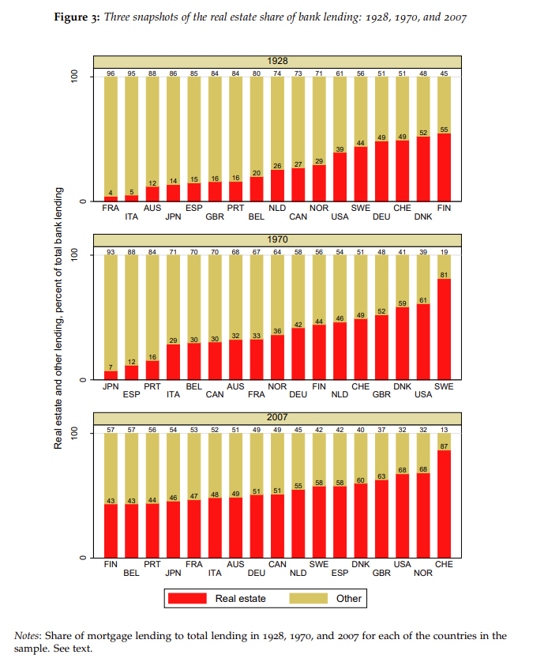

다음은 모든 국가를 통합해 1800년대 후반까지 시간 경과에 따라 그래프로 표시한 또 다른 시각화입니다.

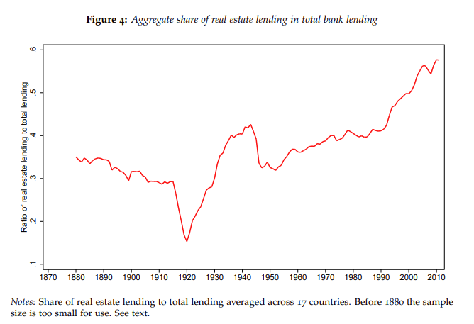

위에서 볼 수 있듯이, 이는 진정한 세계적 현상이며 1950년경부터 지속적인 상승 추세를 보여왔습니다. 현재 부동산 대출 비중은 헨리 조지의 시대에 비해 거의 두 배로 증가했습니다.

다른 출처를 참고하여 이 통계의 일부를 확인해 보겠습니다. [Positive Money](https://positivemoney.org/2018/06/how-has-bank-lending-fared-since-the-crisis/)는 영국 내 산업별 대출을 세분화한 그래프를 제공합니다. 이 데이터의 출처는 영국 중앙은행(Bank of England)입니다.

출처: _표 C1.2 영국 중앙은행 통계 자료 via [Positive Money](https://positivemoney.org/2018/06/how-has-bank-lending-fared-since-the-crisis/)_

픽셀을 세고 수동으로 백분율을 계산해 보면, 부동산(두 개의 파란색 지역)이 2007년경 약 45%를 차지했으며 2017년에는 60%로 상승했습니다. 2007년 수치는 _The Great Mortgaging_의 위 차트에 표시된 수치보다 작지만, 어느 경우든 여전히 매우 큰 규모입니다.

다른 곳에서 쉽게 확인할 수 있는 자료가 있을까요? 뉴질랜드(The Great Mortgaging에 포함되지 않은 국가)에는 이 [정말 멋진 대시보드](https://bankdashboard.rbnz.govt.nz/asset-quality)가 있습니다. 이 대시보드에서는 해당 국가의 모든 은행 대출을 세부적으로 구분해 보여줍니다. 보시다시피, 대출의 대부분은 주택 대출입니다.

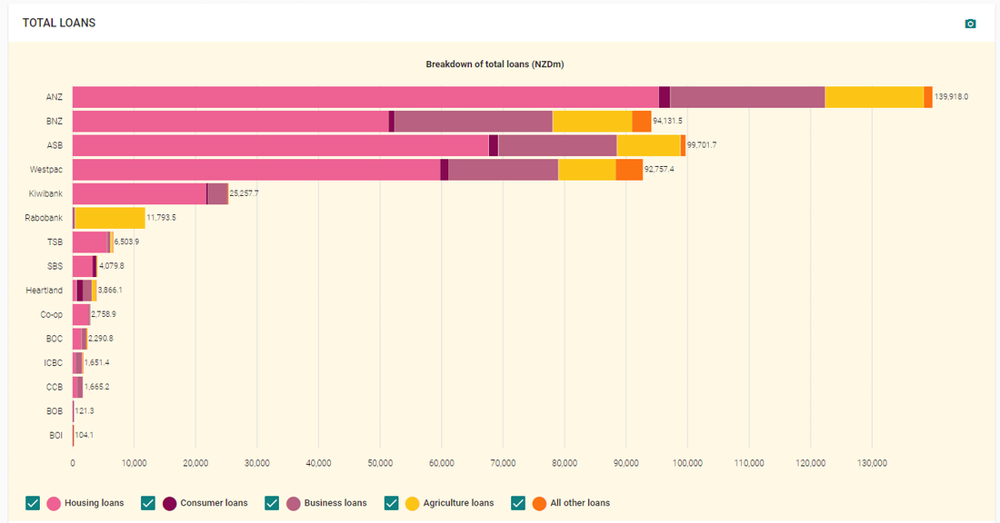

같은 데이터를 시각화한 또 다른 자료입니다.

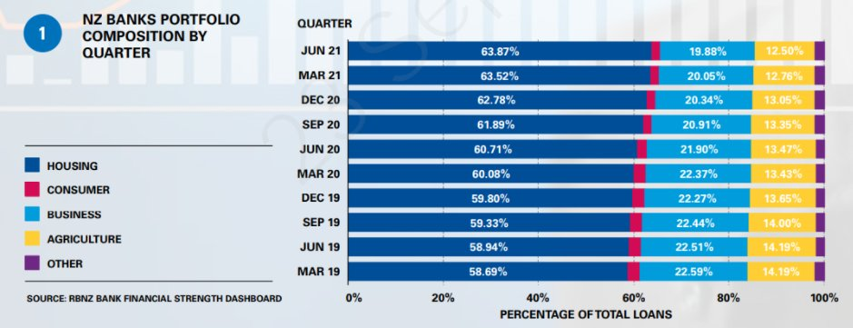

출처: [Interest.co.nz](https://www.interest.co.nz/banking/112371/nz-banks-housing-lending-continues-rising-percentage-their-overall-lending-business)

더 깊이 조사할 수 있지만, 이 일반적인 점을 설득하기에는 충분한 자료를 봤다고 생각합니다. 많은 주요 선진국(미국, 영국, 뉴질랜드 등)에서 은행 대출의 대부분은 부동산에 사용되며, 이미 보여드린 대로 부동산 가치의 대부분은 토지에 집중되어 있습니다. 토지가 은행 대출의 명확한 다수를 차지하든 아니든, 이는 분명히 큰 비중을 차지합니다.

**결론:** 토지는 주요 은행 대출의 상당 부분을 차지합니다

좋아, 그럼 어때? 은행이 부동산에 많은 돈을 쏟아붓는 것이 왜 그렇게 큰 문제인가요?

새로운 주택 건설을 위한 자금 조달은 좋은 일이지만, 토지 매매에 묶인 자금은 그 자체로 생산적이지 않습니다. 왜냐하면 새로운 유체 자산이 창출되지 않기 때문입니다. 또한 토지에 대한 저금리 대출은 토지 가격을 올리는 입찰 경쟁을 유발합니다. 따라서 부동산 대출은 경제를 더 나쁘게 만드는 데 기여하고 있습니다.

2008년을 경험한 사람은 누구나 추상적으로 보이는 부동산 투자 조작이 일상 생활에 돌풍처럼 들이닥쳐 [전 세계 경제를 무너뜨릴 수 있는지](https://en.wikipedia.org/wik/Subprime_mortgage_crisis) 직접 목격했습니다.. 특히 중국은 현재 [같은 문제들과 맞서고 있습니다](https://www.nytimes.com/article/evergrande-debt-crisis.html).

이제 티드먼의 논문(https://papers.ssrn.com/sol3/papers.cfm?abstract_id=3954888) 3.7.1절 “금융 부문”에서 강조한 이 충격적인 인용문을 살펴보세요:

> Hudson(2012, 2018)은 **대부분의 토지 임대료가 은행에 이자로 지급된다**고 보여주었으며, 은행 대출이 주택 가격 상승의 주요 요인이라고 지적했습니다(“부동산은 은행이 대출로 제공할 수 있는 금액만큼의 가치를 가진다”). 추가적인 실증적 증거는 Favara와 Imbs (2015)에 의해 제시되었으며, La Cava (2015)는 이 현상이 Rognlie (2015)가 연구한 자본 소득 중 주택의 비중 증가를 설명할 수 있음을 발견했습니다. Ryan-Collins 등(2017)과 Turner(2017)는 은행 대출과 토지 가치 상승 사이의 자기강화적 순환이 은행 대출이 기업 대출에서 주택 담보 대출로 전환되고 토지 가격 인플레이션을 초래했으며, 이는 금융 안정성을 저해했다고 주장합니다. 이는 Keen(2017)에서도 언급된 바 있습니다.

Rognlie(2015)의 인용은 특히 자세히 살펴볼 가치가 있습니다. Rognlie는 Thomas Piketty의 유명한 책 [21세기 자본](https://en.wikipedia.org/wiki/Capital_in_the_Twenty-First_Century)에 대한 주요 결함을 지적해 많은 주목을 받았습니다.에서 지적한 주요 결함들을 지적하며 많은 주목을 받았습니다. 피케티의 주요 주장은 자본의 수익률이 경제 성장률보다 높으며, 이것이 부의 집중과 불평등을 초래한다는 것입니다.

로그니는 [논문](https://www.brookings.edu/bpea-articles/deciphering-the-fall-and-rise-in-the-net-capital-share/)에서 피케티가 자본 자산의 감가상각을 적절히 처리하지 않았다고 지적했습니다. 이를 고려하면, 불평등을 주도하는 '자본'의 과도한 수익은 거의 전적으로 주택에 기인한다는 것을 발견할 수 있습니다.

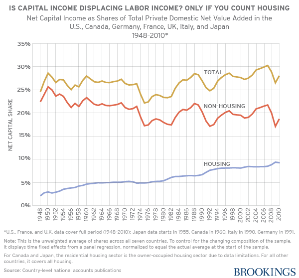

주택의 구매 불가능성은 불평등의 단순한 증상이 아니라 오히려 그 핵심 원인 중 하나입니다. 은행들은 경제 전체의 그림자 지주로서 이 구매 불가능성에 기여하고 있습니다.

## 4. 토지는 개인 총자산의 상당 부분을 차지합니다

이 책 리뷰에서 기억할 수 있는 두 개의 그래프입니다. 첫 번째 그래프는 스페인에서 개인 총자산의 약 40%가 토지로 구성되어 있음을 보여줍니다. 약 25-30%는 결국 실물 자산(토지와 자본)의 조합으로 현금화되어야 하는 “금융 자산”이므로, 토지에 기인한 실제 비율은 40%보다 높을 가능성이 있습니다.

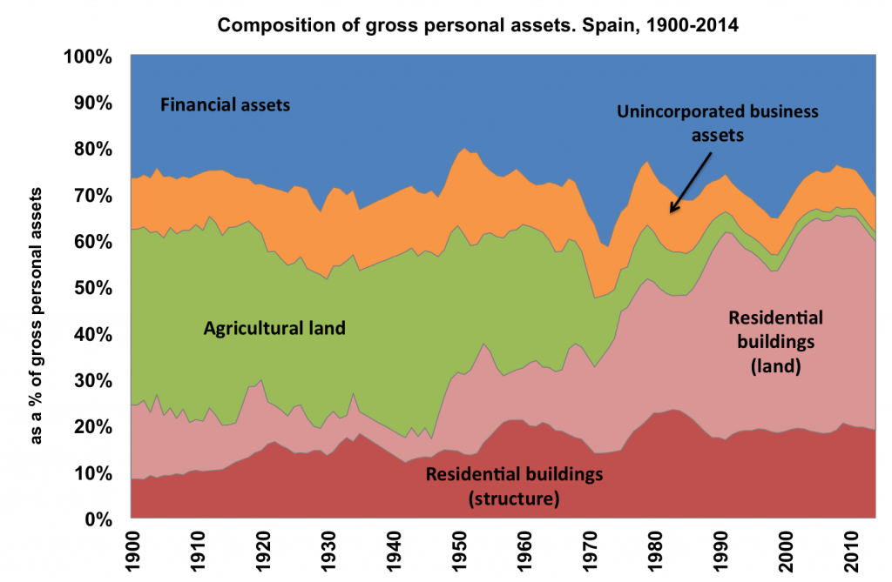

출처: [스페인의 부, 1900-2014](https://web.archive.org/web/20180821115745/http://wid.world/wp-content/uploads/2018/02/WID.WP_ABM_WEALTHSPAIN_2018.pdf) Blanco, Bauluz, & Martínes-Toledano

두 번째 차트는 영국 실물 자산의 약 절반이 토지에 기인함을 보여줍니다.

영국 국가 회계 자료: The Blue Book 2017을 기반으로 합니다. 2017년 10월 31일 발행. 개정 기간: 각 시계열의 시작 시점. 다음 발표일: 2018년 7월. “토지 및 특권”에 포함된 “특권”은 택시 면허증이나 특허권과 같은 것으로, 차트를 작성한 네이트 블레어에 따르면 그 가치는 “거의 제로”라고 합니다.

다음은 토마스 피케티가 영국과 프랑스의 “국가 자본”을 부문별로 분석한 두 개의 그래프입니다.

 

출처: 토마스 피케티의 《21세기 자본》

출처: 토마스 피케티의 《21세기 자본》

과거에는 국가 자본의 대부분이 농업용 토지에 있었습니다. 현재는 대부분이 주택에 있습니다. 1700년에는 영국과 프랑스의 국가 자본의 약 76%와 80%가 부동산이었습니다. 2010년에는 각각 55%와 61%로 감소했습니다.

미국은 어떨까요? [Tideman & co의 대규모 보고서](https://papers.ssrn.com/sol3/papers.cfm?abstract_id=3960235)에서 가져온 데이터입니다. 이 데이터는 OECD 자료를 바탕으로 미국 가계 자산 중 “비생산적 자산”(인간이 창조하지 않은 토지, 자연 자원 등)의 비중을 그래프로 나타냈습니다. 조지스트들은 이를 “토지”라고 부릅니다.

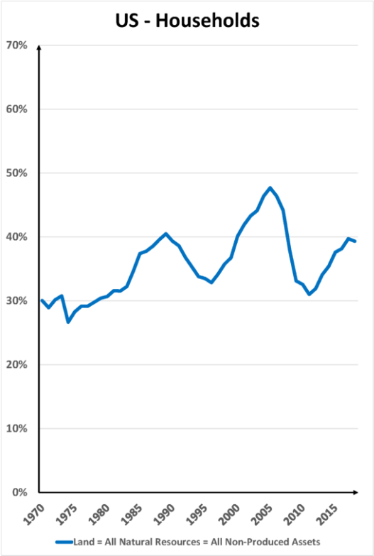

그림에서 볼 수 있듯이 약 40% 수준을 유지하고 있습니다.

미국 가구 자산의 약 40%가 토지로 구성되어 있습니다. 스페인에서는 자산 가치의 40%를 초과하며, 프랑스와 영국에서는 50~60% 사이를 차지합니다.

세계 다른 지역은 어떨까요? [맥킨지 보고서](https://archive.md/DRUiI)에 따르면, 부동산 보유량은 전 세계 실물 자산의 2/3를 차지하며, 이 중 절반 이상이 토지에서 비롯됩니다.

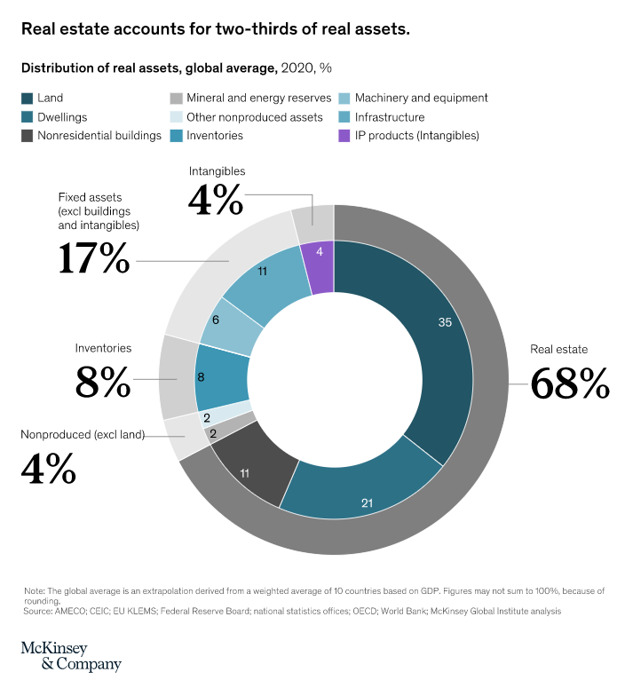 

전통적인 토지로 인한 35%와 “생산되지 않은” 자산(광물 및 에너지 매장량 등을 포함)으로 인한 4%를 합치면, 조지스트 정의에 따른 토지의 비중이 전 세계 실물 자산의 39%를 차지합니다. 지적재산권(IP)을 “경제적 토지”로 포함하면 이 비율은 43%로 상승합니다.

이것은 제게는 상당히 큰 문제로 보입니다.

**결론:**
토지는 실제로 미국을 포함한 선진국에서 개인 총자산 가치의 상당 부분을 차지합니다.
 

* * *

이 시점에서 일부 분들은 불안해하실 수도 있습니다. 그 끔찍한 조지스트들이 LVT로 나를 파산시킬까 봐요? 저도 집주인으로서 공감합니다. 이 부분에서 시민 배당금(UBI)이 도입되어야 한다고 생각합니다.

2020년 미국 토지 임대료의 가장 비관적인 추산치인 $1.2조 달러(연방준비제도(Fed)의 5% 자본화율 방법)를 사용해 보겠습니다. 이 금액을 18세 이상 미국 시민 약 2억 900만 명에게 나누면, $23만 달러 미만의 부동산을 소유한 사람은 손익분기점을 넘거나 이익을 볼 것입니다.

이 단순한 표는 몇 가지 가정을 포함합니다. 토지 지분을 50%로 고정하고 자본화율을 5%로 설정했습니다. 하지만 모든 시민이 배당금을 받는다는 점을 기억하세요. 따라서 가구당 성인 2명이 있다면 부동산 가치 $500K 미만에서 손익분기점을 넘게 됩니다.

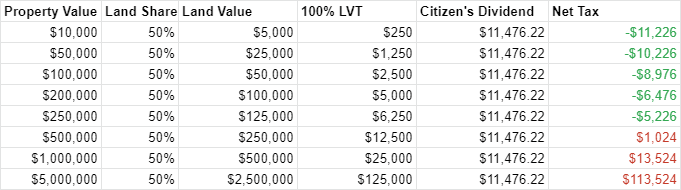
 

이것은 중산층을 파산시키는 처방이 아닙니다. 오히려 미국을 살기 좋은 곳으로 만드는 데 기여한 모든 사람에게 보상하는 것입니다. 이 보상은 주로 가장 가치 있는 위치와 자연 자원을 통제하는 사람들이 부담합니다. 이러한 자원은 누구의 노력이나 투자로도 창출되지 않은 것입니다.

또한 LVT는 건물에 부과되는 재산세의 부분을 폐지한다는 점을 기억하세요. 저는 자신의 재산세 기록을 확인해봤습니다(저는 주요 도시 중심지에서 멀리 떨어진 중형 도시의 교외 지역에 거주합니다). 평가된 토지 비율이 40%로 두 배 이상 증가한다면, 100% LVT 체제 하에서 매년 재산세로 $545.05를 절약하게 됩니다–이것은 시민 배당금 없이 계산된 금액입니다.

## 5. 토지 소유는 부유층에 극도로 집중되어 있습니다

세계 4위 부자인 빌 게이츠는 미국 전역에 걸쳐 242,000에이커의 농지를 소유하고 있어 [미국 최대의 사설 농지 소유주](https://www.forbes.com/sites/arielshapiro/2021/01/14/americas-biggest-owner-of-farmland-is-now-bill-gates-bezos-turner/). 하지만 이는 농지뿐입니다. [미국 전체 토지](https://landreport.com/americas-100-largest-landowners/)를 기준으로 하면 게이츠는 49위에 불과합니다. 제프 베조스는 25위, 테드 터너는 4위입니다. 부자들은 많은 땅을 소유하고 있습니다.

그렇다면 전체 부동산 가치의 몇 %가 상위 1%, 상위 10%, 상위 50%가 소유하고 있을까요? 연방준비제도(Federal Reserve)에 따르면 상당히 많은 비율입니다.

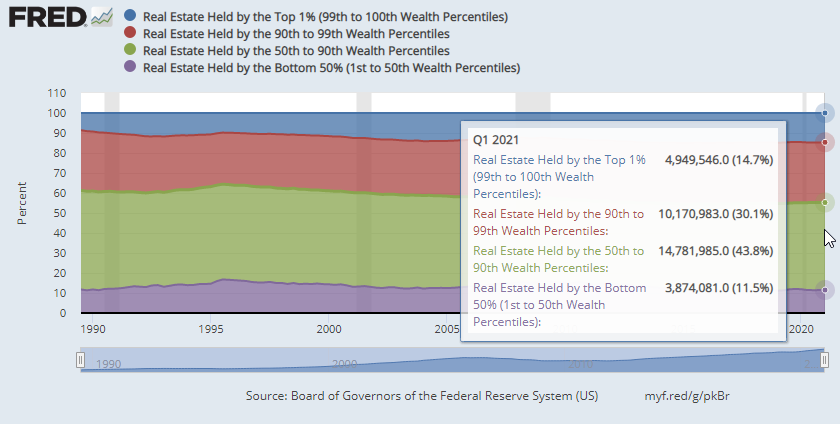

즉, 미국 전체 부동산 가치 중 상위 1%가 14.7%를 소유하고 있으며, 상위 10%가 44.8%를 소유하고 있으며, 상위 50%가 88.5%를 소유하고 있습니다.

이 수치를 총 자산과 비교해 보면 다음과 같습니다.

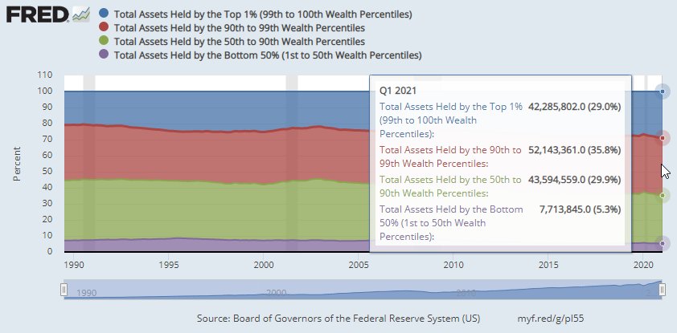

미국 전체 자산 가치 중 상위 1%가 29%를 소유하고 있으며, 상위 10%가 65%를, 상위 50%가 94.7%를 소유하고 있습니다.

총 자산 가치와 비교할 때 부동산은 상대적으로 더 균등하게 분배된 것처럼 보이지만, 절대적 의미에서는 여전히 극도로 계층화되어 있습니다. 상위 1%는 국가 전체 부동산 가치의 거의 15%를 소유하고 있으며, 상위 10%는 그 중 거의 절반을 소유하고 있습니다. 이 기반을 바탕으로 상위 1%와 상위 10%는 나머지 모든 사람으로부터 임대료를 징수할 수 있는 능력을 얻게 됩니다.

하지만 상위 1%가 진짜로 이익을 보는 곳은 금융 자산입니다.

사기업 소유권도 빼놓을 수 없습니다.

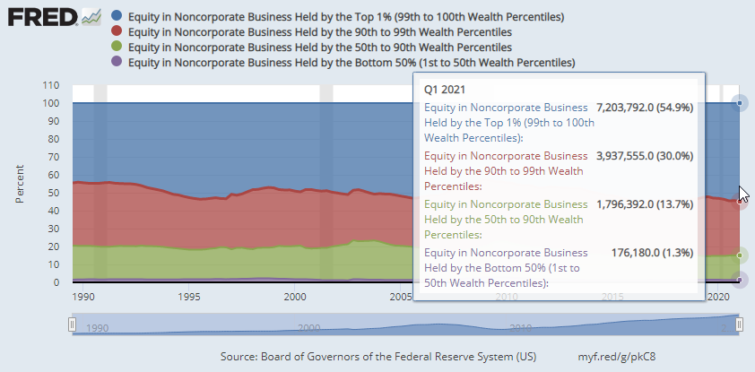 

다시 한 번, 금융 자산의 가치를 풀어내는 문제는 이 조사 범위를 넘어섭니다. 합리적인 세상에서는 주식과 채권 같은 대부분의 금융 상품의 '본질적 가치'는 전통적인 자본과 노동으로 귀결되어야 하지만, 우리는 이미 세계의 종이 부의 대부분이 [일반인들의 모기지 위에 걸린 복잡한 주술](https://www.finra.org/investors/learn-to-invest/types-investments/bonds/types-of-bonds/mortgage-backed-securities#:~:text=Mortgage-backed%20securities,%20called%20MBS,million%20worth%20of%20such%20mortgages.)에 불과하다는 것을 경험한 위기를 겪었습니다. 은행 대출 중 부동산에 연동된 규모를 고려할 때, 우리는 이미 그 방향으로 돌아가고 있습니다.

연방준비제도(Fed) 외의 다른 자료는 어떨까요? [The Economist](https://www.economist.com/briefing/2015/04/04/the-paradox-of-soil)는 유사한 계층별 데이터를 제공하며, [제가 들은 바에 따르면](https://www.reddit.com/r/georgism/comments/pryhtf/land_value_ownership_inequality_stats/hdqf9m7/?context=3)는 결국 [여기](https://eml.berkeley.edu/~saez/SaezZucman2015.pdf)에서 나온 것입니다.

부유층은 국가의 토지 가치의 대부분을 소유하고 있으며, 실제로 그 대부분을 소유하고 있습니다. 또한 [주택은 세계 최대의 자산 클래스입니다](https://www.economist.com/special-report/2020/01/16/how-housing-became-the-worlds-biggest-asset-class).

가장 우려스러운 점은 세대 간 격차입니다. 각 세대의 주택 소유율은 이전 세대보다 낮습니다.

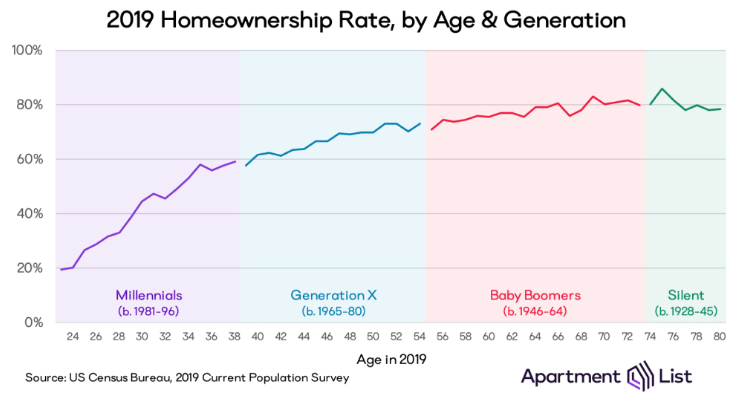

밀레니얼 세대는 더 젊으니까 당연히 주택 소유율이 낮겠죠. 나중에 따라잡을 수도 있겠죠?

증거는 그렇지 않다고 말합니다.

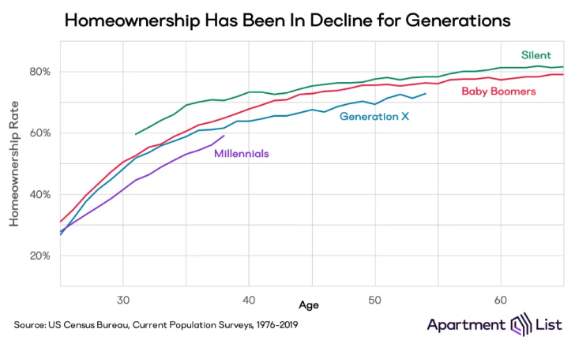 

토지 소유는 단순히 부유층에 집중되어 있는 것이 아니라, 부유하고 나이 많은 계층에 집중되어 있습니다. [부유하고 나이 많은 사람들의 기대수명이 증가하고 있습니다](https://www.nber.org/papers/w27509), 이는 상속과 재산세 납부 시점을 가장 필요한 시점보다 늦추고 있습니다. 반면 다음 세대의 구성원들은 여전히 자신의 삶을 안정시키거나 가정을 꾸리려고 노력하고 있습니다.

밀레니얼 세대가 더 이상 젊지 않다는 점을 인식하는 것이 중요합니다. 저는 밀레니얼 세대이며 이미 37세로, 결코 젊은 세대가 아닙니다. 줌머 세대의 미래는 어떻게 될까요?

**결론:**
토지 소유는 실제로 부유층에 극도로 집중되어 있습니다.

* * *

우리는 다음과 같은 사실을 증거를 넘어 명확히 입증했습니다:

✅ 도시 부동산의 대부분은 토지의 가치입니다  
✅ 미국의 모든 토지 임대료는 정부 지출의 상당 부분을 차지합니다  
✅ 토지는 주요 은행 대출의 상당 부분을 차지합니다  
✅ 토지는 개인 순자산 가치의 상당 부분을 차지합니다  
✅ 토지 소유는 부유층에 극도로 집중되어 있습니다  

# 결론

정말 땅은 엄청나게 중요한 문제입니다.

땅은 산업화 이전 농업 경제에서만 중요한 사소한 문제가 아닙니다. 모든 사람이 땅이 필요하지만, 더 이상 땅을 만들 수 없습니다. 땅에 접근하지 못하면 일할 수 없고, 먹을 수 없고, 잠을 잘 수 없으며, 심지어 배변도 할 수 없습니다(금지구역에서 그 중 하나를 시도해 보세요. 무슨 일이 일어나는지 보세요). 주택 위기는 부풀어 오른 땅값에 의해驱动되며, 이는 다시 빈곤, 홈리스 문제, 그리고 기타 모든 사회적 문제로 이어집니다. 그리고 우리가 공공 지출로 이러한 사회적 문제를 해결하려 할 때, 땅은 종종 그 지출이 창출한 가치를 흡수하고 사유화합니다. 이는 사적 행위자들이 그 이익을 이용해 모든 사람의 임대료를 인상하는 데 사용되며, 악순환이 계속됩니다. 그 사이 은행들은 계속해서 불에 기름을 부어댑니다.

정말이지, 토지 가치 세금이 이 문제를 해결할 수 있습니다.

다음: [제2부 - 토지 가치 세금은 임차인에게 전가될 수 있나요?](can-lvt-be-passed-on-to-tenants)