# Is Land a Really Big Deal?

by [Lars A. Doucet](lars-a-doucet), 2021

[Part 0 - Book Review: Progress & Poverty](progress-and-poverty-review)  
**Part I  - Is Land Really a Big Deal? 👈** (You are here)  
[Part II - Can Land Value Tax be Passed on to Tenants?](can-lvt-be-passed-on-to-tenants)  
[Part III - Can Unimproved Land Value be Accurately Assessed Separately from Buildings?](can-land-be-accurately-assessed)  

_Extremely special thanks to Count Bla and Alexandra Elbakyan_

* * *

I originally reviewed Henry George's [Progress & Poverty](progress-and-poverty-review) for [Astral Codex Ten](https://astralcodexten.substack.com/)'s book review contest. Henry George is the founder of an economic philosophy known as [Georgism](https://en.wikipedia.org/wiki/Georgism) which is principally concerned with the deprivations caused by unchecked rentiers. George is famous for promoting two specific policies, the Land Value Tax (LVT) and the Citizen's Dividend (what we would now call a Universal Basic Income).

I was shocked and humbled when Astral Codex Ten's readership [selected me as the winner](https://astralcodexten.substack.com/p/book-review-contest-winners). Even more shocking was how many people from around the world wrote to me about their interest in the article. Family, friends, and acquaintances for sure, but also a lot of total strangers–including business owners, activists, podcasters, online game designers, investors, even government officials from around the world. Scott's blog has _way_ more reach than I realized.

This fills me with a sense of responsibility. If there's a chance people might make policy decisions based on my writing, I need to make sure I haven't been taken in by an argument that's just really persuasive; it had also better be _true_. What follows therefore is my best attempt at a fair, rigorous, and (where possible) empirical assessment of whether the claims of the Georgist movement stand up to scrutiny.

Let's admit some bias upfront. I'm a Georgist, and I would be happy to find this philosophy true and sad to find it false. But by George, what would make me really sad is to live in a world where Georgism is wrong but where I blissfully continue to believe in it anyway. In that world, I would waste time and energy advocating for a policy that doesn't work at best, and harms society at worst. I'll do my best to kick the tires here, and hopefully the commentariat will point out any of my blind spots. It's impossible for this to not come across as an advocacy piece to some degree, but I promise to give all my critics plenty of surface area to attack.

* * *

Some readers of the book review were understandably skeptical that Georgism actually works in practice, so this week I'm going to empirically assess "the big three" critiques that come up the most often:

1.  Land might have been a big deal in 1879, but it just doesn't matter much today
    
2.  Landlords will just pass Land Value Tax (LVT) on to tenants, so it won't work
    
3.  In real life you can't accurately assess land value separately from improvements, so even if LVT would work in theory, it doesn't work in practice
    

Today we'll start with point 1, and subsequent articles posted in the next two days will address points 2 and 3. I'll probably write further articles on the subject, but I make no presumptions about whether I'll have worn out my welcome on Astral Codex Ten by then.

If you haven't read [the Book Review](https://astralcodexten.substack.com/p/your-book-review-progress-and-poverty) yet, I've posted a brief recap of the relevant concepts below. Otherwise, feel free to skip directly to the subsequent section.

## Table of Contents

- [Introduction](#introduction)  
- [A Brief Recap](#a-brief-recap)  
- [Is Land a Really Big Deal?](#is-land-a-really-big-deal)  
- [1. Most of the Value of Urban Real Estate Is Land](#1-most-of-the-value-of-urban-real-estate-is-land)  
- [2. America's Land Rents Equal a Sizeable % of Government Spending](#2-americas-land-rents-equal-a-sizable-of-government-spending)  
  - [Land rents vs. Budgets](#land-rents-vs-budgets)
  - [How Much Money Can We Raise From Land Rents?](#how-much-money-can-we-raise-from-land-rents)
  - [ATCOR and the Henry George Theorem](#atcor-and-the-henry-george-theorem)
- [3. Land Represeents a Significant % of all Major Bank Loans](#3-land-represents-a-significant-of-all-major-bank-loans)
- [4. Land Represents a Significant % of all Gross Personal Assets](#4-land-represents-a-significant-of-all-gross-personal-assets)
- [5. Land Ownership is Highly Concentrated Among the Wealthy](#5-land-ownership-is-highly-concentrated-among-the-wealthy)  

# A Brief Recap

Georgism is a school of [political economy](https://en.wikipedia.org/wiki/Political_economy) that is really upset about, among other things, the Rent Being Too Damn High. It seeks to liberate labor and capital alike from those who gatekeep access to scarce "non-produced assets," such as land and natural resources, while still affirming the virtues of hard work and free enterprise. George uses the term "Land" to mean not just regular land, but everything that is external to human beings and the things they produce–nature itself, really.

Georgism's chief insight is to move economic thinking from a two-factor model (Labor and Capital) to a three-factor model (Land, Labor, and Capital). It's chief (but not only) policy prescription is the **Land Value Tax** (LVT), which taxes real estate at as close to 100% of its "land rent" as possible (the amount of rent due to the land alone apart from "improvements" such as buildings). In actual practice, most Georgists seem to think 85% is a reasonable figure to target.

Let's carefully unpack what those terms means. "**Land value**" refers to the full market value of a property, _excluding_ all of its improvements, such as buildings. This is the portion of a property's value arising solely from its location and natural attributes (agricultural fertility, endowment of stuff like water, minerals, etc.). "**Land rent**" (AKA "ground rent") refers to the _recurring rental income_ a property is capable of generating from the market because of its land value.

It is Land Rent which Land Value Tax is intended to capture.  You can think of it as a _Location_ or _Site_ Value Tax if that's more helpful. It's not a tax on the full market purchase price of a property, nor is it a fixed amount of tax per acre of land, but rather a tax proportional to the market value of the land alone (or better yet, the land rent). When assessed correctly, as LVT approaches 100% the market _selling price_ of the land itself will approach zero.

Don't let the "100%" confuse you, either. If a piece of land costs $10,000 to buy, and is leased for $500/year, then an LVT that captures 100% of the land rent is $500/year, which works out to a 5% annual tax of the land value.

LVT should not be confused with a _property tax._ Property taxes consider land plus improvements (typically buildings).  An LVT considers land value alone.

Georgists assert that if we sufficiently tax land in this manner, we'll not only end the housing crisis but also fix a bunch of misaligned incentives that cause poverty to persist alongside economic progress, _while_ raising a bunch of revenue that can lower or even eliminate other less efficient taxes, such as sales and income taxes.

This is because virtually all economists agree that LVT has zero "deadweight loss"–a fancy word for a drag on the economy that makes certain activities no longer profitable. Other taxes with no deadweight loss include [Pigouvian](https://www.investopedia.com/terms/p/pigoviantax.asp) taxes on bad things, like congestion and pollution.

But won't landlords just raise the rent to make up for the LVT, passing the burden of the tax on to the tenants? Georgists say no, because land is special in that it is scarce and nobody can make any more of it. Indeed, LVT is a rare form of taxation that actually _boosts_ the economy, because it discourages rent-seeking and speculation. Some Georgists even go so far as to say that LVT can raise enough revenue to replace all other less efficient taxes, becoming the so-called "Single Tax," but this is not a universally held position among modern Georgists. To be clear, proponents of the "Single Tax" believe that LVT is _sufficient_ for all public purposes and that no other taxes (such as income tax, capital taxes, and tariffs) are _necessary_ for revenue generation, although they still might support carbon taxes or "sin taxes" on things they want to discourage.

Georgism doesn't begin and end with the LVT, however, and the movement isn't solely concerned with real estate and tax revenue. Henry George was an early proponent of what we now call "Universal Basic Income," or as he called it, the "Citizen's Dividend" (funded by LVT, naturally). But even if you threw every penny of LVT revenue into the sea, the anti-sprawl effects of the policy are appealing enough by themselves to earn the endorsement of [YIMBY's](https://en.wikipedia.org/wiki/YIMBY) and urbanists like [Strong Towns](https://www.strongtowns.org/landvaluetax).

If you take Georgism to its natural conclusions, you might start to question government-enforced monopolies over other kinds of  "Land," such as electromagnetic spectrum, water and mineral rights, and orbital real estate for satellites, not to mention the deadweight loss created by intellectual property gatekeepers over, say, [research papers](https://www.nature.com/articles/nature.2017.22196).

And if you have my day job as an analyst for the video games industry, one day you'll find yourself applying the observed 30-year history of [housing crises in MMO's](https://www.gamedeveloper.com/business/digital-real-estate-and-the-digital-housing-crisis) to virtual real estate sales in [leading blockchain games](https://naavik.co/business-breakdowns/axie-infinity).

Some people come to Georgism because of their aversion to income and capital taxes, some want to use LVT to fund generous social programs, some are motivated by the beneficial environmental effects, and some just think the Rent is Too Damn High. No matter where you come from on the political compass, there's probably a way to mix up a club soda and Georgism that's right for you.

# Is Land Really a Big Deal?

[Paul Krugman](https://psmag.com/news/this-land-is-your-land-3392) speaks for many mainstream economists when he admits that Georgist analysis is sound, but he insists that it's a moot point because land just isn't important anymore in the modern economy:

> Believe it or not, urban economics models actually do suggest that Georgist taxation would be the right approach at least to finance city growth. But I would just say: I don't think you can raise nearly enough money to run a modern welfare state by taxing land. It's just not a big enough thing.

By George, if land just isn't a big deal, then LVT can't raise much money, the problems of speculative landownership are vastly overstated, and you can stop reading this article.

The main tension between Georgists on the one hand, and Marxists and Neoclassicals on the other, is that the latter two significantly downplay land, centering the whole discussion instead on labor and capital. For Georgists, land is the key to understanding the whole economy.

Krugman's main complaint is that LVT can't raise enough money, which is a response to the "Single Tax" movement in particular. In George's time, it was popular to advocate for a 100% Land Value Tax _and_ the elimination of all other taxes. Keep in mind that in George's time, there was no federal income tax, and state and federal spending was much lower, so whether LVT could raise enough money wasn't nearly as controversial as it is today.

But even if it turns out that a modern-day "Single Tax" isn't enough to cover the federal budget, Krugman misses the point. The purpose of LVT is not just to raise revenue, but to end speculation, rent-seeking, unaffordable housing, and wasteful, environmentally damaging sprawl. LVT is worth doing for those good effects alone. The revenue it generates doesn't need to fund literally every penny of government spending to still be a win, which is why Georgist economist Terrence Dwyer calls LVT "better than neutral."

Liberal Krugman and conservative [Milton Friedman](https://www.youtube.com/watch?v=yS7Jb58hcsc) both seem to agree that LVT has no [deadweight loss](https://www.investopedia.com/terms/d/deadweightloss.asp#:~:text=A%20deadweight%20loss%20is%20a,an%20inefficient%20allocation%20of%20resources.), which means LVT, unlike income and capital taxes, doesn't create a drag on productivity. This means that if we can raise _enough_ money from LVT, we can reduce at least some inefficient taxes, such as those on labor, while keeping government spending the same. Not only could this be popular politically, it would also boost the economy.

Those are the claims Georgists make, at least. Let's see if they're true.

Here are a few testable hypotheses that capture different aspects of land being a "really big deal":

1.  Most of the value of urban real estate is land
    
2.  America's land rents equal a sizable % of government spending
    
3.  Land represents a significant % of all major bank loans
    
4.  Land represents a significant % of all gross personal assets
    
5.  Land ownership is highly concentrated among the wealthy
    

Note that I'm not trying to prove each of these absolutely unequivocally. I'm just trying to see whether the preponderance of evidence counters the dismissal of land as being only a minor concern in the modern economy.

## 1. Most of the value of urban real estate is land

It's more expensive to live in the heart of New York City than in the middle of Nebraska. That's not because construction costs are orders of magnitude more expensive in New York, but because the land is orders of magnitude more expensive.

Here's a map of land prices across America's 100 largest metro areas, courtesy of the American Enterprise Institute. Notice that the most valuable properties are situated in coastal urban areas.

 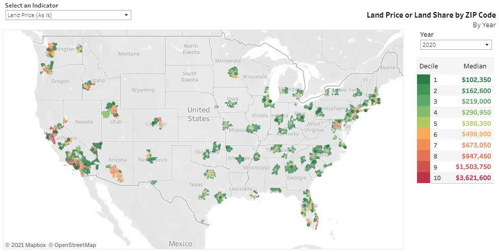

Source: [American Enterprise Institute](https://www.aei.org/housing/land-price-indicators/) ([methodology](https://www.aei.org/wp-content/uploads/2021/05/AEI-adjusted-Land-Price-and-Land-Share-Indicators-Methodology.pdf?x91208'))

Here's the same map but for _land share_–the percentage of a property's value that's due solely to the land. If you build a shack in the desert, nearly 100% of the property's value will come from the shack, because the land is worthless. But if you build a shack in San Francisco, nearly all of the property's value will come from the land. Notice how the land share gets closer to 100% as you move towards big cities along the coast.

  

This is because of increased demand for land near large population centers and areas with significant economic activity and commerce. The increased value of the land is not due to any individual, but to the collective inputs of the entire community in developing the area around it. This is often called the [agglomeration effect](https://en.wikipedia.org/wiki/Economies_of_agglomeration).

Even so, maybe you don't trust the American Enterprise Institute's figures and want to hear from some other people.

In 2014, the "developable land" on Manhattan island alone was estimated to be worth about $1.74 trillion, according to [Barr, Smith, and Kulkarni](https://www.sciencedirect.com/science/article/abs/pii/S0166046217300820) (just the land).

Between 2005-2010, the urban land value for _all_ of New York City was worth about $2.5 trillion, according to [Albouy, Ehrlich, and Shin](https://web.archive.org/web/20180517024758/http://davidalbouy.net/landvalue_index.pdf) (just the land).

In 2020, all real estate in NYC was worth about $2.7 trillion, according to [LendingTree](https://web.archive.org/web/20200716152956/https://www.lendingtree.com/home/mortgage/lendingtree-reveals-the-most-valuable-cities-in-america/) (the land + the buildings).  
  
But let's go ahead and see for ourselves. You can run a quick spot check by going on [Zillow](https://www.zillow.com) or [Redfin](https://www.redfin.com) in a major city like New York or San Francisco. First, search for a vacant lot for sale in the heart of downtown, and note the asking price. Then look for a similarly-sized lot with a building on it that has sold within the last few years, situated next to the empty lot. The last selling price should be available. You can subtract one price from the other to get a rough estimate of the land share of the plot with the building on it.

Here's a listing for a vacant lot in the heart of San Francisco (personal information redacted). They're asking for $1.99 million dollars, and, judging from other listings and sales records in the area, they'll probably get it.

  

Here's a townhouse right next door that sold last year, situated on a lot of nearly the same size. We're ignoring the "Redfin Estimate"; all we care about is the "this home last sold for" figure at the bottom, which is about $2.4 million.

  
 
This is all the information we need for our spot check. First, we adjust for size. The second property's lot is 88% as big as the vacant lot, so we multiply the vacant lot's value ($1.99M) by 88% to get $1.75M. Now we subtract: $2.32M - $1.75M = $568K, the presumptive value of the building. That suggests that 24% of the total property value is from the building, and 76% is from the land. This is just napkin math, but it's congruent with the 70.9% figure AEI gives for the average land share of property in San Francisco county in 2020.

Our spot check confirms the findings from the studies and AEI's dataset. Real estate in urban areas is expensive because of land, and the most valuable land is in urban areas.

And if you don't believe me, I have an empty lot in [Gerlach, Nevada](https://web.archive.org/web/20210809032137/https://landequities.com/nevada/061-020-55) to sell you. But don't worry–it's only $0.0054/sqft. Meanwhile, our empty lot in San Francisco is going for $865.21/sqft, which is over 159,000 times as expensive.

Given the evidence from the various land value estimation studies and databases like AEI's, as well as how easy it is to run spot checks, I'm convinced.

**Conclusion:** Most of the value of urban real estate is, in fact, land.

## 2. America's land rents equal a sizable % of government spending

Krugman and other skeptics don't believe you can raise enough with LVT alone to fund a modern state. Noah Smith, on the other hand, claims that [Land is Underrated as a Source of Wealth](https://www.bloomberg.com/opinion/articles/2018-01-02/land-is-underrated-as-a-source-of-wealth). Regardless of who's right, LVT doesn't need to replace all other taxes to still be worth doing, as long as it can raise a significant enough chunk. So how much can it raise? Let's do the math and find out.

**Spoiler alert:**  
Conservative estimates show that **we can entirely pay for any one of Defense, Social Security, or Medicare + Medicaid using land rents alone**. And optimistic estimates suggest that we're within striking distance of the Single Tax–**replacing all labor and capital taxes with taxes on land rents** (on the federal level, at least).

**Math alert:**  
We're about to dive into all the research papers and calculations that back up the above statement. If you don't care about seeing me show my work and you want to jump right to the conclusion, go to the next section, **How Much Money Can We Raise From Land Rents?**

* * *

Let's start by defining some terms very precisely:

**Land Income** or **Land Rent** is the recurring amount of revenue that the land itself is capable of generating. It's the market value that derives from the benefits the land itself provides (crops it can grow, proximity to a desirable job, etc) and the most anybody is willing to pay to access that land for a while (conventional "rent"). It is ultimately land income that drives land value, not the other way around.

**Land Price** or **Land Value** is how much it costs to buy a piece of land. **Full Market Value,** however, is specifically the land price under "fair" and open market conditions. What are "unfair" conditions? I mean, your dad could sell you a valuable property for $1 as an obvious gift, but if he put it on the open market, it would go for much more than that. Likewise, it's not uncommon for a property that's been foreclosed on and hastily auctioned off to be re-listed publicly by the auction winner for a higher price.

Cool, so how much is all the land in America worth? Or more precisely, what is the **full market value** of all of America's land?

Here's a graph of America's total aggregate land value over time, according to twelve different estimation methods. My sources are The [Lincoln Institute](https://web.archive.org/web/20171121002821/http://datatoolkits.lincolninst.edu/subcenters/land-values), [Larson (2015)](https://www.bea.gov/system/files/papers/WP2015-3.pdf), [Albouy, Ehrlich, and Shin (2018)](https://web.archive.org/web/20191217113256/http://davidalbouy.net/landvalue_index.pdf), [The American Enterprise Institute](https://www.aei.org/housing/land-price-indicators//), [PLACES Lab](https://placeslab.org/fmv_usa/), the [Federal Reserve](https://web.archive.org/web/20131211071139/http://www.federalreserve.gov/releases/z1/Current/z1.pdf) via a method worked out by [Matt Yglesias](https://slate.com/business/2013/12/value-of-all-land-in-the-united-states.html), [Larson (2019/2020)](https://www.fhfa.gov/PolicyProgramsResearch/Research/PaperDocuments/wp1901-1028.pdf), and Jeffrey Johnson Smith's 2020 book _[Counting Bounty: The Quest to Know the Worth of the Earth](https://bookshop.org/books/counting-bounty-the-quest-to-know-the-worth-of-earth/9781634242981)._

 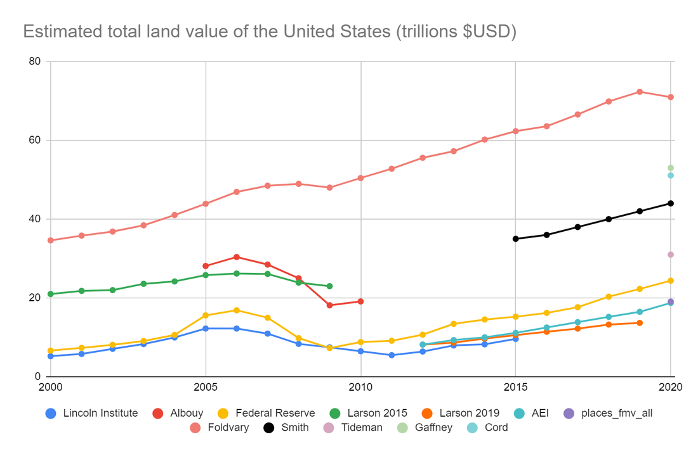 
 
The data points for Foldvary, Smith, Tideman, Gaffney and Cord all come from _Counting Bounty._ Smith gives his own estimate of $44 trillion and notes an estimate of $31 trillion that Nicolaus Tideman sent him via private correspondence.

Smith further mentions that Fred Foldvary was constantly saying that land rents equal about 1/3 of national income, and a cursory googling of Foldvary's writings confirms this. The "Foldvary" line here is my own construction that takes a third of [GNI](https://fred.stlouisfed.org/series/A023RX1Q020SBEA) for each year and then multiplies it by 10 (Smith's method for converting land rents to land value). Smith also cites a land rent estimate by Mason Gaffney at $5.3 trillion, or $53T in total value, though I've not been able to track down the primary source for that. Finally, I've extrapolated Smith's estimate five years back from his single 2020 data point according to the observed growth line from the other data sets.

That gives us a massive spread of anywhere between $19 trillion to $65 trillion in 2020 for all of America's land values.

So...whom do we trust here?

Let's start from the top with Foldvary's estimate. Foldvary is looking at the results of a 2003 paper by Terrence Dwyer in Australia, and then saying that the same pattern Dwyer notes is likely to hold in America.

For context, Terrence Dwyer is a Georgist who spent several years as an Australian Treasury tax official, was an advisor to the Prime Minister and Cabinet, and has written extensively about tax policy. His paper is called [The Taxable Capacity of Australian Land and Resources](https://www.prosper.org.au/wp-content/uploads/2007/11/dwyer-tax-resources.pdf).

Unlike America, Australia has a long history of land taxation and detailed land valuation records, which Dwyer leans on to put together four tables comparing land incomes to all Australian tax receipts. Although Australia has a history of land valuation and LVT that continues to this day, they fall far short of Fully Automated Luxury Space Georgism, relying on quite a bit of conventional capital and labor taxes.

Here are some figures from the most recent decade in Dwyer's fourth table, which shows that land rents could raise 70-75% as much as all of Australia's other taxes combined.

  
 
And if you compare Australia's land income to the receipts taken in just by Australia's company and personal income taxes, it would be more than enough to replace them entirely while still bringing in a surplus.

  
 
Dwyer's methodology seems plausible; it's a straightforward application of Australia's detailed land and property value records against Australia's published budget figures. Dwyer notably _doesn't_ factor in the potential revenue from the "dynamic effects" of Land Value Taxation, which would only serve to raise his figures. Great news for Australia, at least if you believe Dwyer and his data sources.

But I want to see what we can say about America, so let's check that National Income ratio real quick. In 1999, Dwyer gives land income as $132.7 billion AUD. In 1999, Macrotrends says [Australian GNI](https://www.macrotrends.net/countries/AUS/australia/gni-gross-national-income) was $405.5 billion _USD,_ and, using the [1999 conversion rate](https://www.macrotrends.net/2551/australian-us-dollar-exchange-rate-historical-chart), that's $623.9 billion AUD. That gives a land-rent-to-GNI ratio of 21.3%. Spot-checking 1991 gives me 20.8%, so about the same.

This is pretty far off from Foldvary's "one-third" guess, but pretty close to Steven Cord's. Cord estimated land rent [at about 24% of national income](https://cooperative-individualism.org/barron-ian_steven-cord-challenges-economists-on-the-lack-of-land-value-data-1988-sep-oct.pdf). That would be about $47 trillion using Smith's method. Given Foldvary is contradicted by his own source (Dwyer), we should probably exclude his line for now and construct a new one for Cord, as well as a "Dwyer-USA" line using 21% of America's GNI to better represent what Foldvary was getting at. If we buy that the Australian pattern might hold for the United States, our new chart looks something like this:

 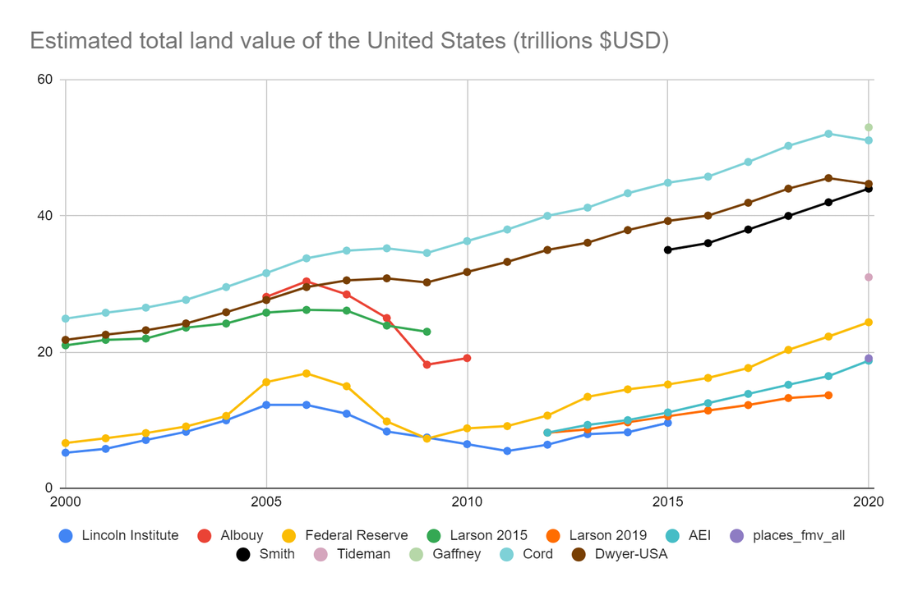 
 
Because the Cord and Dwyer-USA lines are just naively tracking GNI, they somewhat mask the 2005-2008 housing bubble, but they give us something like an upper bound. So we've got three emerging lines here. Could this reflect a difference in methodologies?

Indeed.

  
 
In part III, we'll dig into how to accurately assess land values in detail, but for now, let's look at the broad strokes differences between the estimation methods used here.

The bearish values in purple all rely on a method called the "cost approach," or "land residual" method. This is where you take the estimated cost it would take to replace a building, multiply that against depreciation based on the building's age, and then subtract that from the total market value of the property to get the land value.

Larson (2019) uses this method, and AEI's figures are based directly on those results with a slight upward correction. The Lincoln Institute and the Federal Reserve's figures use the same basic approach, relying on official estimates of construction costs and housing prices. The one outlier is the PLACES lab estimate, which uses a machine learning model but gives a single-year result that tracks with the four cost approach lines.

The bullish values in blue all come from estimates by various Georgists cited in Smith's book and are naively back-extrapolated by me just to set an upper bound.

The middle values in red include Larson (2015), who uses a "hedonic regression" model, and Albouy, who builds a model that _only_ looks at vacant land sales.

Long story short, I found numerous persuasive criticisms of the cost approach. Ultimately, I think Smith's estimate is most likely closest to the truth. Let's dig into Larson, Albouy, and the Federal Reserve figures to understand why.

### A Tale of Two Larsons

Larson disagrees with himself. Let me grey out most of the other lines to highlight this discrepancy.

  
 
Larson (2015) was written by Larson alone and uses a "hedonic regression" approach similar to the one described in [Kuminoff and Pope (2013)](https://doi.org/10.3368/le.89.1.1). In this method, you note all the characteristics of a property and then use a computer model to tease out the individual contributions of each factor to the final market value. This paper's data comes from a variety of sources but includes vacant land sales, developed property sales, and official stats from appraisals.

Larson (2019), on the other hand, was co-written with Davis, Oliner, and Shui and uses the cost approach exclusively. Crucially, Larson (2019) explicitly and intentionally _excludes_ all vacant land sales from the dataset. This estimate thus has the _least_ direct contact with ground truth data from the market concerning land.

### Albouy's Astounding Appendix

I think we can all agree that the purest way to measure the value of land is to find a piece of land with nothing on it and observe the price it sells for on the market. With enough of these data points, you could interpolate between them to create a smooth gradient map of land values, which could be good enough for estimating the aggregate value of large areas.

Unfortunately, this method isn't going to work to model urban land values because there just aren't enough pure-land sales in the city center.

Or are there?

  
 
This startling figure is from the "[online appendix](https://mitp.silverchair-cdn.com/mitp/content_public/journal/rest/100/3/10.1162_rest_a_00710/2/rest_a_00710-esupp.pdf?Expires=1640585859&Signature=gnRHP4gjxtsswGVrzQOb98gdycV2TnrrU0Yn5u4C2v7anb7GB-QGQLL7ULbfdAqPDBawButRVxu4PeN35kWbJz5He1I66v02mATLL-MZ6YpoyVWizynxpUq4~I8wfF~yCEaIK5fsVgTOg45xemzQLXWpI311M2I5NBCyz~A2mWV0s8hI71wURagJ-aksPe0F-Wv~xbTZaN2yAAPNbsJxQ4sf8nZl2~1tjLN~h9keA6MU4d70v~gk~7GL9B3dnnfBpLggb1oU3JLZMd5IT1zzG56gVrV-tbZRiXqh05mI8GbixZOYyGVVLXWTP-zVhlEjyPZj9ziDBaN7AYsxEE4GKA__&Key-Pair-Id=APKAIE5G5CRDK6RD3PGA)" to Albouy's paper, briefly referenced in a footnote in the main paper. Apparently, there are _more_ pure land sales in urban areas than there are in outlying areas. As far as I can tell, Albouy builds his statistical model using _nothing_ but pure land sales, excluding anything that has a structure on it. And yet his data points are most densely clustered around major city centers, when I had expected this approach would yield the exact opposite.

Both Albouy and Larson (2015) use regression models that include vacant land sales, but Albouy _only_ considers vacant land sales. By contrast, Larson (2019) uses the cost approach and explicitly _excludes_ vacant land sales. What about the Federal Reserve Method?

### The Fuzzy Fed

The "Federal Reserve" line is my own construction. Matthew Yglesias described this method in _[What's All the Land in America worth?](https://slate.com/business/2013/12/value-of-all-land-in-the-united-states.html)_ in 2013, arriving at $15 trillion. In this method, you look at the balance sheets on the Federal Reserve's annual [flow of funds report](https://www.federalreserve.gov/releases/z1/) and subtract the replacement values of all structures from the total value of real estate holdings. There's good reason to believe this method produces estimates that are too low.

Smith spends a lot of time attacking the Federal Reserve's figures, with arguments similar to Michael Hudson's critique from a 2001 article called [Where Did All the Land Go?](https://michael-hudson.com/2001/03/where-did-all-the-land-go-the-feds-new-balance-sheet-calculationsa-critique-of-land-value-statistics/) Here's Hudson:

> When the Fed’s methodology was examined on a sector by sector basis, serious problems were found in the breakdown between land and structures. For instance, by 1993 the FRB estimated that the land held by all nonfinancial corporations had a negative value of $4 billion.

This does, in fact, check out. The Fed was apparently so embarrassed by this that they stopped reporting land value estimates in subsequent reports, which is why you now have to derive them yourself.

This raises two questions: 1) are these problems still in effect today, and 2) if the Fed was so incompetent in the past, how can we trust that later estimates are not just as wrong, but in the other direction, i.e. wildly _over_\-stated land values?

Based on Smith and Hudson's critiques, as well as my own analysis of the data, the answers seem to be that: 1) the problems seem less worse today (no more negative land values!) but are probably still present to some degree, and 2) any bias is most likely in the downward direction.

It all has to do with the limitations of the cost approach, a problem many of these papers raise explicitly–including Larson (2019). Buildings naturally depreciate over time, while land tends to appreciate. The cost to _replace_ your building with a new one of identical design is on average going to be a lot more than what your old building is actually worth, even after factoring in depreciation. That's because the market doesn't care what you spent to build it, it only cares how much value it provides under current conditions.

Here's a contrived example. Say you built an amusement park for $10M ten years ago, and now prospective buyers want to tear it down and build apartments on it. Your roller coasters aren't worth $10M minus ten years depreciation; they're worth zero, even if they're still in decent shape. That's because now there's a shinier and better amusement park down the road that's driven you nearly out of business, and none of your prospective buyers are interested in operating an amusement park. All they want is the land. Your structures might even have _negative_ value because it costs money to tear them down.

In short, the cost approach is flawed because subtracting the inflated building price from the full market value of the property overvalues structures and undervalues land.

But what about the other figure in the equation–the full market value of the real estate (land + buildings)? If the Federal Reserve is basing those figures off of assessed values, we have good reason to believe they are too low. For one, only a minority of US states and Canadian provinces [re-assess property values annually](https://www.iaao.org/wcm/Resources_Content/PTAPP.aspx).

  
 
Source: [2017 PTAPP survey](https://www.iaao.org/wcm/Resources_Content/PTAPP.aspx) from the International Association of Assessment Officers

And for two, property tax assessments have all kinds of exemptions and carve-outs that serve to depress official statistics. Let's put aside [Proposition 13](https://en.wikipedia.org/wiki/1978_California_Proposition_13)'s legacy in California for a second and just compare the sale history to the tax history of properties like this one in Manhattan:

  
 
Assessed values less than 10% of the extremely obvious full market value

It sold for 5.8 million 10 years ago, and now it's listed for 9 million. And yet the  
"assessed value" is a mere $600K. What's going on? The assessor is probably _not_ saying that the full market value of this obviously multi-million dollar property is $600K. Most likely the assessor gave their best guess of "full market value," and then state statutes forced the assessor to also write down a separate "assessed value" that applies some markdown percentage. But the really damning part of these tax assessment records is that the land value assessment hasn't budged. The price has gone up over 3 million dollars in ten years, and you're telling me the land value hasn't changed at _all_? Fuhgeddaboudit.

Agencies that don't collect much property tax don't have strong incentives to strive for accurate assessments. This creates a vicious cycle where official statistics are severely depressed, and those same statistics are then used as proof that land just isn't a big deal.

If the Federal Reserve's data for total real estate values is at all based on property values from official sources, we would expect them to be 1) out of date and 2) discounting the property's total market value because of exemptions, caps, and other issues (Smith makes this same critique of both the Fed and Larson's data as well).

Taken together with the fact that improvements are likely being over-valued based on naïve replacement costs + depreciation formulas instead of the actual present market value, this would imply that the Federal Reserve method for estimating all of America's land values at $24 Trillion is a **conservative lower bound,** and the same goes for all the other methods using the cost approach.

### From Albouy to Smith

Okay, so let's look at Smith's method. Instead of doing a whole new study, he singles out Albouy as having the best methodology and makes some adjustments. You see, Albouy estimated the value of urban land _alone,_ leaving out federal lands, agricultural lands, and things like water rights and natural resources, which accrue rental income and are considered "Economic Land" by Georgists.

Smith starts by extrapolating Albouy's last given figure to the present day by applying the observed growth in the housing market (presumably due to appreciation of land values). He then adds on values for the missing types of land by using other existing estimates. It all comes to $44 trillion.

We can check his work pretty quickly. All the figures we have for the last decade that don't come from Smith grow at a very similar rate, with the Federal Reserve line growing at a steady ~$1.4T a year on average. So let's extrapolate Albouy at the same rate:

 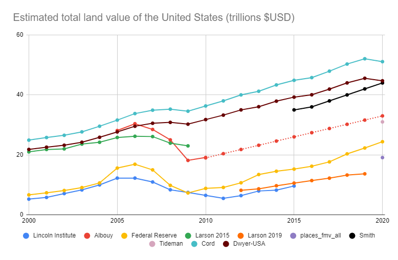 
 
Interestingly enough, that puts us just over Tideman's estimate but short of Smith's final value by about $11T. The USDA tells us the average value of farm land was [$3,160 / acre in 2020](https://www.nass.usda.gov/Publications/Todays_Reports/reports/land0820.pdf). Multiply that by [896.6 million acres](https://www.statista.com/statistics/196104/total-area-of-land-in-farms-in-the-us-since-2000/) and you get $2.8 trillion dollars. Smith further cites Richard Ebeling, who in 2015 estimated the value of all of the federal government's holdings in land and mineral reserves at [$5.5 trillion dollars](https://www.fff.org/explore-freedom/article/there-is-no-social-security-santa-claus/). Smith applies an extrapolation to update this value to 2020, putting it at $6.6 trillion.

If we just pop $2.8T + $6.6T on top of the extrapolated line from Albouy, that gives us this:

 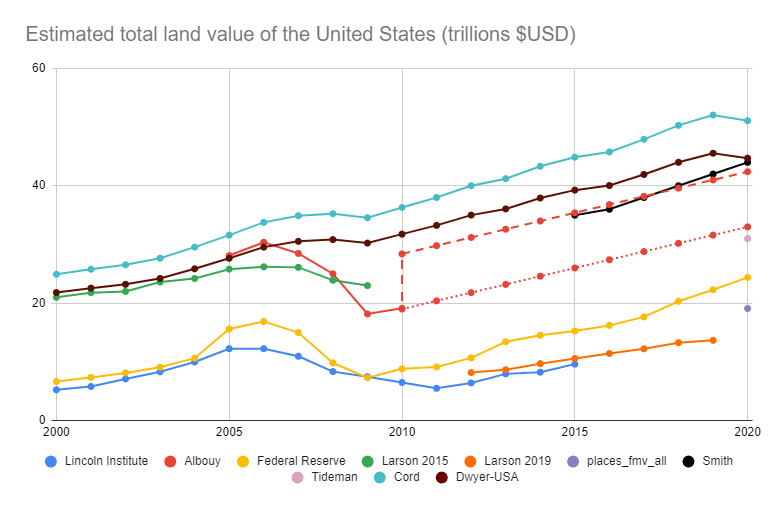 
 
Which gets us pretty close to Smith's figure. The USDA figure seems reliable, because most farmland doesn't have structures on it and is just pure land. The USDA can value the land just by observing market transactions. As for Ebeling, you kind of have to take his word for it, as he doesn't give a methodology. Ebeling is also a hardcore libertarian who advocates selling off all federal lands to reimburse taxpayers (wonder how he'd feel seeing Smith use his estimates to advocate Georgism!). But in any case, if you buy all of that, you get pretty close to Smith's $44T figure, which is itself close to Dwyer's observed ratio in Australia of land rents as 21% of national income (provided you use Smith's 10:1 ratio to convert land rents to land values).

Of the original studies, Albouy has the most convincing methodology, and Smith's additions and extrapolations seem plausible. But to be fair, let's set Smith ($44T) as an upper bound, and the Federal Reserve figure ($24T) as a lower bound.

I should note here that a lot of this land is already paying property taxes, which is at least partially a Land Value Tax. Research shows that Land Value Taxes are "capitalized" into land prices. I'll explain this next time in Part II, but for now, suffice it to say that if an income-generating piece of land produced $10,000 a year for you, and you knew you had to pay $5,000 a year for the privilege of holding it, you'd probably only be willing to buy it for half as much as you would if the tax didn't exist. Since the point of this exercise is to estimate how much a blanket LVT could raise, a more rigorous study would work out how much present land prices have been depressed by existing land taxes and adjust these figures upwards accordingly to get a more accurate estimate of the full land rents.

### Land Rents vs. Budgets

Now we have to convert land values to land rents–the amount of income the land is capable of generating each year.

To convert between land values and land rents, we need to use the **[capitalization rate](https://en.wikipedia.org/wiki/Capitalization_rate),** or "cap rate." If your land costs $1M and earns $50K/year, the cap rate is $50K/$1M, or 5%. This is the ratio between the net operating income produced by a plot of land ($50k) and its market value ($1M).

[According](https://arbor.com/research/q1-2021-single-family-rental-investment-trends-report/#leadbot-0e2c1a70-f989dce9-fb3c0420-b714fff4) to [various](https://mapping.cbre.com/maps/caprate/app/) [sources](https://web.archive.org/web/20210806054719/http://cbre.vo.llnwd.net/grgservices/secure/US%20Cap%20Rate%20Survey%20Q3%202020.pdf?e=1628228873&h=a614ce876e66ea42c9785fbba27a658c), cap rates in the USA range between 3.5% on the low end to as much as 11% on the high end, depending on the type of property (offices have a higher rate, residential has a lower rate, etc). However, the vast majority of land values in the United States are urban, so we should weight our cap rates towards urban figures. Call it a low of 5% and a high of 8%. Smith suggests a blanket cap rate of 10%, but I'm erring on the conservative side.

The 2005 federal budget had $2.5 Trillion in expenditures, increasing to $4.4 Trillion in 2019, with a sharp jump to $6.6 Trillion in 2020 thanks to COVID ([source](https://www.presidency.ucsb.edu/statistics/data/federal-budget-receipts-and-outlays)). It's immediately clear that regardless of valuation method, America's total land values ($24-44T) are significantly higher than the annual federal budget. But we care about land _rents_, not land _values._ It's not like the plan is to sell off all of America's land just to pay for a few years' spending.

If we plug in the figures from the Federal Reserve and Smith, that gives us the following figures for America's annual land rents (in trillions of dollars):

  
 
Great, after all that math we finally have a table that tells us how much money LVT might be able to raise. Keep in mind even the optimistic figures don't account for dynamic effects and aren't necessarily pricing in all other sources of "Economic Land" such as mineral rights, water rights, etc. They also don't apply any estimates for how much land values would rise if restrictive zoning ordinances were removed.

Now we just need to compare that to America's budget figures.

* * *

### How Much Money Can We Raise from Land Rents?
  
America's annual land rents are sufficient to cover between 18%-40% (Fed) and 34-78% (Smith) of annual federal spending. The low-end figures come from 2020, which was a major outlier in federal spending thanks to COVID.

 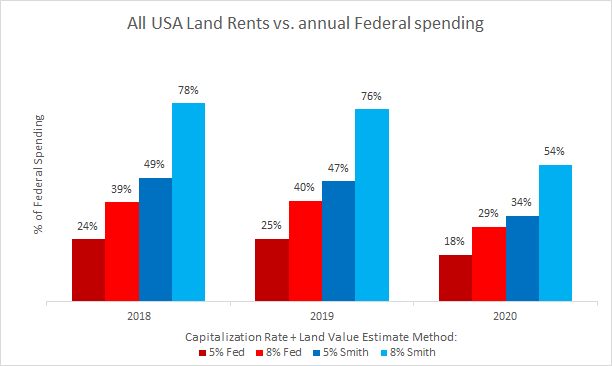 
 
To put those amounts in context, in the [2019 federal budget](https://www.cbo.gov/publication/56324), total spending was $4.4 trillion. We spent $676 billion on defense (15%), Social Security was $1 trillion (23%), and Medicare + Medicaid together were $1.05 trillion (24%). Let's compare those to our four individual estimates for annual land rent values:

 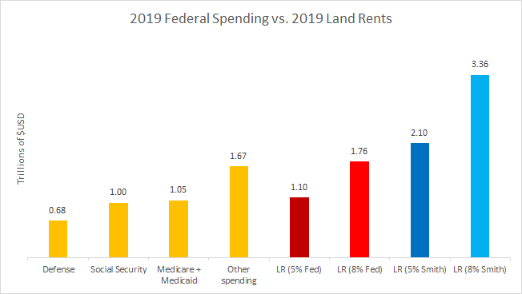 
 
Even the lowest estimate, the Federal Reserve method using a 5% cap rate, is enough to cover any one of Defense, Social Security, or Medicare + Medicaid, all by itself. And if you believe Smith's figure at the 8% cap rate, we could cover _all three of those things_ and still have enough left over to cover a third of all other spending.

Here's another point of comparison. There are [745 billionaires in America](https://www.nytimes.com/2021/10/28/business/america-billionaires.html), and some people think we should tax them to pay for all our stuff. As obscenely rich as billionaires are, the amount of money it takes to run a country at scale is even more obscene. If we were to "eat the rich" and forcibly expropriate 100% of billionaires' money, we would raise a one-time lump sum of about $5 trillion. That's a lot! But land rents by comparison can raise between 22-44% as much _every single year,_ and that's at the low cap rate.

This is not an argument against taxes on billionaires, mind you (I have no problem with the rich paying their fair share). It's simply meant to show that land rents represent a lot more value than people realize, and, unlike one-time personal wealth expropriations, they recur annually. Furthermore, land, unlike capital, can't flee the country and take investment and industry with it.

Fun fact: taking all the billionaires' money yields a little less than selling off all of America's federal lands and mineral reserves (Ebeling's estimate). So whether or not you opt for the libertarian hobby horse (sell federal lands) or the leftist one (eat the rich), either could at best pay for a single year's spending on the scale of 2020's budget.

But wait, what about [state budgets](https://higherlogicdownload.s3.amazonaws.com/NASBO/9d2d2db1-c943-4f1b-b750-0fca152d64c2/UploadedImages/SER%20Archive/2021_State_Expenditure_Report_S.pdf)? Many states are funded by property taxes, so if we're going to shift to land value taxes, we need to take states into account, too. So let's add state budgets into the mix (minus federal funding to states so we're not double counting). If we do that, we drop to 18-30% (Fed) or 36-58% (Smith) of annual spending.

 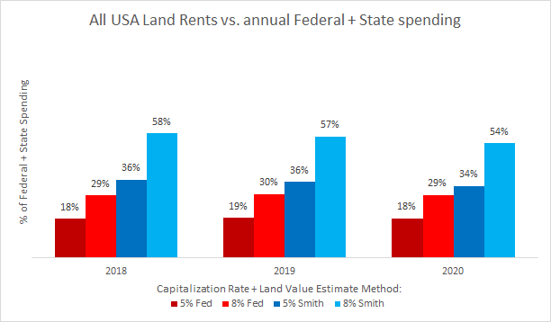 
 
If we look ONLY at net spending from all state budgets (all 50 state government outlays minus federal funding to states), you could cover anywhere from 67-121% (Fed) or 142-230% (Smith) with land rents, implying that states–particularly the ones with big cities–could easily fund themselves off of LVT alone.

  
 
But let's look at this another way. The federal government hasn't run a balanced budget since that [one time in the 1998](https://www.fool.com/investing/general/2013/09/30/was-americas-budget-really-balanced-in-the-90s.aspx), so the proper way to evaluate LVT against the status quo isn't comparing against total annual expenditures, but against total annual tax _receipts_. By this measure, all of America's land rents could cover anywhere from 30-56% (Fed) or 60-103% (Smith) of what our current tax receipts bring in.

 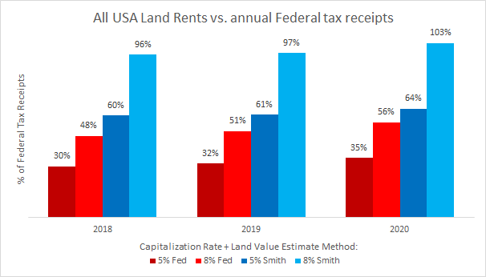 
 
And if you add in state tax receipts too, you get somewhere between 19-36% (Fed) and 41-68% (Smith). I couldn't find a source for state tax receipts, but most states are required to run balanced budgets, so I'm just assuming that the state budget expenditure figures from above are the same as their receipts. If I had more precise figures from the few states that do run deficits, that would only serve to reduce the assumed amount of tax receipts from those states, which could only raise the percentages given here.

  
 
Finally, what about [local governments](https://state-local-finance-data.taxpolicycenter.org/pages.cfm)? That's where a lot of the property taxes currently go anyways (not to mention regressive taxes like sales taxes and lotteries). If we add in all their tax money too, and compare it to annual land rents, that drops us to 14-26% (Fed) or 29-49% (Smith) of annual receipts. Keep in mind this doesn't account for property values that already have state and local property tax burdens priced into them. If we were to factor that in, it would raise these figures significantly.

  
 
No matter how you slice it, the most low-end estimate of 14-26% of all federal, state, _and_ local tax receipts is a lot of money, especially when you consider that it recurs annually and can cover any single giant line-item in the federal budget. And Smith's 29%-49% figure for land rents compared to _all tax receipts for every level of government combined_ would be bonkers.

Restricting ourselves to just the federal level, Smith's 60-103% figure is more than enough to entirely eliminate individual income taxes on the low end (about [50% of federal receipts in 2019](https://www.govinfo.gov/content/pkg/BUDGET-2019-BUD/pdf/BUDGET-2019-BUD.pdf)) and is in clear striking distance of a full-on Federal Single Tax on the high end.

Of course, if you think Smith is wrong and the Federal Reserve's figures have it nailed, then the Single Tax dream might be out of reach.

How big a deal this is depends on what you think about balanced budgets.

If you believe in [Modern Monetary Theory](https://www.investopedia.com/modern-monetary-theory-mmt-4588060), then you don't care about running a balanced budget. Under MMT, a sovereign government that prints its own money is limited only by productive capacity and physical resources, summed up best by the famous Keynes quote, "anything we can do, we can afford." I'm not personally advocating for or against this view–just pointing out that if you're in the MMT camp, then you already don't care about matching 100% of government spending with revenue raised from taxes.

But what if MMT is bunk, and if we also insist on the Fed's figures? Then we're left with two options: either accept that doctrinaire Single-Taxism is done for (in the USA, at least) while still accepting LVT as part of this balanced budget breakfast, or else look into those "dynamic effects" that Dwyer's Australian figures intentionally left out, particularly a tantalizing theory most commonly associated with [Mason Gaffney](https://www.masongaffney.org/workpapers/WP096%202005%20The%20Physiocratic%20Concept%20of%20ATCOR.pdf) called [ATCOR](http://www.wealthandwant.com/themes/ATCOR.html)–"All Taxes Come Out of Rents."

### ATCOR and the Henry George Theorem

ATCOR supposes that a reduction in taxes on income and capital–independent any other policy interventions–will actually cause land values to _rise_ by a proportionate amount. This means that Georgists who suppose that any old LVT policy will cause land prices to go down need to be careful. If you un-tax labor and capital, but don't _also_ sufficiently raise taxes on land, land prices (and rents) will actually go _up,_ because someone working on that land is now taking home more income and therefore capable of paying more in rent (see [Ricardo's Law of Rent](https://www.youtube.com/watch?v=jiGKwi43R0Q)). However, with the right policy, this can be a good thing_._

If ATCOR is true, a Single Tax policy will always work. Abolishing capital and income taxes causes the lost tax revenue to get soaked up by rising land values, which you can then capture with a 100% LVT. You're raising the exact same amount of revenue as before, but the elimination of income and capital taxes lifts a burden off of labor and investment while LVT keeps housing prices and rents down, boosting the economy and lowering the cost of living. This economic boost in turn raises land values, which are fully captured by LVT, thus keeping land values stable.

Then there's the Henry George Theorem. Nobel laureate Joseph Stiglitz [published it in 1979](https://academiccommons.columbia.edu/doi/10.7916/D8JM2M80), and it says that under certain conditions, expenditures on public goods will be soaked up by land rents to such a degree that a 100% LVT is _necessarily_ sufficient to finance all public goods spending in perpetuity. A pure "public good" is something that is "non-rival" and "non-excludable." Non-rival means that you using it doesn't mean I can use it any less, and non-excludable means that there's no way anyone can keep me from benefiting from it once it's out there. Common examples include a fireworks display, national defense, and clean air. The HG Theorem doesn't claim to apply to other forms of public spending, such as mass transit, which are both excludable and rival to some degree. (Transit has a capacity limit, and even if we've abolished racially discriminatory [Jim Crow](https://en.wikipedia.org/wiki/Jim_Crow_laws) laws, the fact that they were even possible proves excludability.)

Nevertheless, there's strong evidence that public spending on non-"pure public goods" [raises land values too](https://www.apta.com/wp-content/uploads/The-Real-Estate-Mantra-Locate-Near-Public-Transportation.pdf), just perhaps not to the same degree. I contacted Nicolaus Tideman, who tells me that a variant of the HG Theorem for non-pure-public-goods holds that "the combination of land value increases and charges equal to marginal cost will finance these expenditures." However, "neither theorem applies if people have different tastes or if benefits do not decline with distance." I think what he's saying is that most public works can be funded entirely by the increases in land value they generate, supplemented with modest user fees. I also think he's saying it depends on what kind of public work it is. If you spend public money on a truly hideous art installation that o

nly three people like, that's not going to raise land values. And if your public work is of equal benefit to everybody no matter where they live, that's also not going to raise the value of land, because no location benefits from it more than any other.

In any case, the status quo is that the bulk of spillover value created by public spending is captured by private landowners. Governments then have to tax citizens' labor and capital to pay for the next round of improvements or else go into debt with deficit spending and bond initiatives (a hidden tax on savings if it causes inflation).

If you put ATCOR, the Henry George Theorem, and observations about non-pure-public-goods-spending together, one could postulate a virtuous cycle where government investment is always able to pay for itself without creating a drag on the economy and _without_ any deficit spending or debt.

BUT. Even if we don't count on any of those effects, the above figures are already pretty astounding, even using the pessimistic Federal Reserve figures at the lower capitalization rate.

If you want to see someone much smarter than I put all this together into an actual policy paper that proposes a modest land value tax to boost the economy, abolish the income tax, _and_ balance the budget, check out the paper Nicolaus Tideman sent me: _[Post-Corona Balanced-Budget Super-Stimulus: The Case for Shifting Taxes Onto Land](https://papers.ssrn.com/sol3/papers.cfm?abstract_id=3954888) (_co-written with Kumhof, Hudson, and Goodhart).

And in case you're wondering who Nicolaus Tideman is, here's a quick bio from his [Wikipedia Page](https://en.wikipedia.org/wiki/Nicolaus_Tideman):

> Tideman was an Assistant Professor of Economics at [Harvard University](https://en.wikipedia.org/wiki/Harvard_University) from 1969-1973, during which time from 1970-1971 he was a Senior Staff Economist for the President's [Council of Economic Advisors](https://en.wikipedia.org/wiki/Council_of_Economic_Advisors). Since 1973 he has been at Virginia Tech, with various visiting positions at Harvard's [Kennedy School of Government](https://en.wikipedia.org/wiki/Kennedy_School_of_Government) (1979-1980), [University of Buckingham](https://en.wikipedia.org/wiki/University_of_Buckingham) (1985-1986), and the [American Institute for Economic Research](https://en.wikipedia.org/wiki/American_Institute_for_Economic_Research) (1999-2000).

* * *

We can quibble about the estimation methods and the cap rates, but by George, land rents represent a huge amount of value. If nothing else, a high LVT could offset many unpopular and inefficient taxes without cutting the budget, or it could be used to fund important programs we supposedly can't currently afford.

**Conclusion:**  
America's land rents are, in fact, equal to a sizable % of the annual budget.

Ironically, by demonstrating that land taxes can raise a large amount of money, I've actually set up another criticism; land taxes don't raise too _little_ revenue, they raise _too much._ This critique is mostly made on moral/ideological grounds and typically comes from the right–to which I'll just let arch-conservative William F. Buckley (apparently both a Georgist _and_ a full-on Single-Taxer) make the case.

At the end of the day, you either accept the moral arguments for making land value common property or you don't. If Buckley's argument that "a parking lot next to the Empire State building should be in principle taxed at the same rate as the skyscraper" doesn't sit right with you, I'm not sure appealing to empirics is going to convince you, as the disagreement likely comes from a much more fundamental place.

And if you think all taxation is theft, well, Land Value Tax is a tax, so presumably you have a problem with it on those grounds. But if you accept that you live in a society that occasionally taxes things, you might opt for what Milton Friedman called "the least bad tax."

* * *

So, we’ve established that land value is the bulk of urban real estate values (and urban real estate values are the bulk of total real estate values), and land rents are large enough to make a big dent in any budget. But here’s something you can be sure affects everyone: the share of land value represented in bank loans.

## 3. Land represents a significant % of all major bank loans

Banks exist for at least two stated purposes–to give people a safe place to store their money and to provide capital in the form of loans to people engaged in productive activities. This song from Mary Poppins is a decent summary of the Econ 101 story we're told about what banks do with their money.

Banking is obviously way more complicated than "you give the bank your money and then they lend it out to people," what with fractional reserve banking, the Federal Reserve, and all the rest of it. But we don't really care about that side of things for the purposes of this question. All we want to know is _given that banks have money, what do they do with it?_

Lately, they lend it out to people who want to buy real estate, according to _[The Great Mortgaging: Housing Finance, Crises, and Business Cycles](https://www.nber.org/system/files/working_papers/w20501/w20501.pdf)_ by Jordà, Schularick, and Taylor. This chart shows three snapshots from 1928, 1970, and 2007 of the share of all bank lending that goes to real estate for a selection of major countries around the world.

  
 
Here's another visualization that takes all the countries together and plots it over time, going back to the late 1800's.

  
 
As we can see above, this is truly a worldwide phenomenon, and it's been on a continuous upward trend since about 1950. As of today, the real estate share of bank lending has grown to nearly twice the level it was in Henry George's time.

Let's see if we can spot check some of these stats by looking up another source. [Positive Money](https://positivemoney.org/2018/06/how-has-bank-lending-fared-since-the-crisis/) provides this graph breaking down per-sector lending in the UK. They give the Bank of England itself as the source for their data.

 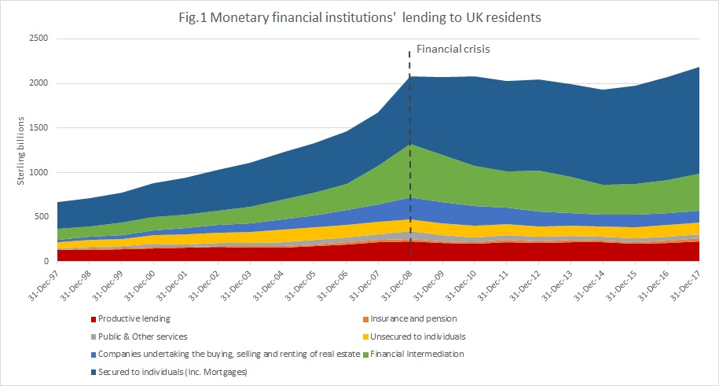 
 
Source: _Table C1.2 Bank of England statistics via [Positive Money](https://positivemoney.org/2018/06/how-has-bank-lending-fared-since-the-crisis/)_

Counting pixels and working out the percentage by hand, it looks like real estate (the two blue regions) combined for about 45% circa 2007 and climbed to 60% in 2017. The 2007 figures are smaller than those given in the above charts from _The Great Mortgaging_ but are still huge in either case.

Is there anywhere else we can check easily? New Zealand (which isn't covered in _The Great Mortgaging_) has this [really cool dashboard](https://bankdashboard.rbnz.govt.nz/asset-quality) that breaks down all the bank loans in their country. As you can see, the majority of loans are for housing.

  
 
Here's another visualization of the same data.

  
 
Source: [Interest.co.nz](https://www.interest.co.nz/banking/112371/nz-banks-housing-lending-continues-rising-percentage-their-overall-lending-business)

I could dig further, but I think I've seen enough to convince me of this general point. The majority of bank loans in a lot of major developed countries (including the US, UK, and New Zealand) are for real estate, and, as we've already shown, the majority of real estate's value is concentrated in land. Whether or not land represents a clear majority of bank loans, it's undeniably a big chunk.

**Conclusion:** Land represents a significant % of all major bank loans

Okay, so what? Why is it such a big deal if banks spend a lot of money chasing after real estate?

Although financing the construction of new houses is a good thing, none of the money tied up in the buying and selling of land is itself productive, because no new tangible wealth is created. Also, all this cheap credit for land just means more bids driving up land prices. So not only are real estate bank loans not making the economy any better, they're actively making it worse.

Anyone who lived through 2008 knows first hand how seemingly abstract real estate investment shenanigans can come smashing into your everyday life and bring [the entire world economy to its knees](https://en.wikipedia.org/wik/Subprime_mortgage_crisis). China in particular [is now grappling](https://www.nytimes.com/article/evergrande-debt-crisis.html) with many of the same problems.

Now take a look at this eye-popping quote from [Tideman's paper](https://papers.ssrn.com/sol3/papers.cfm?abstract_id=3954888), section 3.7.1, "The Financial Sector," emphasis mine:

> Hudson (2012, 2018) has shown that **most land rent is paid out as interest to banks** and that bank credit is a major driver of increases in housing prices (“real estate is worth whatever the bank will lend against it”). Further empirical support is offered by Favara and Imbs (2015), and La Cava (2015) finds that this can explain the increase in the share of housing in capital income studied by Rognlie (2015). Ryan-Collins et al. (2017) and Turner (2017) argue that a self-reinforcing cycle between bank lending and land value increases has caused a shift in bank lending from business loans to mortgages and the inflation of land prices, and this has impaired financial stability, as also argued in Keen (2017).

That Rognlie (2015) citation is worth unpacking in particular. Rognlie got a lot of attention for pointing out some major flaws in Thomas Piketty's famous book, [Capital in the 21st Century](https://en.wikipedia.org/wiki/Capital_in_the_Twenty-First_Century). Piketty's main argument is that the rate of return to capital is greater than the overall rate of economic growth, and that this is leading to wealth concentration and inequality.

Rognlie pointed out [in his paper](https://www.brookings.edu/bpea-articles/deciphering-the-fall-and-rise-in-the-net-capital-share/) that Piketty was improperly handling the depreciation of capital assets. Once you account for this, you find the outsized returns to "capital" driving inequality are due almost entirely to housing.

  
 
The unaffordability of housing appears to be not a mere symptom of inequality but rather a key driver of it. And banks contribute to that unaffordability by acting as the shadow rentiers of the entire economy.

## 4. Land represents a significant % of all gross personal assets

Here are two graphs that you might remember from the book review. The first shows that something like 40% of all gross personal assets in Spain represent land. About 25-30% are "financial assets" that must ultimately cash out to some mixture of real assets (land and capital), so the true percentage due to land is probably higher than 40%.

  
 
source: [Wealth in Spain, 1900-2014](https://web.archive.org/web/20180821115745/http://wid.world/wp-content/uploads/2018/02/WID.WP_ABM_WEALTHSPAIN_2018.pdf) by Blanco, Bauluz, & Martínes-Toledano

The second chart shows that about half of real assets in the United Kingdom are due to land.

 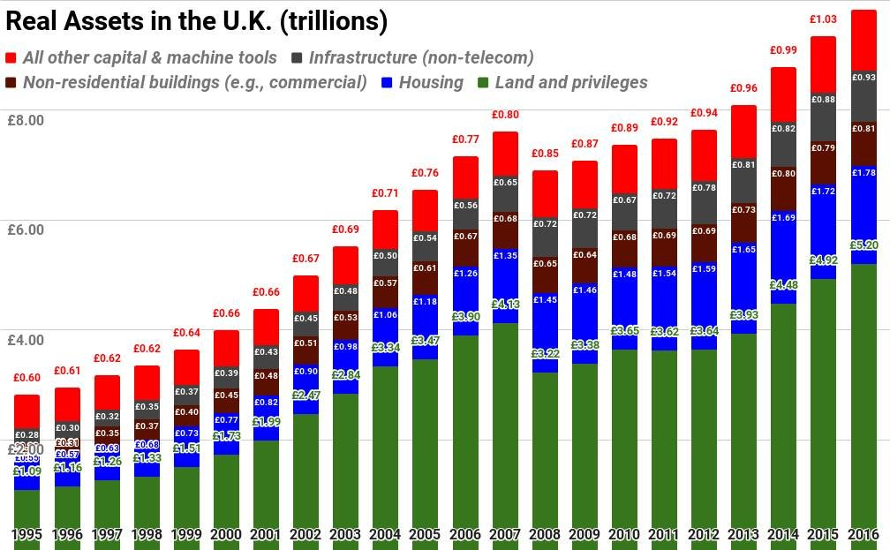 
 
Based on data from the United Kingdom National Accounts: The Blue Book 2017. Published Oct 31, 2017. Revision Period: Beginning of each time series. Date of next release: July 2018. The "privileges" in "Land and privileges" are things like taxi medallions and patents, that were worth "almost zero" according to Nate Blair, who prepared the chart.

Here are two graphs from Thomas Piketty breaking down "national capital" for Britain and France by sector:

 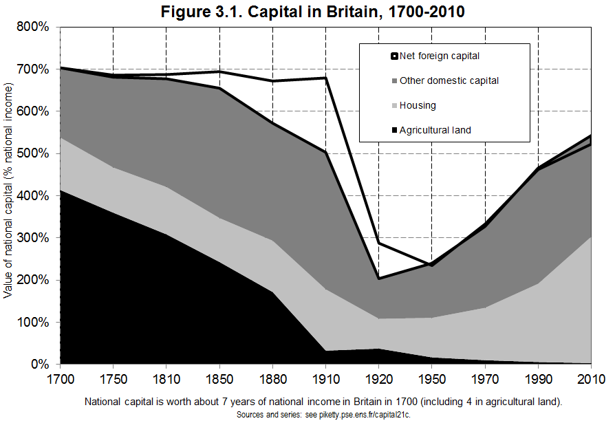 
 
Source: Capital in the 21st Century by Thomas Piketty

 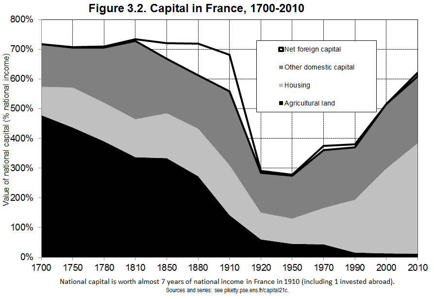 
 
Source: Capital in the 21st Century by Thomas Piketty

In the olden days, the majority of national capital was in agricultural land. Nowadays, the majority of it is in housing. I can work out that in 1700, about 76% of Britain's and 80% of France's national capital was real estate. In 2010, those figures were 55% and 61%, respectively.

What about the US? Here's a figure from [Tideman & co's big paper](https://papers.ssrn.com/sol3/papers.cfm?abstract_id=3960235), which uses OECD numbers to chart the share of household wealth in the USA due to "non-produced assets" (conventional land, natural resources, and everything else that isn't a kind of capital that humans create, which Georgists call "Land").

  
 
As we can see, it hovers around 40%.

Land represents about 40% of household assets in the USA. It also represents more than 40% of asset values in Spain and somewhere between 50-60% of asset values in the France and UK.

How about the rest of the world? According to [this giant report by McKinsey](https://archive.md/DRUiI), real estate holdings account for two-thirds of all _global_ real assets, with more than half of that coming from land.

  
 
If you add together the 35% due to conventional land and the 4% due to "non-produced" assets (which, among other things, includes mineral and energy reserves), you get the amount represented by the Georgist definition of Land: 39% of all real assets in the entire world. That figure rises to 43% if you also count IP as "Economic Land."

That seems like a pretty big deal to me.

**Conclusion:**  
Land does, in fact, represent a significant % of the value of gross personal assets in developed countries, including the US.  

* * *

Now some of you might be nervous at this point. Are those awful Georgists about to ruin me with LVT? I can certainly sympathize, seeing as I'm a homeowner myself. This is where I think the Citizen's Dividend (UBI) should probably come in.

Let's use $1.2 trillion in 2020, the most pessimistic figure for America's land rents (the Federal Reserve method at the low 5% capitalization rate). If we split that amount among all ~209 million American citizens over the age of 18, then anybody sitting on a property worth less than ~$230K is going to either break even or turn a profit.

 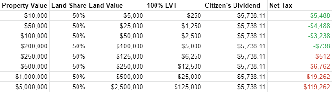 
 
This simplistic table makes a few assumptions, of course. We fix land share at 50%, and capitalization rate at 5%. But keep in mind that _every citizen_ would get the dividend, so if you have two adults in your household, the table breaks even at just under $500K in property value.

  
 
This is not a recipe for bankrupting the middle class. In fact, it compensates everyone for helping make America a desirable place to live. This compensation is paid primarily by those who gatekeep the most valuable locations and natural resources, things which were not brought into existence by anyone's hard work or investment.

Also, keep in mind that LVT would see the elimination of the portion of property tax that falls on buildings. I just checked my own property tax records (I live in the suburbs of a medium-sized town far from any major urban cores). If the assessed land share more than doubled to 40%, under a 100% LVT regime I'd actually save $545.05 on my property taxes every year–and that's _without_ a Citizen's Dividend.

## 5. Land ownership is highly concentrated among the wealthy

Bill Gates, the world's fourth richest person, owns 242,000 acres of farmland across the U.S., making him the [#1 owner of private farmland in the USA](https://www.forbes.com/sites/arielshapiro/2021/01/14/americas-biggest-owner-of-farmland-is-now-bill-gates-bezos-turner/). But that's just farmland. If you're talking about [all land in the USA](https://landreport.com/americas-100-largest-landowners/), Gates ranks #49. Jeff Bezos is #25, and Ted Turner is #4. Rich people own a lot of land.

So what % of total real estate values are owned by the top 1%, the top 10%, and the top 50%? Quite a lot, according to the Federal Reserve.

  
 
In other words, of all the real estate value in the United States, the top 1% own 14.7% of it, the top 10% own 44.8% of it, and the top 50% own 88.5% of it.

Here's how that compares against total assets.

  
 
Of all asset values in the United States, the top 1% own 29% of it, the top 10% own 65% of it, and the top 50% own 94.7% of it.

So compared to total asset values, it looks like real estate is a little more evenly distributed, but it's still highly stratified in an absolute sense. The top 1% own almost 15% of the country's total real estate value, and the top 10% own almost half of it. Keep in mind that it's on this basis that the top 1% and the top 10% gain the ability to collect rent from everybody else.

But where the top 1% really get their kicks is in financial assets.

 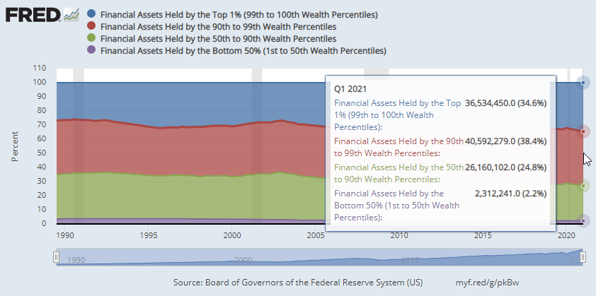 
 
Not to mention ownership of private businesses.

  
 
Once again, we're back to untangling the value of financial assets, which is beyond the scope of this particular investigation. In a sane world, the "ground truth" value of most financial instruments like stocks and bonds would terminate in good old fashioned capital and labor, but we've already been through one crisis where much of the world's paper wealth turned out to be just [elaborate incantations cast upon regular people's mortgages](https://www.finra.org/investors/learn-to-invest/types-investments/bonds/types-of-bonds/mortgage-backed-securities#:~:text=Mortgage-backed%20securities,%20called%20MBS,million%20worth%20of%20such%20mortgages.). From what we've seen about how many bank loans are tied up in real estate, we're well on our way back there.

What about sources other than the Fed? [The Economist](https://www.economist.com/briefing/2015/04/04/the-paradox-of-soil) gives similarly stratified figures, which [I'm told](https://www.reddit.com/r/georgism/comments/pryhtf/land_value_ownership_inequality_stats/hdqf9m7/?context=3) ultimately come from [here](https://eml.berkeley.edu/~saez/SaezZucman2015.pdf).

 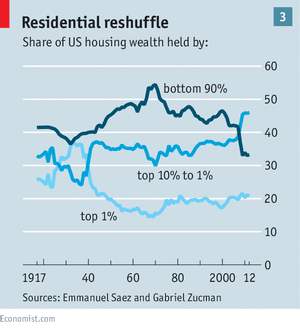 
 
Rich people own a lot of the country's land value, and in fact, they own most of it. On top of that, [housing is the world's biggest asset class](https://www.economist.com/special-report/2020/01/16/how-housing-became-the-worlds-biggest-asset-class).

The really troubling bit is the generational gap. Every generation has lower homeownership rates than the previous one.

  
 
Okay, but Millennials are younger. Obviously they have lower homeownership rates than older people. Maybe they'll catch up?

Evidence suggests they won't.

  
 
Not only is land ownership concentrated among the wealthy, it's concentrated among the _old_ and wealthy. [Life expectancies for the old and rich are increasing](https://www.nber.org/papers/w27509), delaying both inheritances and estate taxes past the point where it would do the most good–while members of the next generation are still establishing themselves and/or trying to build families.

It's important to realize that Millennials are no longer young. I'm a Millennial, and I'm already 37, hardly a spring chicken. What's the picture going to look like for Zoomers?

**Conclusion:**  
Land ownership is, in fact, highly concentrated among the wealthy.

* * *

We've established the following well beyond the preponderance of evidence:

✅ Most of the value of urban real estate is land  
✅ All of America's land rents equal a sizable % of government spending  
✅ Land represents a significant % of all major bank loans  
✅ Land represents a significant % of the value of gross personal assets  
✅ Land ownership is highly concentrated among the wealthy  

# Conclusion

By George, land is a really big deal.

Land is not some minor concern that only matters in pre-industrial agricultural economies. Everybody needs land, but nobody can make any more of it. You can't work, eat, sleep, or even poop without access to land (try doing any one of those things in a forbidden location and see what happens to you). The housing crisis is driven by inflated land prices, which in turn drives poverty, homelessness, and all other manner of social ills. And when we try to fix those social ills with public spending, land often soaks up and privatizes the value the spending creates. This subsidizes private actors who turn right around and use those gains to jack up everybody's rent, and the vicious cycle continues. And all the while banks continue to pour fuel on the fire.

By George, Land Value Tax would solve this.

Next: [Part II - Can Land Value Tax be Passed on to Tenants?](can-lvt-be-passed-on-to-tenants)  
